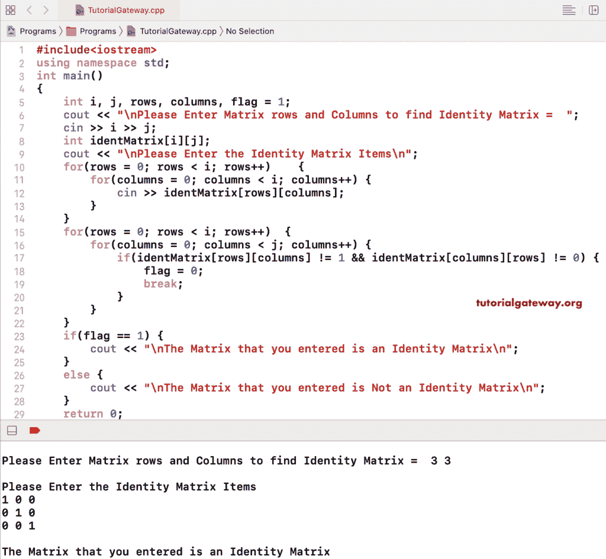

# 寻找矩阵的 C++ 程序是一个单位矩阵

> 原文：<https://www.tutorialgateway.org/cpp-program-to-find-matrix-is-an-identity-matrix/>

写 C++ 程序求矩阵是一个带有例子的恒等式矩阵。C++ 单位矩阵是一个正方形矩阵，它的主对角线项是 1，所有其他元素都是 0。

在这个 C++ 身份矩阵示例中，我们允许用户输入行和列。接下来，我们使用 C++ 嵌套 for 循环来迭代矩阵。在 for 循环中，我们使用 C++ If 语句来检查主对角线项是否为 1，非对角线项是否为 0。如果为真，我们将标志值更改为 0，并应用 break 语句退出 for 循环。接下来，我们使用 C++ If Else 语句打印基于标志值的身份矩阵输出。

```cpp
#include<iostream>
using namespace std;

int main()
{
	int i, j, rows, columns, flag = 1;

	cout << "\nPlease Enter Matrix rows and Columns to find Identity Matrix =  ";
	cin >> i >> j;

	int identMatrix[i][j];

	cout << "\nPlease Enter the Identity Matrix Items\n";
	for(rows = 0; rows < i; rows++)	{
		for(columns = 0; columns < i; columns++) {
			cin >> identMatrix[rows][columns];
		}		
	}

 	for(rows = 0; rows < i; rows++)
  	{
   		for(columns = 0; columns < j; columns++)
    	{
    		if(identMatrix[rows][columns] != 1 && identMatrix[columns][rows] != 0)
    		{
    			flag = 0;
    			break;
			}
   	 	}
  	}
  	if(flag == 1)
  	{
  		cout << "\nThe Matrix that you entered is an Identity Matrix";
	}
	else
	{
		cout << "\nThe Matrix that you entered is Not an Identity Matrix";
	}  	

 	return 0;
}
```



这个用于恒等式矩阵的 [C++ 代码](https://www.tutorialgateway.org/cpp-programs/)使用 Else If 语句检查给定的矩阵是否是恒等式矩阵。

```cpp
#include<iostream>
using namespace std;

int main()
{
	int i, j, rows, columns, flag = 1;

	cout << "\nPlease Enter Matrix rows and Columns to find Identity Matrix =  ";
	cin >> i >> j;

	int identMatrix[i][j];

	cout << "\nPlease Enter the Identity Matrix Items\n";
	for(rows = 0; rows < i; rows++)	{
		for(columns = 0; columns < i; columns++) {
			cin >> identMatrix[rows][columns];
		}		
	}

 	for(rows = 0; rows < i; rows++)
  	{
   		for(columns = 0; columns < j; columns++)
    	{
    		if(rows == columns && identMatrix[rows][columns] != 1)
    		{
    			flag = 0;
			}
			else if(rows != columns && identMatrix[rows][columns] != 0)
			{
				flag = 0;
			}
   	 	}
  	}
  	if(flag == 1)
  	{
  		cout << "\nThe Matrix that you entered is an Identity Matrix";
	}
	else
	{
		cout << "\nThe Matrix that you entered is Not an Identity Matrix";
	}  	

 	return 0;
}
```

```cpp
Please Enter Matrix rows and Columns to find Identity Matrix =  3 3

Please Enter the Identity Matrix Items
1 0 0
0 1 0
0 0 1

The Matrix that you entered is an Identity Matrix
```

让我试试非恒等式矩阵。

```cpp
Please Enter Matrix rows and Columns to find Identity Matrix =  3 3

Please Enter the Identity Matrix Items
1 0 0
0 0 1
0 1 0

The Matrix that you entered is Not an Identity Matrix
```

## 用 While 循环寻找矩阵的 C++ 程序是一个单位矩阵

```cpp
#include<iostream>
using namespace std;

int main()
{
	int i, j, rows, columns, flag = 1;

	cout << "\nPlease Enter Matrix rows and Columns to find Identity Matrix =  ";
	cin >> i >> j;

	int identMatrix[i][j];

	cout << "\nPlease Enter the Identity Matrix Items\n";
	for(rows = 0; rows < i; rows++)	{
		for(columns = 0; columns < i; columns++) {
			cin >> identMatrix[rows][columns];
		}		
	}

	rows = 0; 
 	while(rows < i )
  	{
  		columns = 0; 
   		while(columns < j)
    	{
    		if(rows == columns && identMatrix[rows][columns] != 1)
    		{
    			flag = 0;
			}
			else if(rows != columns && identMatrix[rows][columns] != 0)
			{
				flag = 0;
			}
			columns++;
   	 	}
   	 	rows++;
  	}
  	if(flag == 1)
  	{
  		cout << "\nThe Matrix that you entered is an Identity Matrix";
	}
	else
	{
		cout << "\nThe Matrix that you entered is Not an Identity Matrix";
	}  	

 	return 0;
}
```

```cpp
Please Enter Matrix rows and Columns to find Identity Matrix =  3 3

Please Enter the Identity Matrix Items
1 0 0
0 1 0
0 0 1

The Matrix that you entered is an Identity Matrix
```