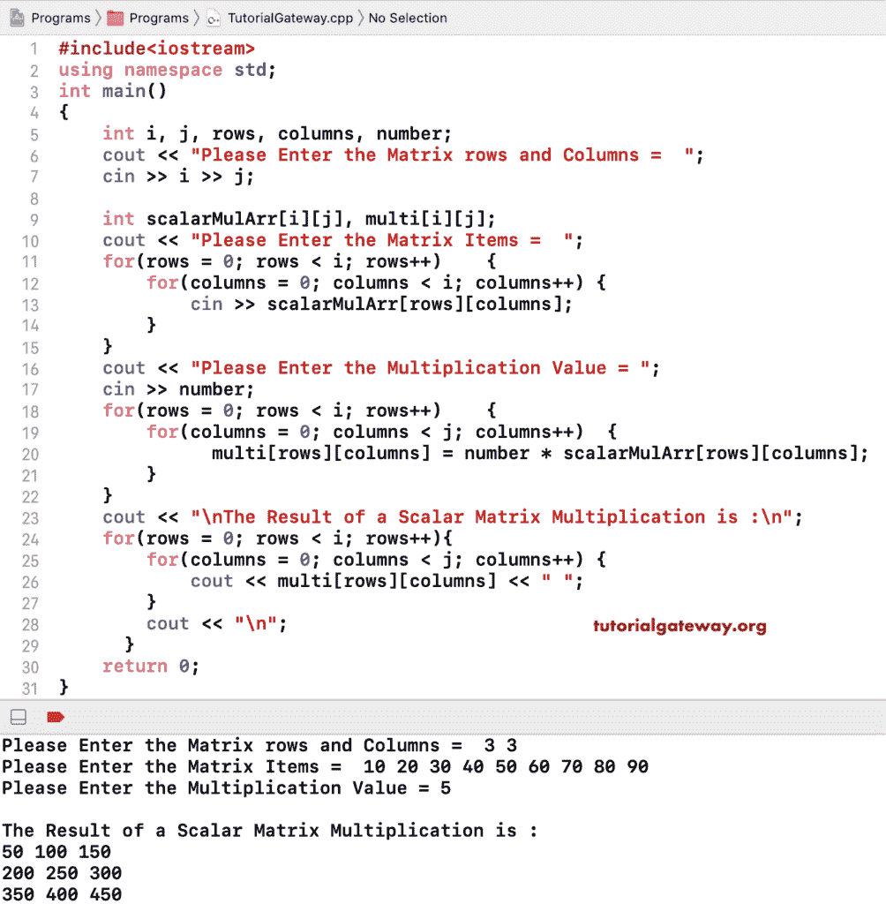

# C++ 程序：执行标量矩阵乘法

> 原文：<https://www.tutorialgateway.org/cpp-program-to-perform-scalar-matrix-multiplication/>

用一个例子写一个 C++ 程序来执行标量矩阵乘法。这个 C++ 标量矩阵乘法程序允许输入行、列、矩阵项和乘法数。接下来，它使用嵌套的 for 循环将每一行和每一列乘以这个数字。最后一个嵌套循环是打印标量矩阵乘法结果。

```cpp
#include<iostream>
using namespace std;

int main()
{
	int i, j, rows, columns, number;

	cout << "\nPlease Enter the Matrix rows and Columns =  ";
	cin >> i >> j;

	int scalarMulArr[i][j], multi[i][j];

	cout << "\nPlease Enter the Matrix Items =  ";
	for(rows = 0; rows < i; rows++)	{
		for(columns = 0; columns < i; columns++) {
			cin >> scalarMulArr[rows][columns];
		}		
	}

	cout << "\nPlease Enter the Multiplication Value\n";
 	cin >> number;

	for(rows = 0; rows < i; rows++)
  	{
  		for(columns = 0; columns < j; columns++)
  		{
  			multi[rows][columns] = number * scalarMulArr[rows][columns];
		}
  	}

 	cout << "\nThe Result of a Scalar Matrix Multiplication is :\n";
	for(rows = 0; rows < i; rows++)
  	{
  		for(columns = 0; columns < j; columns++)
  		{
  			cout << multi[rows][columns] << " ";
		}
		cout << "\n"; 
  	}  	

 	return 0;
}
```



## 执行标量矩阵乘法的 C++ 程序示例 2

我们没有使用另一个嵌套 for 循环来显示标量矩阵乘法结果，而是使用了 cout (cout << multi[rows][columns] << ” “;) within the same loop.

```cpp
#include<iostream>
using namespace std;

int main()
{
	int i, j, rows, columns, number;

	cout << "\nPlease Enter the Matrix rows and Columns =  ";
	cin >> i >> j;

	int scalarMulArr[i][j], multi[i][j];

	cout << "\nPlease Enter the Matrix Items\n";
	for(rows = 0; rows < i; rows++)	{
		for(columns = 0; columns < i; columns++) {
			cin >> scalarMulArr[rows][columns];
		}		
	}

	cout << "\nPlease Enter the Multiplication Value = ";
 	cin >> number;

 	cout << "\nThe Result of a Scalar Matrix Multiplication is :\n";
	for(rows = 0; rows < i; rows++)
  	{
  		for(columns = 0; columns < j; columns++)
  		{
  			multi[rows][columns] = number * scalarMulArr[rows][columns];
  			cout << multi[rows][columns] << " ";
		}
		cout << "\n"; 
  	}  	

 	return 0;
}
```

```cpp
Please Enter the Matrix rows and Columns =  3 3

Please Enter the Matrix Items
11 22 33
44 55 66
77 88 99

Please Enter the Multiplication Value = 8

The Result of a Scalar Matrix Multiplication is :
88 176 264 
352 440 528 
616 704 792 
```

在这个 [C++](https://www.tutorialgateway.org/cpp-programs/) 标量矩阵乘法示例中，我们使用了额外的 cout 语句来显示每次迭代时的行、列和乘法值。

```cpp
#include<iostream>
using namespace std;

int main()
{
	int i, j, rows, columns, number;

	cout << "\nPlease Enter the Matrix rows and Columns =  ";
	cin >> i >> j;

	int scalarMulArr[i][j], multi[i][j];

	cout << "\nPlease Enter the Matrix Items\n";
	for(rows = 0; rows < i; rows++)	{
		for(columns = 0; columns < i; columns++) {
			cin >> scalarMulArr[rows][columns];
		}		
	}

	cout << "\nPlease Enter the Multiplication Value = ";
 	cin >> number;

	for(rows = 0; rows < i; rows++)
  	{
  		cout << "\nRow Iteration = " << rows + 1 << ", Row Number = " << rows;
  		for(columns = 0; columns < j; columns++)
  		{
  			cout << "\nColumn Iteration = " << columns + 1 << ", Column Number = " << 
			  	columns << ", and Row Number = " << rows;

  			multi[rows][columns] = number * scalarMulArr[rows][columns];
  			cout <<  "\nscalarMulArr["<<rows<<"]["<< columns <<"] = " << scalarMulArr[rows][columns] << 
			" and number * scalarMulArr["<<rows<<"]["<< columns <<"] = " << multi[rows][columns] << endl;
		}
  	}  	

  	cout << "\nThe Result of a Scalar Matrix Multiplication is :\n";
	for(rows = 0; rows < i; rows++)
  	{
  		for(columns = 0; columns < j; columns++)
  		{
  			cout << multi[rows][columns] << " ";
		}
		cout << "\n"; 
  	} 

 	return 0;
}
```

```cpp
Please Enter the Matrix rows and Columns =  2 2

Please Enter the Matrix Items
10 20
30 40

Please Enter the Multiplication Value = 9

Row Iteration = 1, Row Number = 0
Column Iteration = 1, Column Number = 0, and Row Number = 0
scalarMulArr[0][0] = 10 and number * scalarMulArr[0][0] = 90

Column Iteration = 2, Column Number = 1, and Row Number = 0
scalarMulArr[0][1] = 20 and number * scalarMulArr[0][1] = 180

Row Iteration = 2, Row Number = 1
Column Iteration = 1, Column Number = 0, and Row Number = 1
scalarMulArr[1][0] = 30 and number * scalarMulArr[1][0] = 270

Column Iteration = 2, Column Number = 1, and Row Number = 1
scalarMulArr[1][1] = 40 and number * scalarMulArr[1][1] = 360

The Result of a Scalar Matrix Multiplication is :
90 180 
270 360 
```