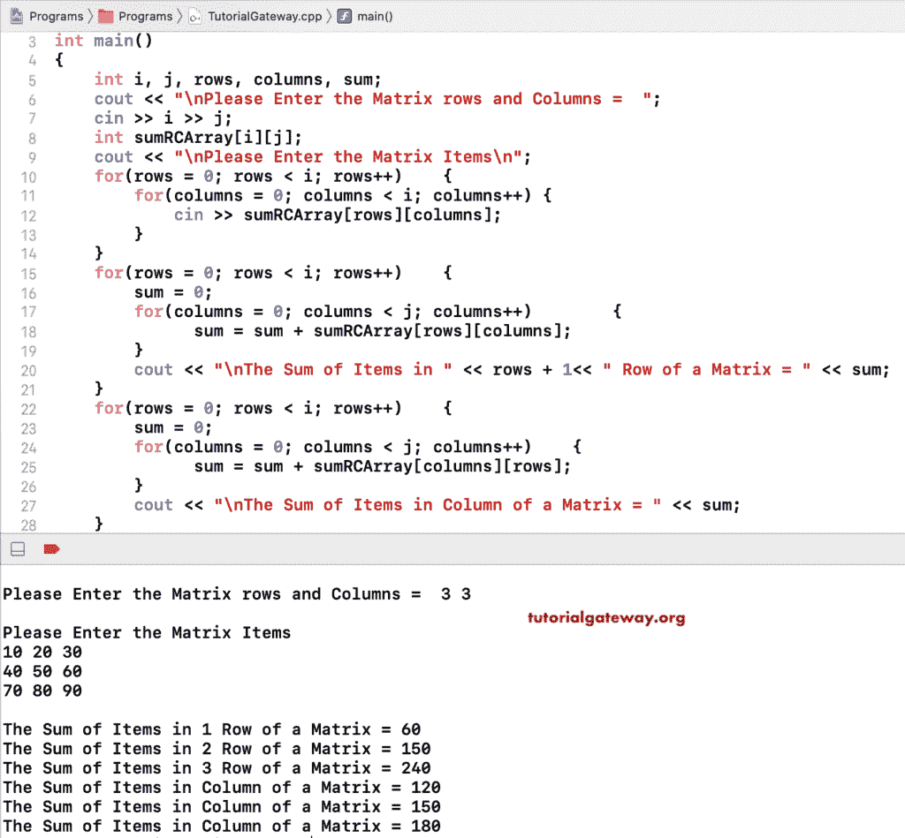

# C++ 程序：求矩阵行列和

> 原文：<https://www.tutorialgateway.org/cpp-program-to-find-sum-of-matrix-row-and-column/>

用例子写一个 C++ 程序求矩阵行和列的和。在这个 C++ 矩阵行和列求和的例子中，我们允许用户输入 sumRCArray 矩阵大小和矩阵项。在第一个 C++ 嵌套 for 循环中，我们计算矩阵行的总和。接下来，我们使用另一个循环来求矩阵列的和。

```cpp
#include<iostream>
using namespace std;

int main()
{
	int i, j, rows, columns, sum;

	cout << "\nPlease Enter the Matrix rows and Columns =  ";
	cin >> i >> j;

	int sumRCArray[i][j];

	cout << "\nPlease Enter the Matrix Items =  ";
	for(rows = 0; rows < i; rows++)	{
		for(columns = 0; columns < i; columns++) {
			cin >> sumRCArray[rows][columns];
		}		
	}

	for(rows = 0; rows < i; rows++)
  	{
  		sum = 0;
  		for(columns = 0; columns < j; columns++)
  		{
  			sum = sum + sumRCArray[rows][columns];
		}
   		cout << "\nThe Sum of Items in " << rows + 1<< " Row of a Matrix = " << sum ;
  	}

 	for(rows = 0; rows < i; rows++)
  	{
  		sum = 0;
  		for(columns = 0; columns < j; columns++)
  		{
  			sum = sum + sumRCArray[columns][rows];
		}
   		cout << "\nThe Sum of Items in Column of a Matrix = " << sum ;
  	}  	

 	return 0;
}
```



## C++ 程序求矩阵行和列的和示例 2

我们只使用了一个循环，而不是使用两个不同的嵌套 for 循环来计算矩阵行和列的总和。在嵌套的 for 循环中，我们计算矩阵行和列的总和。

```cpp
#include<iostream>
using namespace std;

int main()
{
	int i, j, rows, columns, rowsum, columnsum;

	cout << "\nPlease Enter the Matrix rows and Columns =  ";
	cin >> i >> j;

	int sumRCArray[i][j];

	cout << "\nPlease Enter the Matrix Items =  ";
	for(rows = 0; rows < i; rows++)	{
		for(columns = 0; columns < i; columns++) {
			cin >> sumRCArray[rows][columns];
		}		
	}

	for(rows = 0; rows < i; rows++)
  	{
  		rowsum = columnsum = 0;
  		for(columns = 0; columns < j; columns++)
  		{
  			rowsum = rowsum + sumRCArray[rows][columns];
  			columnsum = columnsum + sumRCArray[columns][rows];
		}
   		cout << "\n\nThe Sum of Items in " << rows + 1<< " Row of a Matrix = " << rowsum ;
   		cout << "\nThe Sum of Items in Column of a Matrix = " << columnsum ;
  	}

 	return 0;
}
```

```cpp
Please Enter the Matrix rows and Columns =  3 3

Please Enter the Matrix Items =  
11 22 33
44 55 66
77 88 99

The Sum of Items in 1 Row of a Matrix = 66
The Sum of Items in Column of a Matrix = 132

The Sum of Items in 2 Row of a Matrix = 165
The Sum of Items in Column of a Matrix = 165

The Sum of Items in 3 Row of a Matrix = 264
The Sum of Items in Column of a Matrix = 198
```

在这个 [C++ 程序](https://www.tutorialgateway.org/cpp-programs/)中计算矩阵行和列的和，我们把矩阵行和与列和逻辑分离成两个不同的函数。

```cpp
#include<iostream>
using namespace std;

void addMatrixRows(int sumRCArray[50][50], int i, int j)
{
	int sum, rows, columns;
	for(rows = 0; rows < i; rows++)
  	{
  		sum = 0;
  		for(columns = 0; columns < j; columns++)
  		{
  			sum = sum + sumRCArray[rows][columns];
		}
   		cout << "\nThe Sum of Items in " << rows + 1<< " Row of a Matrix = " << sum ;
  	}
}

void addMatrixColumns(int sumRCArray[50][50], int i, int j)
{
	int sum, rows, columns;
	for(rows = 0; rows < i; rows++)
  	{
  		sum = 0;
  		for(columns = 0; columns < j; columns++)
  		{
  			sum = sum + sumRCArray[columns][rows];
		}
   		cout << "\nThe Sum of Items in Column of a Matrix = " << sum ;
  	} 
}

int main()
{
	int i, j, rows, columns, sumRCArray[50][50];

	cout << "\nPlease Enter the Matrix rows and Columns =  ";
	cin >> i >> j;

	cout << "\nPlease Enter the Matrix Items =  ";
	for(rows = 0; rows < i; rows++)	{
		for(columns = 0; columns < i; columns++) {
			cin >> sumRCArray[rows][columns];
		}		
	}

	addMatrixRows(sumRCArray, i, j); 
	addMatrixColumns(sumRCArray, i, j); 	

 	return 0;
}
```

```cpp
Please Enter the Matrix rows and Columns =  2 2

Please Enter the Matrix Items =  19 22 33 44

The Sum of Items in 1 Row of a Matrix = 41
The Sum of Items in 2 Row of a Matrix = 77
The Sum of Items in Column of a Matrix = 52
The Sum of Items in Column of a Matrix = 66
```