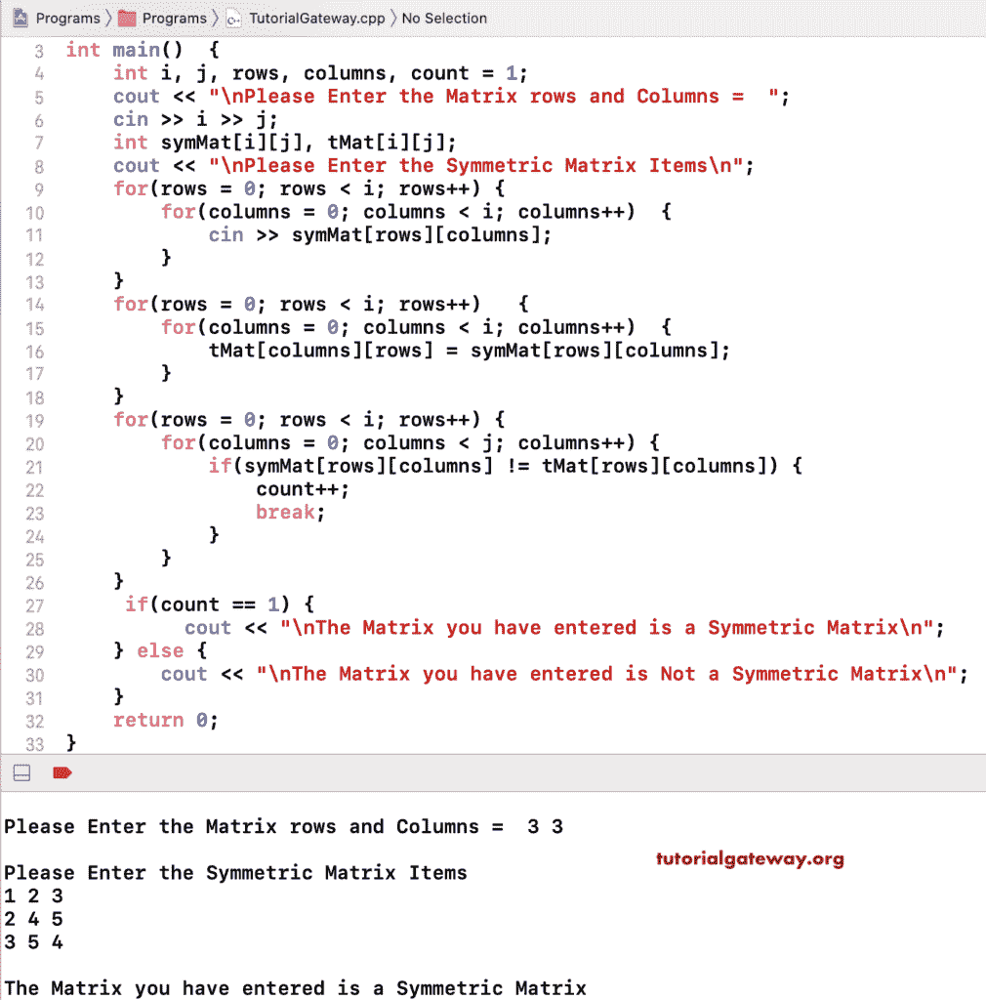

# C++ 程序：校验矩阵是对称矩阵

> 原文：<https://www.tutorialgateway.org/cpp-program-to-check-matrix-is-a-symmetric-matrix/>

写一个 c++ 程序检查矩阵是一个对称矩阵，并举例说明。如果原始矩阵等于它的转置，那么任何矩阵都可以是对称的。在这个 C++ 对称矩阵的例子中，首先，我们转置了符号矩阵，并将其分配给了 tMat。接下来，我们检查 symMat 矩阵中的每一项是否不等于 tMat 矩阵(if(symMat[row][columns]！= TMat[行][列])。如果失败，增加计数值，break 语句将帮助编译器退出循环。如果计数值等于 0，则它是对称矩阵。

```cpp
#include<iostream>
using namespace std;

int main()
{
	int i, j, rows, columns, count = 1;

	cout << "\nPlease Enter the Matrix rows and Columns =  ";
	cin >> i >> j;

	int symMat[i][j], tMat[i][j];

	cout << "\nPlease Enter the Symmetric Matrix Items\n";
	for(rows = 0; rows < i; rows++)	
	{
		for(columns = 0; columns < i; columns++) 
		{
			cin >> symMat[rows][columns];
		}		
	}

	for(rows = 0; rows < i; rows++)	
	{
		for(columns = 0; columns < i; columns++) 
		{
			tMat[columns][rows] = symMat[rows][columns];
		}		
	}

	for(rows = 0; rows < i; rows++)
  	{
  		for(columns = 0; columns < j; columns++)
  		{
  			if(symMat[rows][columns] != tMat[rows][columns])
  			{
  				count++;
  				break;
			}
		}
  	}

 	if(count == 1)
  	{
  		cout << "\nThe Matrix you have entered is a Symmetric Matrix";
	}
	else
	{
		cout << "\nThe Matrix you have entered is Not a Symmetric Matrix";
	}  	

 	return 0;
}
```



## 用 While 循环检查矩阵是对称矩阵的 c++ 程序

```cpp
#include<iostream>
using namespace std;

int main()
{
	int i, j, rows, columns, count = 1;

	cout << "\nPlease Enter the Matrix rows and Columns =  ";
	cin >> i >> j;

	int symMat[i][j], tMat[i][j];

	cout << "\nPlease Enter the Symmetric Matrix Items\n";
	for(rows = 0; rows < i; rows++)	
	{
		for(columns = 0; columns < i; columns++) 
		{
			cin >> symMat[rows][columns];
		}		
	}
	rows = 0; 
	while(rows < i)	
	{
		columns = 0; 
		while(columns < i) 
		{
			tMat[columns][rows] = symMat[rows][columns];
			columns++;
		}
		rows++;		
	}
	rows = 0;
	while(rows < i)	
	{
		columns = 0; 
		while(columns < i) 
		{	
  			if(symMat[rows][columns] != tMat[rows][columns])
  			{
  				count++;
  				break;
			}
			columns++;
		}
		rows++;	
  	}

 	if(count == 1)
  	{
  		cout << "\nThe Matrix you have entered is a Symmetric Matrix";
	}
	else
	{
		cout << "\nThe Matrix you have entered is Not a Symmetric Matrix";
	}  	

 	return 0;
}
```

```cpp
Please Enter the Matrix rows and Columns =  3 3

Please Enter the Symmetric Matrix Items
10 20 30
20 50 60
30 60 50

The Matrix you have entered is a Symmetric Matrix
```

在这个 [C++](https://www.tutorialgateway.org/cpp-programs/) 对称矩阵的例子中，我们添加了额外的 cout 语句来显示迭代方式的行值、symMat[行][列]值、tMat[列][行]值和列值。

```cpp
#include<iostream>
using namespace std;

int main()
{
	int i, j, rows, columns, count = 1;

	cout << "\nPlease Enter the rows and Columns =  ";
	cin >> i >> j;

	int symMat[i][j], tMat[i][j];

	cout << "\nPlease Enter the Items\n";
	for(rows = 0; rows < i; rows++)	
	{
		for(columns = 0; columns < i; columns++) 
		{
			cin >> symMat[rows][columns];
		}		
	}

	for(rows = 0; rows < i; rows++)	
	{
		cout << "\nRow Iteration = " << rows + 1 << ", Row Number = " << rows;
		for(columns = 0; columns < i; columns++) 
		{
			cout << "\nColumn Iteration = " << columns + 1 << ", Column Number = " << 
			  	columns << ", and Row Number = " << rows;
			tMat[columns][rows] = symMat[rows][columns];
			cout<<"\nValue of (symMat[" << rows << "][" << columns << "] = " << symMat[rows][columns] << ". So, tMat[" 
				<< columns << "][" << rows << "]) = " << tMat[columns][rows];
		}		
	}
 	cout <<"\n";
	for(rows = 0; rows < i; rows++)
  	{
  		cout << "\nRow Iteration = " << rows + 1 << ", Row Number = " << rows;
  		for(columns = 0; columns < j; columns++)
  		{
  			cout << "\nColumn Iteration = " << columns + 1 << ", Column Number = " << 
			  	columns << ", and Row Number = " << rows;
			cout<<"\nResult of (symMat[" << rows << "][" << columns << "] != tMat[" 
				<< rows << "][" << columns << "]) = " << (symMat[rows][columns] != tMat[rows][columns]);
  			if(symMat[rows][columns] != tMat[rows][columns])
  			{
  				count++;
  				break;
			}
		}
  	}

 	if(count == 1)
  	{
  		cout << "\nThe Matrix you have entered is a Symmetric";
	}
	else
	{
		cout << "\nThe Matrix you have entered is Not a Symmetric";
	}  	

 	return 0;
}
```

```cpp
Please Enter the rows and Columns =  2 2

Please Enter the Items
10 20
20 10

Row Iteration = 1, Row Number = 0
Column Iteration = 1, Column Number = 0, and Row Number = 0
Value of (symMat[0][0] = 10\. So, tMat[0][0]) = 10
Column Iteration = 2, Column Number = 1, and Row Number = 0
Value of (symMat[0][1] = 20\. So, tMat[1][0]) = 20
Row Iteration = 2, Row Number = 1
Column Iteration = 1, Column Number = 0, and Row Number = 1
Value of (symMat[1][0] = 20\. So, tMat[0][1]) = 20
Column Iteration = 2, Column Number = 1, and Row Number = 1
Value of (symMat[1][1] = 10\. So, tMat[1][1]) = 10

Row Iteration = 1, Row Number = 0
Column Iteration = 1, Column Number = 0, and Row Number = 0
Result of (symMat[0][0] != tMat[0][0]) = 0
Column Iteration = 2, Column Number = 1, and Row Number = 0
Result of (symMat[0][1] != tMat[0][1]) = 0
Row Iteration = 2, Row Number = 1
Column Iteration = 1, Column Number = 0, and Row Number = 1
Result of (symMat[1][0] != tMat[1][0]) = 0
Column Iteration = 2, Column Number = 1, and Row Number = 1
Result of (symMat[1][1] != tMat[1][1]) = 0
The Matrix you have entered is a Symmetric
```