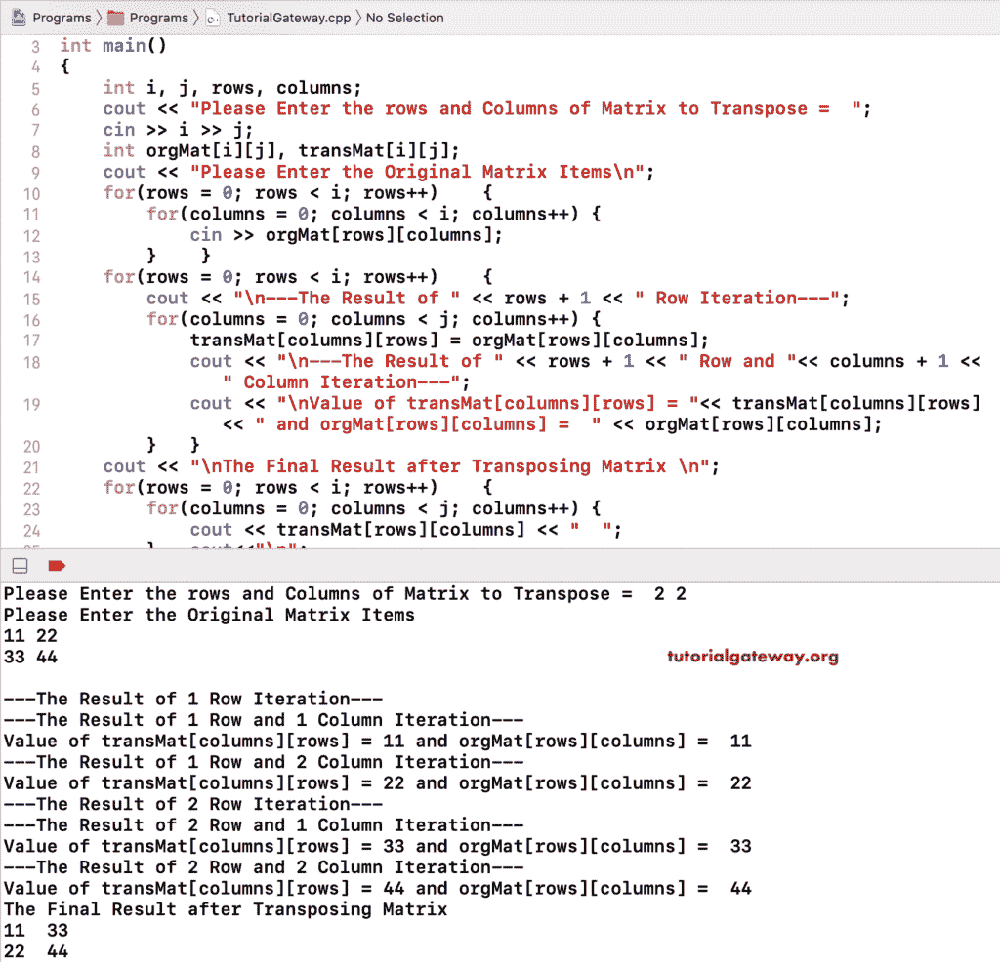

# C++ 程序：转置矩阵

> 原文：<https://www.tutorialgateway.org/cpp-program-to-transpose-a-matrix/>

用例子写一个 C++ 程序来转置矩阵。在 C++ 嵌套 for 循环中，我们将原始矩阵行列值分配给列行位置。接下来，我们使用另一个嵌套 for 循环来打印转置的矩阵输出。

```cpp
#include<iostream>
using namespace std;

int main()
{
	int i, j, rows, columns;

	cout << "\nPlease Enter the rows and Columns =  ";
	cin >> i >> j;

	int orgMat[i][j], transMat[i][j];

	cout << "\nPlease Enter the Original Items\n";
	for(rows = 0; rows < i; rows++)	{
		for(columns = 0; columns < i; columns++) {
			cin >> orgMat[rows][columns];
		}	
	}	
	for(rows = 0; rows < i; rows++)	{
		for(columns = 0; columns < j; columns++) {
			transMat[columns][rows] = orgMat[rows][columns];
		}
	}
	cout << "\nThe Final Result after Transposing \n";
	for(rows = 0; rows < i; rows++)	{
		for(columns = 0; columns < j; columns++) {
			cout << transMat[rows][columns] << "  ";
		}
		cout<<"\n";
	}
 	return 0;
}
```

```cpp
Please Enter the rows and Columns =  3 3

Please Enter the Original Items
10 20 30
40 50 60
70 80 90

The Final Result after Transposing
10  40  70  
20  50  80  
30  60  90 
```

## 转置矩阵的 C++ 程序示例

在这个 [C++](https://www.tutorialgateway.org/cpp-programs/) 的例子中，我们使用了额外的 cout 语句来显示每次迭代时的行、列值、原始项目值和转置的矩阵项目值。

```cpp
#include<iostream>
using namespace std;

int main()
{
	int i, j, rows, columns;

	cout << "\nPlease Enter the rows and Columns of Matrix to Transpose =  ";
	cin >> i >> j;

	int orgMat[i][j], transMat[i][j];

	cout << "\nPlease Enter the Original Matrix Items\n";
	for(rows = 0; rows < i; rows++)	{
		for(columns = 0; columns < i; columns++) {
			cin >> orgMat[rows][columns];
		}	
	}	
	for(rows = 0; rows < i; rows++)	{
		cout << "\n---The Result of " << rows + 1 << " Row Iteration---";
		for(columns = 0; columns < j; columns++) {
			transMat[columns][rows] = orgMat[rows][columns];

			cout << "\n---The Result of " << rows + 1 << " Row and "<< columns + 1 << " Column Iteration---";
			cout << "\nValue of transMat[columns][rows] = "<< transMat[columns][rows] << " and orgMat[rows][columns] =  " << orgMat[rows][columns];
		}
	}
	cout << "\nThe Final Result after Transposing Matrix \n";
	for(rows = 0; rows < i; rows++)	{
		for(columns = 0; columns < j; columns++) {
			cout << transMat[rows][columns] << "  ";
		}
		cout<<"\n";
	}
 	return 0;
}
```

