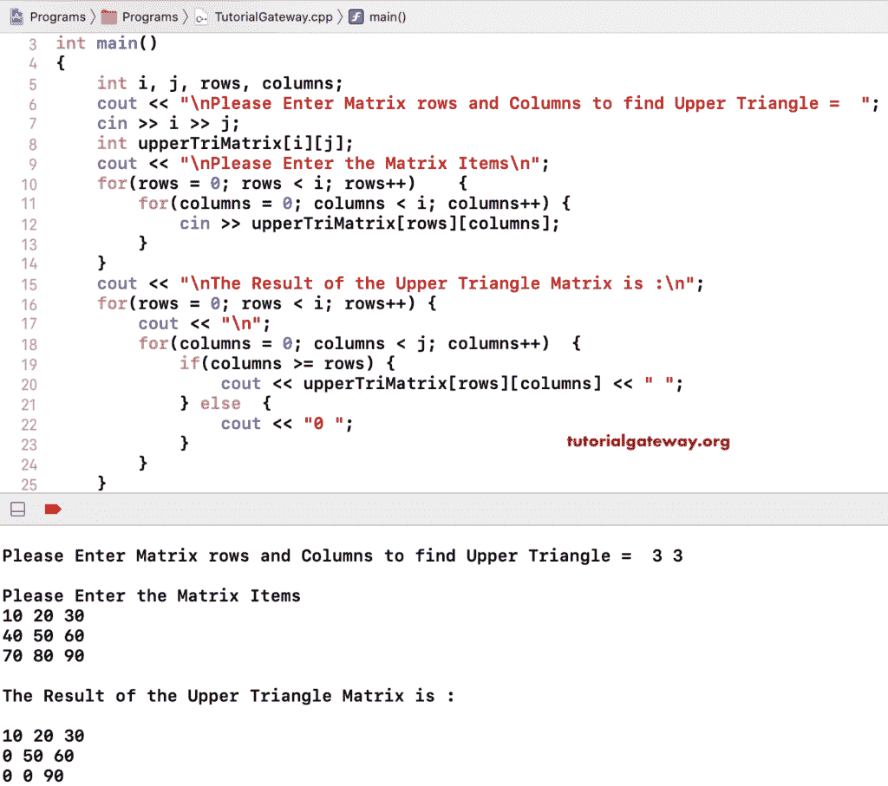

# C++ 程序：打印矩阵的上三角

> 原文：<https://www.tutorialgateway.org/cpp-program-to-print-upper-triangle-of-a-matrix/>

用例子写一个 C++ 程序打印矩阵的上三角。下图显示了矩阵上三角形。


在这个 C++ 矩阵上三角的例子中，我们使用嵌套 for 循环来迭代上三角矩阵的行和列。其中，我们使用 C++ If Else 语句(If(列> =行))来检查列值是否大于或等于行值。如果为真，则在该位置打印上部矩阵项目；否则，在该位置打印 0。

```cpp
#include<iostream>
using namespace std;

int main()
{
	int i, j, rows, columns;

	cout << "\nPlease Enter Matrix rows and Columns to find Upper Triangle =  ";
	cin >> i >> j;

	int upperTriMatrix[i][j];

	cout << "\nPlease Enter the Matrix Items\n";
	for(rows = 0; rows < i; rows++)	{
		for(columns = 0; columns < i; columns++) {
			cin >> upperTriMatrix[rows][columns];
		}		
	}

 	cout << "\nThe Result of the Upper Triangle Matrix is :\n";
 	for(rows = 0; rows < i; rows++)
  	{
  		cout << "\n";
   		for(columns = 0; columns < j; columns++)
    	{
    		if(columns >= rows)
    		{
    			cout << upperTriMatrix[rows][columns] << " ";
			}
			else
			{
				cout << "0 ";
			}
   	 	}
  	}	

 	return 0;
}
```



在这个 [C++](https://www.tutorialgateway.org/cpp-programs/) 矩阵上三角形的例子中，我们使用了额外的 cout 语句来显示迭代方式的行值、列值和上矩阵[行][列]值。

```cpp
#include<iostream>
using namespace std;

int main()
{
	int i, j, rows, columns;

	cout << "\nPlease Enter Matrix rows and Columns to find Upper Triangle =  ";
	cin >> i >> j;

	int upperTriMatrix[i][j];

	cout << "\nPlease Enter the Matrix Items\n";
	for(rows = 0; rows < i; rows++)	{
		for(columns = 0; columns < i; columns++) {
			cin >> upperTriMatrix[rows][columns];
		}		
	}

 	cout << "\nThe Result of the Upper Triangle Matrix is :\n";
 	for(rows = 0; rows < i; rows++)
  	{
  		cout << "\n";
  		cout << "\nRow Iteration = " << rows + 1 << ", Row Number = " << rows;
   		for(columns = 0; columns < j; columns++)
    	{
    		cout << "\nColumn Iteration = " << columns + 1 << ", Column Number = " << 
			  	columns << ", and Row Number = " << rows;
			cout << "\nThe result of (columns >= rows) = " << (columns >= rows) << 
				" and upperTriMatrix[" << rows << "][" << columns << "] = " << upperTriMatrix[rows][columns] << endl;
    		if(columns >= rows)
    		{
    			cout << upperTriMatrix[rows][columns] << " ";
			}
			else
			{
				cout << "0 ";
			}
   	 	}
  	}	

 	return 0;
}
```

```cpp
Please Enter Matrix rows and Columns to find Upper Triangle =  2 2

Please Enter the Matrix Items
10 20
30 40

The Result of the Upper Triangle Matrix is :

Row Iteration = 1, Row Number = 0
Column Iteration = 1, Column Number = 0, and Row Number = 0
The result of (columns >= rows) = 1 and upperTriMatrix[0][0] = 10
10 
Column Iteration = 2, Column Number = 1, and Row Number = 0
The result of (columns >= rows) = 1 and upperTriMatrix[0][1] = 20
20 

Row Iteration = 2, Row Number = 1
Column Iteration = 1, Column Number = 0, and Row Number = 1
The result of (columns >= rows) = 0 and upperTriMatrix[1][0] = 30
0 
Column Iteration = 2, Column Number = 1, and Row Number = 1
The result of (columns >= rows) = 1 and upperTriMatrix[1][1] = 40
40
```

## 用 While 循环打印矩阵上三角的 C++ 程序

```cpp
#include<iostream>
using namespace std;

int main()
{
	int i, j, rows, columns;

	cout << "\nPlease Enter Matrix rows and Columns to find Upper Triangle =  ";
	cin >> i >> j;

	int upperTriMatrix[i][j];

	cout << "\nPlease Enter the Matrix Items\n";
	for(rows = 0; rows < i; rows++)	{
		for(columns = 0; columns < i; columns++) {
			cin >> upperTriMatrix[rows][columns];
		}		
	}

 	cout << "\nThe Result of the Upper Triangle Matrix is :\n";
 	rows = 0; 
 	while(rows < i)
  	{
  		cout << "\n";
  		columns = 0; 
   		while(columns < j)
    	{
    		if(columns >= rows)
    		{
    			cout << upperTriMatrix[rows][columns] << " ";
			}
			else
			{
				cout << "0 ";
			}
			columns++;
   	 	}
   	 	rows++;
  	}	

 	return 0;
}
```

```cpp
Please Enter Matrix rows and Columns to find Upper Triangle =  3 3

Please Enter the Matrix Items
11 22 33
44 55 66
77 88 99

The Result of the Upper Triangle Matrix is :

11 22 33 
0 55 66 
0 0 99 
```