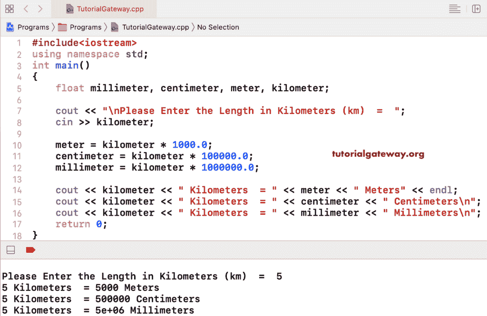

# C++ 程序：将千米转换成米厘米和毫米

> 原文：<https://www.tutorialgateway.org/cpp-program-to-convert-kilometer-to-meters-centimeters-and-millimeters/>

写一个 C++ 程序把千米转换成米厘米和毫米。或者 C++ 程序，它接受千米作为输入，并将千米转换为米、厘米和毫米。

```cpp
#include<iostream>

using namespace std;

int main()
{
	float millimeter, centimeter, meter, kilometer;

	cout << "\nPlease Enter the Length in Kilometers (km)  =  ";
	cin >> kilometer;

	meter = kilometer * 1000.0;
  	centimeter = kilometer * 100000.0; 	
  	millimeter = kilometer * 1000000.0; 	

	cout << kilometer << " Kilometers  = " << meter << " Meters" << endl;
	cout << kilometer << " Kilometers  = " << centimeter << " Centimeters" << endl;
	cout << kilometer << " Kilometers  = " << millimeter << " Millimeters";

 	return 0;
}
```

将公里转换为米、厘米和毫米的输出

