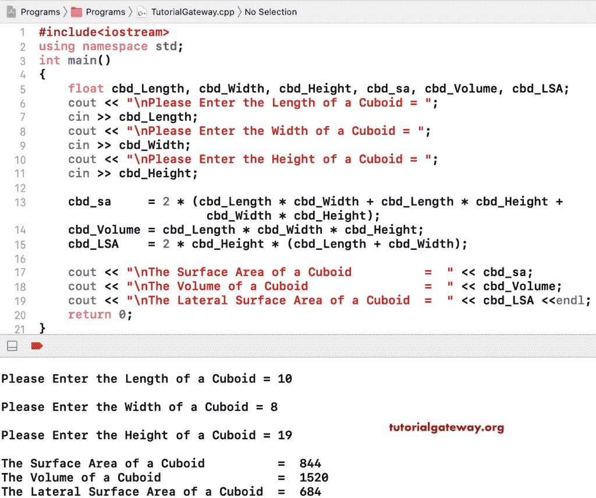

# C++ 程序：求长方体的体积和表面积

> 原文：<https://www.tutorialgateway.org/cpp-program-to-find-volume-and-surface-area-of-a-cuboid/>

用一个例子写一个 C++ 程序求长方体的体积和表面积。这个 C++ 程序允许用户输入长方体的长度、宽度和高度。接下来，我们使用数学公式计算长方体的表面积、体积和侧面表面积。他们是

*   长方体的 C++ 体积= 1 磅
*   [C++](https://www.tutorialgateway.org/cpp-programs/) 长方体的表面积= 2(lw + lh + wh)
*   C++ 长方体的侧面面积= 2h(l + w)

其中 l =长度，b =宽度，h =高度，w =宽度

```cpp
#include<iostream>
using namespace std;

int main()
{
	float cbd_Length, cbd_Width, cbd_Height, cbd_sa, cbd_Volume, cbd_LSA;

	cout << "\nPlease Enter the Length of a Cuboid = ";
	cin >> cbd_Length;

	cout << "\nPlease Enter the Width of a Cuboid = ";
	cin >> cbd_Width;

	cout << "\nPlease Enter the Height of a Cuboid = ";
	cin >> cbd_Height;

	cbd_sa     = 2 * (cbd_Length * cbd_Width + cbd_Length * cbd_Height + cbd_Width * cbd_Height);
	cbd_Volume = cbd_Length * cbd_Width * cbd_Height;
	cbd_LSA    = 2 * cbd_Height * (cbd_Length + cbd_Width);

	cout << "\nThe Surface Area of a Cuboid          =  " << cbd_sa;
	cout << "\nThe Volume of a Cuboid                =  " << cbd_Volume;
	cout << "\nThe Lateral Surface Area of a Cuboid  =  " << cbd_LSA;

 	return 0;
}
```

