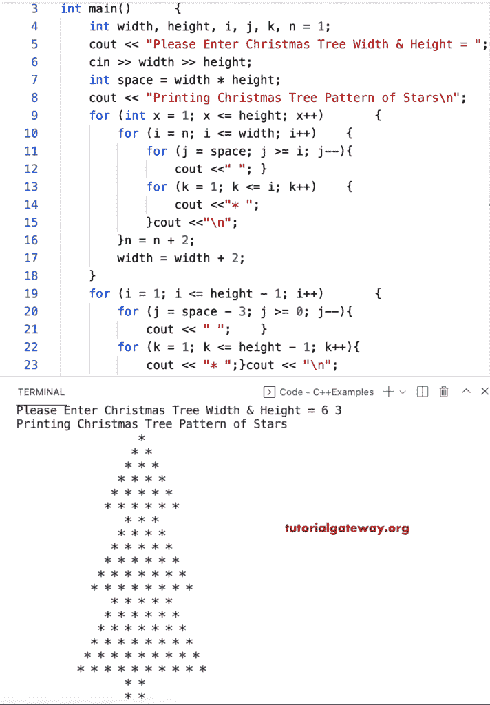

# C++ 程序：打印星号的圣诞树图案

> 原文：<https://www.tutorialgateway.org/cpp-program-to-print-christmas-tree-star-pattern/>

写一个 C++ 程序，用 for 循环打印星号的圣诞树图案。

```cpp
#include<iostream>
using namespace std;

int main()
{
	int width, height, i, j, k, n = 1;

	cout << "Please Enter Christmas Tree Width & Height = ";
	cin >> width >> height;

	int space = width * height;

	cout << "Printing Christmas Tree Pattern of Stars\n";

	for (int x = 1; x <= height; x++)
	{
		for (i = n; i <= width; i++)
		{
			for (j = space; j >= i; j--)
			{
				cout <<" ";
			}
			for (k = 1; k <= i; k++)
			{
				cout <<"* ";
			}
			cout <<"\n";
		}
		n = n + 2;
		width = width + 2;
	}
	for (i = 1; i <= height - 1; i++)
	{
		for (j = space - 3; j >= 0; j--)
		{
			cout << " ";
		}
		for (k = 1; k <= height - 1; k++)
		{
			cout << "* ";
		}
		cout << "\n";
	}
}
```



这个 [C++ 例子](https://www.tutorialgateway.org/cpp-programs/)使用 while 循环打印了星星的圣诞树图案。

```cpp
#include<iostream>
using namespace std;

void ChristmasTreePattern(int width, int height, char ch)
{
	int space = width * height;
	int i, j, k, n = 1;

	for (int x = 1; x <= height; x++ ) 
	{
		for (i = n; i <= width; i++ )
		{
			for(j = space; j >= i; j--)
			{
				cout << " ";
			}
			for(k = 1; k <= i; k++)
			{
				cout << ch << " ";
			}
			cout << "\n";
		}
		n = n + 2;
		width = width + 2;		
	}
	for(i = 1; i <= height - 1; i++)
	{
		for(j = space - 3; j >= 0; j--)
		{
			cout << " ";
		}
		for(k = 1; k <= height - 1; k++)
		{
			cout << ch << " ";
		}
		cout << "\n";
	}	
}

int main()
{
	int width, height, i, j, k, n = 1;
	char ch;

	cout << "\nEnter Character for Christmas Tree Pattern = ";
	cin >> ch;

	cout << "Please Enter Christmas Tree Width & Height = ";
	cin >> width>>height;

	int space = width * height;

	cout << "Printing Christmas Tree Pattern of Stars\n";
	ChristmasTreePattern(width, height, ch);	
}
```

```cpp
Enter Character for Christmas Tree Pattern = *
Please Enter Christmas Tree Width & Height = 8 5
Printing Christmas Tree Pattern of Stars
                                        * 
                                       * * 
                                      * * * 
                                     * * * * 
                                    * * * * * 
                                   * * * * * * 
                                  * * * * * * * 
                                 * * * * * * * * 
                                      * * * 
                                     * * * * 
                                    * * * * * 
                                   * * * * * * 
                                  * * * * * * * 
                                 * * * * * * * * 
                                * * * * * * * * * 
                               * * * * * * * * * * 
                                    * * * * * 
                                   * * * * * * 
                                  * * * * * * * 
                                 * * * * * * * * 
                                * * * * * * * * * 
                               * * * * * * * * * * 
                              * * * * * * * * * * * 
                             * * * * * * * * * * * * 
                                  * * * * * * * 
                                 * * * * * * * * 
                                * * * * * * * * * 
                               * * * * * * * * * * 
                              * * * * * * * * * * * 
                             * * * * * * * * * * * * 
                            * * * * * * * * * * * * * 
                           * * * * * * * * * * * * * * 
                                * * * * * * * * * 
                               * * * * * * * * * * 
                              * * * * * * * * * * * 
                             * * * * * * * * * * * * 
                            * * * * * * * * * * * * * 
                           * * * * * * * * * * * * * * 
                          * * * * * * * * * * * * * * * 
                         * * * * * * * * * * * * * * * * 
                                      * * * * 
                                      * * * * 
                                      * * * * 
                                      * * * * 
```