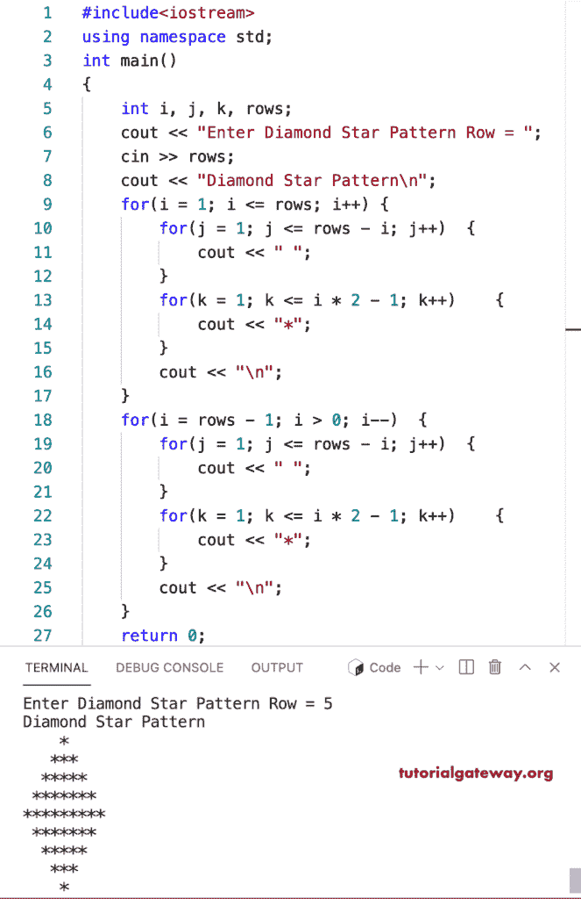

# C++ 程序：打印星号的菱形图案

> 原文：<https://www.tutorialgateway.org/cpp-program-to-print-diamond-star-pattern/>

写一个 C++ 程序，用 for 循环打印星号的菱形图案。

```cpp
#include<iostream>
using namespace std;

int main()
{
	int i, j, k, rows;

    cout << "Enter Diamond Star Pattern Row = ";
    cin >> rows;

    cout << "Diamond Star Pattern\n"; 

    for(i = 1; i <= rows; i++)
    {
    	for(j = 1; j <= rows - i; j++)
		{
            cout << " ";
        }
        for(k = 1; k <= i * 2 - 1; k++)
        {
            cout << "*";
        }
        cout << "\n";
    }	

    for(i = rows - 1; i > 0; i--)
    {
    	for(j = 1; j <= rows - i; j++)
		{
            cout << " ";
        }
        for(k = 1; k <= i * 2 - 1; k++)
        {
            cout << "*";
        }
        cout << "\n";
    }

 	return 0;
}
```



这个 [C++ 示例](https://www.tutorialgateway.org/cpp-programs/)使用 while 循环打印给定符号的菱形图案。

```cpp
#include<iostream>
using namespace std;

int main()
{
	int i = 1, j, k, rows;
    char ch;

    cout << "Enter Diamond Star Pattern Row = ";
    cin >> rows;

    cout << "Enter Symbol for Diamond Pattern = ";
    cin >> ch;

    cout << "Diamond Star Pattern\n"; 

    while(i <= rows)
    {
        j = 1;
    	while( j <= rows - i)
		{
            cout << " ";
            j++;
        }
        k = 1;
        while( k <= i * 2 - 1)
        {
            cout << ch;
            k++;
        }
        cout << "\n";
        i++;
    }	

    i = rows - 1;
    while( i > 0)
    {
    	j = 1;
    	while( j <= rows - i)
		{
            cout << " ";
            j++;
        }
        k = 1;
        while( k <= i * 2 - 1)
        {
            cout << ch;
            k++;
        }
        cout << "\n";
        i--;
    }	
 	return 0;
}
```

```cpp
Enter Diamond Star Pattern Row = 12
Enter Symbol for Diamond Pattern = #
Diamond Star Pattern
           #
          ###
         #####
        #######
       #########
      ###########
     #############
    ###############
   #################
  ###################
 #####################
#######################
 #####################
  ###################
   #################
    ###############
     #############
      ###########
       #########
        #######
         #####
          ###
           #
```