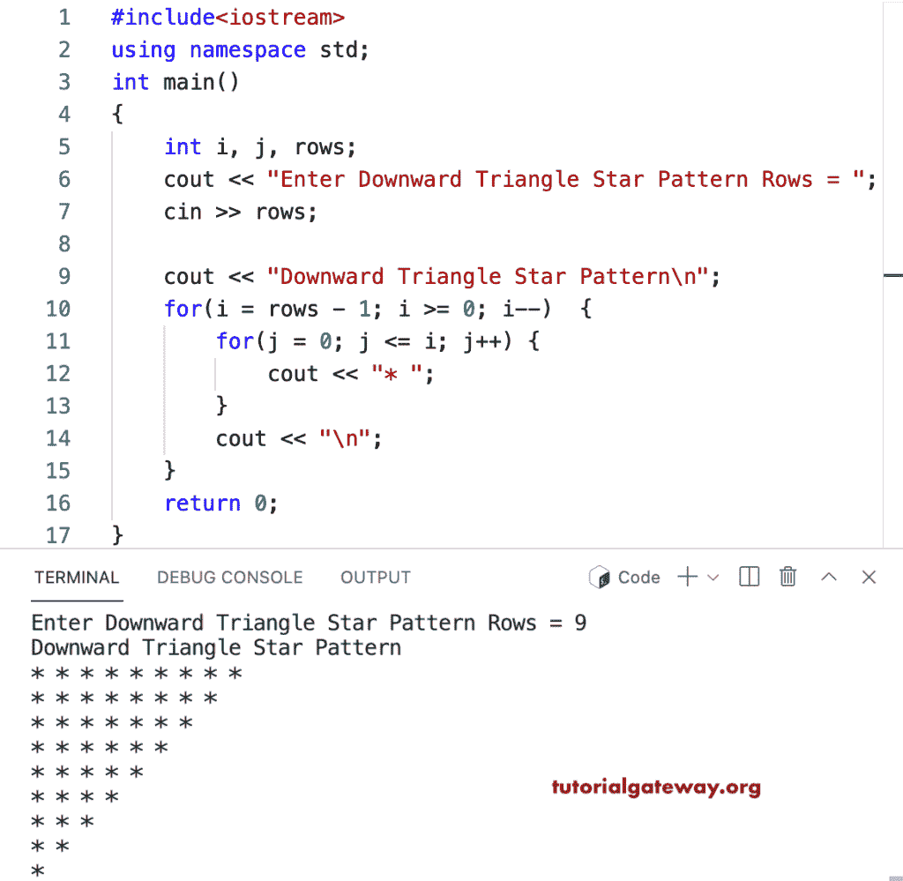

# C++ 程序：打印星号的向下三角形图案

> 原文：<https://www.tutorialgateway.org/cpp-program-to-print-downward-triangle-star-pattern/>

写一个 C++ 程序，用 for 循环打印星号的向下的三角形图案。

```cpp
#include<iostream>
using namespace std;

int main()
{
	int i, j, rows;

    cout << "Enter Downward Triangle Star Pattern Rows = ";
    cin >> rows;

    cout << "Downward Triangle Star Pattern\n"; 

    for(i = rows - 1; i >= 0; i--)
    {
    	for(j = 0; j <= i; j++)
		{
            cout << "* ";
        }
        cout << "\n";
    }		
 	return 0;
}
```



这个 [C++ 例子](https://www.tutorialgateway.org/cpp-programs/)使用 while 循环显示给定符号的向下三角形模式。

```cpp
#include<iostream>
using namespace std;

int main()
{
	int i, j, rows;
    char ch;

    cout << "Enter Downward Triangle Star Pattern Rows = ";
    cin >> rows;

    cout << "Enter Symbol for Downward Triangle Star Pat = ";
    cin >> ch;

    cout << "Downward Triangle Pattern of Given Symbol\n"; 

    i = rows - 1;
    while( i >= 0)
    {
        j = 0; 
    	while(j <= i)
		{
            cout << ch << " ";
            j++;
        }
        cout << "\n";
        i--;
    }		
 	return 0;
}
```

```cpp
Enter Downward Triangle Star Pattern Rows = 15
Enter Symbol for Downward Triangle Star Pat = @
Downward Triangle Pattern of Given Symbol
@ @ @ @ @ @ @ @ @ @ @ @ @ @ @ 
@ @ @ @ @ @ @ @ @ @ @ @ @ @ 
@ @ @ @ @ @ @ @ @ @ @ @ @ 
@ @ @ @ @ @ @ @ @ @ @ @ 
@ @ @ @ @ @ @ @ @ @ @ 
@ @ @ @ @ @ @ @ @ @ 
@ @ @ @ @ @ @ @ @ 
@ @ @ @ @ @ @ @ 
@ @ @ @ @ @ @ 
@ @ @ @ @ @ 
@ @ @ @ @ 
@ @ @ @ 
@ @ @ 
@ @ 
@ 
```