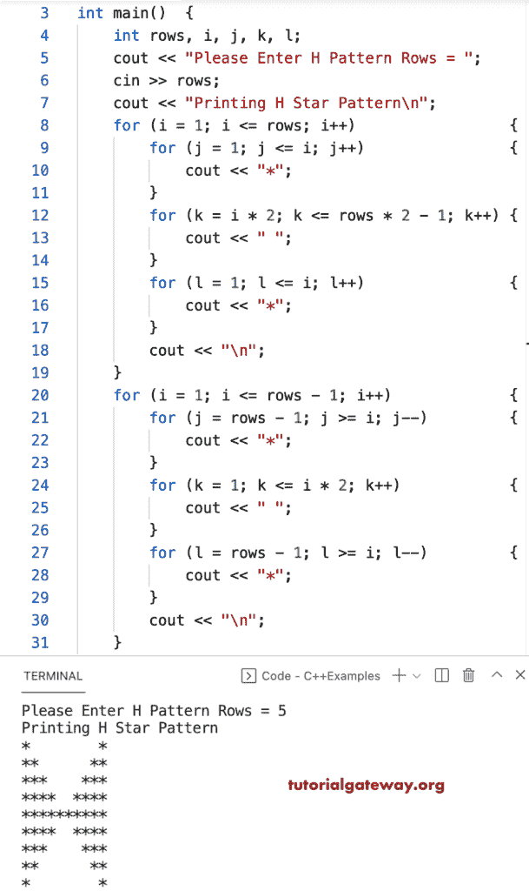

# C++ 程序：打印`H`星形图案

> 原文：<https://www.tutorialgateway.org/cpp-program-to-print-h-star-pattern/>

写一个 C++ 程序，用 for 循环打印 H 星形模式。

```cpp
#include<iostream>
using namespace std;

int main()
{
	int rows, i, j, k, l;

	cout << "Please Enter H Pattern Rows = ";
	cin >> rows;

	cout << "Printing H Star Pattern\n";

	for (i = 1; i <= rows; i++)
	{
		for (j = 1; j <= i; j++)
		{
			cout << "*";
		}
		for (k = i * 2; k <= rows * 2 - 1; k++)
		{
			cout << " ";
		}
		for (l = 1; l <= i; l++)
		{
			cout << "*";
		}
		cout << "\n";
	}

	for (i = 1; i <= rows - 1; i++)
	{
		for (j = rows - 1; j >= i; j--)
		{
			cout << "*";
		}
		for (k = 1; k <= i * 2; k++)
		{
			cout << " ";
		}
		for (l = rows - 1; l >= i; l--)
		{
			cout << "*";
		}
		cout << "\n";
	}
}
```



这个 C++ 程序使用 while 循环显示恒星的 H 字母模式。

```cpp
#include<iostream>
using namespace std;

int main()
{
	int rows, i, j, k, l;

	cout << "Please Enter H Pattern Rows = ";
	cin >> rows;

	cout << "Printing H Star Pattern\n";
	i = 1;
	while (i <= rows)
	{
		j = 1;
		while (j <= i)
		{
			cout << "*";
			j++;
		}
		k = i * 2;
		while (k <= rows * 2 - 1)
		{
			cout << " ";
			k++;
		}
		l = 1;
		while (l <= i)
		{
			cout << "*";
			l++;
		}
		cout << "\n";
		i++;
	}

	i = 1;
	while (i <= rows - 1)
	{
		j = rows - 1;
		while (j >= i)
		{
			cout << "*";
			j--;
		}
		k = 1;
		while (k <= i * 2)
		{
			cout << " ";
			k++;
		}
		l = rows - 1;
		while (l >= i)
		{
			cout << "*";
			l--;
		}
		cout << "\n";
		i++;
	}
}
```

```cpp
Please Enter H Pattern Rows = 10
Printing H Star Pattern
*                  *
**                **
***              ***
****            ****
*****          *****
******        ******
*******      *******
********    ********
*********  *********
********************
*********  *********
********    ********
*******      *******
******        ******
*****          *****
****            ****
***              ***
**                **
```

## 用边做边循环打印`H`星形图案的 C++ 程序

```cpp
#include<iostream>
using namespace std;

int main()
{
	int rows, i, j, k, l;

	cout << "Please Enter H Pattern Rows = ";
	cin >> rows;

	cout << "Printing H Star Pattern\n";
	i = 1;
	do
	{
		j = 1;
		do
		{
			cout << "*";
		} while (++j <= i);
		k = i * 2;
		while (k <= rows * 2 - 1)
		{
			cout << " ";
			k++;
		}
		l = 1;
		do
		{
			cout << "*";
		} while (++l <= i);
		cout << "\n";
	} while (++i <= rows);

	i = 1;
	do
	{
		j = rows - 1;
		do
		{
			cout << "*";
		} while (--j >= i);
		k = 1;
		do
		{
			cout << " ";
		} while (++k <= i * 2);
		l = rows - 1;
		do
		{
			cout << "*";
		} while (--l >= i);
		cout << "\n";
	} while (++i <= rows - 1);
}
```

```cpp
Please Enter H Pattern Rows = 13
Printing H Star Pattern
*                        *
**                      **
***                    ***
****                  ****
*****                *****
******              ******
*******            *******
********          ********
*********        *********
**********      **********
***********    ***********
************  ************
**************************
************  ************
***********    ***********
**********      **********
*********        *********
********          ********
*******            *******
******              ******
*****                *****
****                  ****
***                    ***
**                      **
*                        *
```

在这个 [C++ 例子](https://www.tutorialgateway.org/cpp-programs/)中，hppattern 函数允许用户输入字符并打印给定字符的 H 模式。

```cpp
#include<iostream>
using namespace std;

void HPattern(int rows, char ch)
{
	int i, j, k, l;

	for (i = 1; i <= rows; i++)
	{
		for (j = 1; j <= i; j++)
		{
			cout << ch;
		}
		for (k = i * 2; k <= rows * 2 - 1; k++)
		{
			cout << " ";
		}
		for (l = 1; l <= i; l++)
		{
			cout << ch;
		}
		cout << "\n";
	}

	for (i = 1; i <= rows - 1; i++)
	{
		for (j = rows - 1; j >= i; j--)
		{
			cout << ch;
		}
		for (k = 1; k <= i * 2; k++)
		{
			cout << " ";
		}
		for (l = rows - 1; l >= i; l--)
		{
			cout << ch;
		}
		cout << "\n";
	}
}

int main()
{
	int rows;
	char ch;

	cout << "Please Enter H Pattern Rows = ";
	cin >> rows;

	cout << "Enter Character for H Pattern = ";
	cin >> ch;

	cout << "Printing H Pattern\n";
	HPattern(rows, ch);
}
```

```cpp
Please Enter H Pattern Rows = 15
Enter Character for H Pattern = &
Printing H Pattern
&                            &
&&                          &&
&&&                        &&&
&&&&                      &&&&
&&&&&                    &&&&&
&&&&&&                  &&&&&&
&&&&&&&                &&&&&&&
&&&&&&&&              &&&&&&&&
&&&&&&&&&            &&&&&&&&&
&&&&&&&&&&          &&&&&&&&&&
&&&&&&&&&&&        &&&&&&&&&&&
&&&&&&&&&&&&      &&&&&&&&&&&&
&&&&&&&&&&&&&    &&&&&&&&&&&&&
&&&&&&&&&&&&&&  &&&&&&&&&&&&&&
&&&&&&&&&&&&&&&&&&&&&&&&&&&&&&
&&&&&&&&&&&&&&  &&&&&&&&&&&&&&
&&&&&&&&&&&&&    &&&&&&&&&&&&&
&&&&&&&&&&&&      &&&&&&&&&&&&
&&&&&&&&&&&        &&&&&&&&&&&
&&&&&&&&&&          &&&&&&&&&&
&&&&&&&&&            &&&&&&&&&
&&&&&&&&              &&&&&&&&
&&&&&&&                &&&&&&&
&&&&&&                  &&&&&&
&&&&&                    &&&&&
&&&&                      &&&&
&&&                        &&&
&&                          &&
&                            &
```