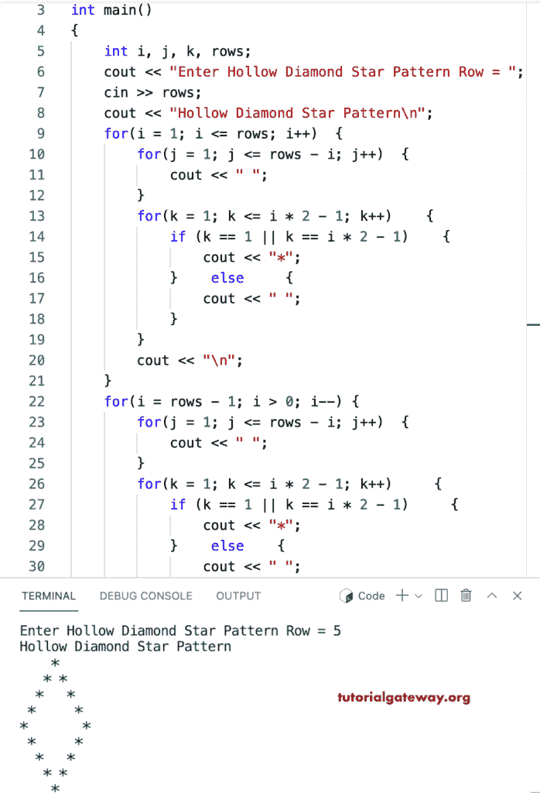

# C++ 程序：打印空心菱形星形图案

> 原文：<https://www.tutorialgateway.org/cpp-program-to-print-hollow-diamond-star-pattern/>

写一个 C++ 程序打印空心菱形星形图案用于循环。

```cpp
#include<iostream>
using namespace std;

int main()
{
	int i, j, k, rows;

    cout << "Enter Hollow Diamond Star Pattern Row = ";
    cin >> rows;

    cout << "Hollow Diamond Star Pattern\n"; 

    for(i = 1; i <= rows; i++)
    {
    	for(j = 1; j <= rows - i; j++)
		{
            cout << " ";
        }
        for(k = 1; k <= i * 2 - 1; k++)
        {
            if (k == 1 || k == i * 2 - 1)
            {
                cout << "*";
            }
            else
            {
                cout << " ";
            }
        }
        cout << "\n";
    }	

    for(i = rows - 1; i > 0; i--)
    {
    	for(j = 1; j <= rows - i; j++)
		{
            cout << " ";
        }
        for(k = 1; k <= i * 2 - 1; k++)
        {
            if (k == 1 || k == i * 2 - 1)
            {
                cout << "*";
            }
            else
            {
                cout << " ";
            }
        }
        cout << "\n";
    }

 	return 0;
}
```



这个 [C++ 示例](https://www.tutorialgateway.org/cpp-programs/)使用 while 循环打印给定字符的空心菱形图案。

```cpp
#include<iostream>
using namespace std;

int main()
{
	int i = 1, j, k, rows;
    char ch;

    cout << "Enter Hollow Diamond Star Pattern Row = ";
    cin >> rows;

    cout << "Enter Symbol for Hollow Diamond Pattern = ";
    cin >> ch;

    cout << "Hollow Diamond Star Pattern\n"; 

    while(i <= rows)
    {
        j = 1;
    	while( j <= rows - i)
		{
            cout << " ";
            j++;
        }
        k = 1;
        while( k <= i * 2 - 1)
        {
            if (k == 1 || k == i * 2 - 1)
            {
                cout << ch;
            }
            else
            {
                cout << " ";
            }
            k++;
        }
        cout << "\n";
        i++;
    }	

    i = rows - 1;
    while( i > 0)
    {
    	j = 1;
    	while( j <= rows - i)
		{
            cout << " ";
            j++;
        }
        k = 1;
        while( k <= i * 2 - 1)
        {
            if (k == 1 || k == i * 2 - 1)
            {
                cout << ch;
            }
            else
            {
                cout << " ";
            }
            k++;
        }
        cout << "\n";
        i--;
    }

 	return 0;
}
```

```cpp
Enter Hollow Diamond Star Pattern Row = 15
Enter Symbol for Hollow Diamond Pattern = $
Hollow Diamond Star Pattern
              $
             $ $
            $   $
           $     $
          $       $
         $         $
        $           $
       $             $
      $               $
     $                 $
    $                   $
   $                     $
  $                       $
 $                         $
$                           $
 $                         $
  $                       $
   $                     $
    $                   $
     $                 $
      $               $
       $             $
        $           $
         $         $
          $       $
           $     $
            $   $
             $ $
              $
```