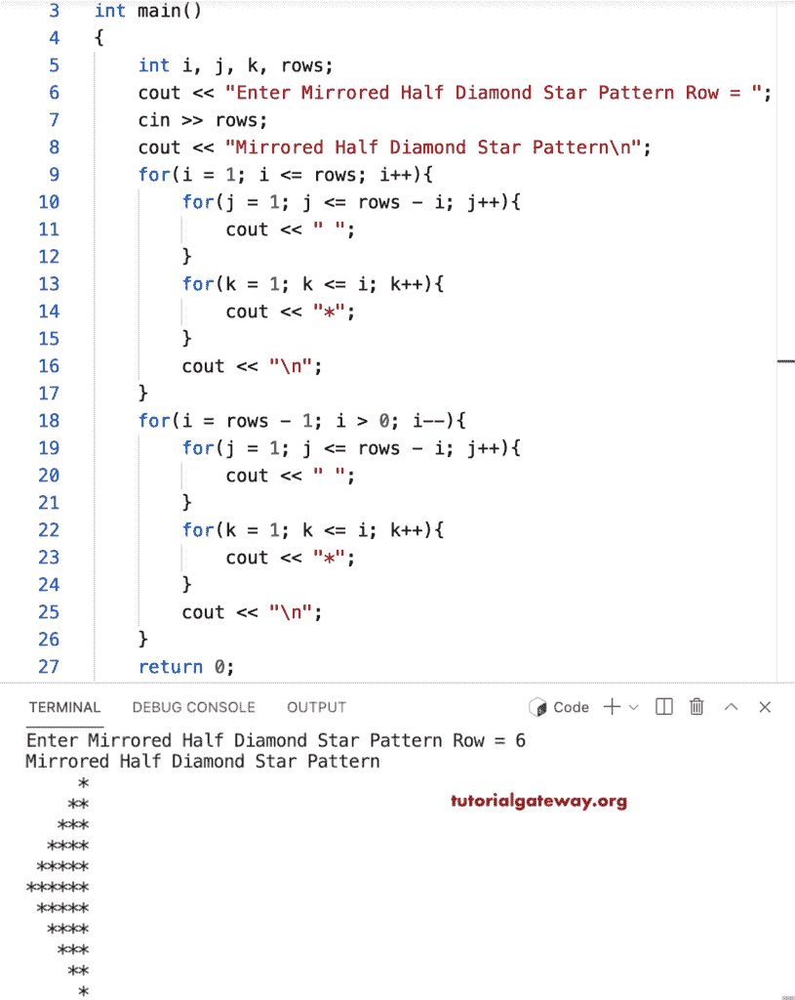

# C++ 程序：打印星号的镜像半菱形图案

> 原文：<https://www.tutorialgateway.org/cpp-program-to-print-mirrored-half-diamond-star-pattern/>

写一个 C++ 程序，用 for 循环打印星号的镜像的半菱形图案。

```cpp
#include<iostream>
using namespace std;

int main()
{
	int i, j, k, rows;

    cout << "Enter Mirrored Half Diamond Star Pattern Row = ";
    cin >> rows;

    cout << "Mirrored Half Diamond Star Pattern\n"; 

    for(i = 1; i <= rows; i++)
    {
    	for(j = 1; j <= rows - i; j++)
		{
            cout << " ";
        }
        for(k = 1; k <= i; k++)
		{
            cout << "*";
        }
        cout << "\n";
    }	

    for(i = rows - 1; i > 0; i--)
    {
    	for(j = 1; j <= rows - i; j++)
		{
            cout << " ";
        }
        for(k = 1; k <= i; k++)
		{
            cout << "*";
        }
        cout << "\n";
    }	
 	return 0;
}
```



这个 [C++ 示例](https://www.tutorialgateway.org/cpp-programs/)使用 while 循环打印给定角色的镜像半菱形图案。

```cpp
#include<iostream>
using namespace std;

int main()
{
	int i = 1, j, k, rows;
    char ch;

    cout << "Enter Mirrored Half Diamond Star Pattern Row = ";
    cin >> rows;

    cout << "Enter Symbol Mirrored Half Diamond Pattern = ";
    cin >> ch;

    cout << "Mirrored Half Diamond Star Pattern\n"; 

    while(i <= rows)
    {
        j = 1;
    	while( j <= rows - i)
		{
            cout << " ";
            j++;
        }
        k = 1;
        while( k <= i)
		{
            cout << ch;
            k++;
        }
        cout << "\n";
        i++;
    }	

    i = rows - 1;
    while( i > 0)
    {
    	j = 1;
    	while( j <= rows - i)
		{
            cout << " ";
            j++;
        }
        k = 1;
        while( k <= i)
		{
            cout << ch;
            k++;
        }
        cout << "\n";
        i--;
    }	
 	return 0;
}
```

```cpp
Enter Mirrored Half Diamond Star Pattern Row = 9
Enter Symbol Mirrored Half Diamond Pattern = $
Mirrored Half Diamond Star Pattern
        $
       $$
      $$$
     $$$$
    $$$$$
   $$$$$$
  $$$$$$$
 $$$$$$$$
$$$$$$$$$
 $$$$$$$$
  $$$$$$$
   $$$$$$
    $$$$$
     $$$$
      $$$
       $$
        $
```