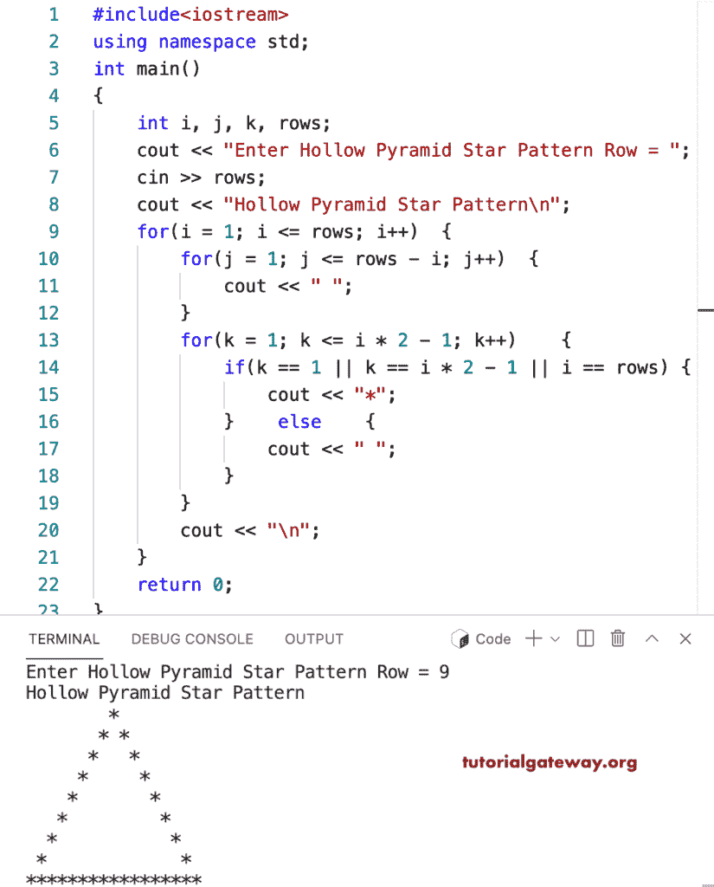

# C++ 程序：打印星号的空心金字塔图案

> 原文：<https://www.tutorialgateway.org/cpp-program-to-print-hollow-star-pyramid-pattern/>

写一个 C++ 程序打印空心星号金字塔图案，用于循环。

```cpp
#include<iostream>
using namespace std;

int main()
{
	int i, j, k, rows;

    cout << "Enter Hollow Pyramid Star Pattern Row = ";
    cin >> rows;

    cout << "Hollow Pyramid Star Pattern\n"; 

    for(i = 1; i <= rows; i++)
    {
    	for(j = 1; j <= rows - i; j++)
		{
            cout << " ";
        }
        for(k = 1; k <= i * 2 - 1; k++)
        {
            if(k == 1 || k == i * 2 - 1 || i == rows)
            {
                cout << "*";
            }
            else
            {
                cout << " ";
            }
        }
        cout << "\n";
    }		
 	return 0;
}
```



这个 [C++ 示例](https://www.tutorialgateway.org/cpp-programs/)使用 while 循环打印给定字符的空心金字塔模式。

```cpp
#include<iostream>
using namespace std;

int main()
{
	int i, j, k, rows;
    char ch;

    cout << "Enter Hollow Pyramid Star Pattern Row = ";
    cin >> rows;

    cout << "Enter Symbol for Hollow Pyramid Pattern = ";
    cin >> ch;

    cout << "Hollow Pyramid Star Pattern\n"; 

    for(i = 1; i <= rows; i++)
    {
    	for(j = 1; j <= rows - i; j++)
		{
            cout << " ";
        }
        for(k = 1; k <= i * 2 - 1; k++)
        {
            if(k == 1 || k == i * 2 - 1 || i == rows)
            {
                cout << ch;
            }
            else
            {
                cout << " ";
            }
        }
        cout << "\n";
    }		
 	return 0;
}
```

```cpp
Enter Hollow Pyramid Star Pattern Row = 14
Enter Symbol for Hollow Pyramid Pattern = &
Hollow Pyramid Star Pattern
             &
            & &
           &   &
          &     &
         &       &
        &         &
       &           &
      &             &
     &               &
    &                 &
   &                   &
  &                     &
 &                       &
&&&&&&&&&&&&&&&&&&&&&&&&&&&
```