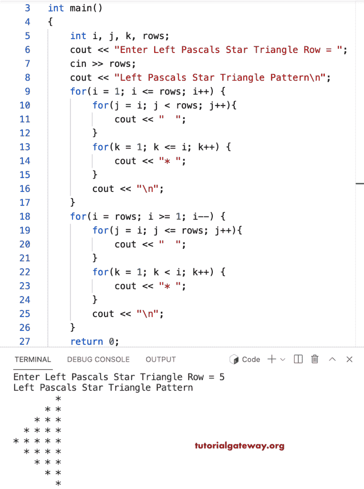

# C++ 程序：打印左帕斯卡星号三角形

> 原文：<https://www.tutorialgateway.org/cpp-program-to-print-left-pascals-star-triangle/>

写一个 C++ 程序，用 for 循环打印左帕斯卡星号三角形。

```cpp
#include<iostream>
using namespace std;

int main()
{
	int i, j, k, rows;

    cout << "Enter Left Pascals Star Triangle Row = ";
    cin >> rows;

    cout << "Left Pascals Star Triangle Pattern\n"; 

    for(i = 1; i <= rows; i++)
    {
    	for(j = i; j < rows; j++)
		{
            cout << "  ";
        }
        for(k = 1; k <= i; k++)
        {
            cout << "* ";
        }
        cout << "\n";
    }	

    for(i = rows; i >= 1; i--)
    {
    	for(j = i; j <= rows; j++)
		{
            cout << "  ";
        }
        for(k = 1; k < i; k++)
        {
            cout << "* ";
        }
        cout << "\n";
    }

 	return 0;
}
```



这个 [C++ 示例](https://www.tutorialgateway.org/cpp-programs/)使用 while 循环打印给定字符的左帕斯卡三角形模式。

```cpp
#include<iostream>
using namespace std;

int main()
{
	int i = 1, j, k, rows;
    char ch;

    cout << "Enter Left Pascals Star Triangle Row = ";
    cin >> rows;

    cout << "Symbol to print Left Pascals Star Triangle = ";
    cin >> ch;

    cout << "Left Pascals Star Triangle Pattern\n"; 

    while(i <= rows)
    {
        j = i;
    	while( j < rows)
		{
            cout << "  ";
            j++;
        }
        k = 1;
        while( k <= i)
        {
            cout << ch << " ";
            k++;
        }
        cout << "\n";
        i++;
    }	

    i = rows;
    while( i >= 1)
    {
        j = i;
    	while( j <= rows)
		{
            cout << "  ";
            j++;
        }
        k = 1;
        while( k < i)
        {
            cout << ch << " ";
            k++;
        }
        cout << "\n";
        i--;
    }	
 	return 0;
}
```

```cpp
Enter Left Pascals Star Triangle Row = 13
Symbol to print Left Pascals Star Triangle = &
Left Pascals Star Triangle Pattern
                        & 
                      & & 
                    & & & 
                  & & & & 
                & & & & & 
              & & & & & & 
            & & & & & & & 
          & & & & & & & & 
        & & & & & & & & & 
      & & & & & & & & & & 
    & & & & & & & & & & & 
  & & & & & & & & & & & & 
& & & & & & & & & & & & & 
  & & & & & & & & & & & & 
    & & & & & & & & & & & 
      & & & & & & & & & & 
        & & & & & & & & & 
          & & & & & & & & 
            & & & & & & & 
              & & & & & & 
                & & & & & 
                  & & & & 
                    & & & 
                      & & 
                        & 
```