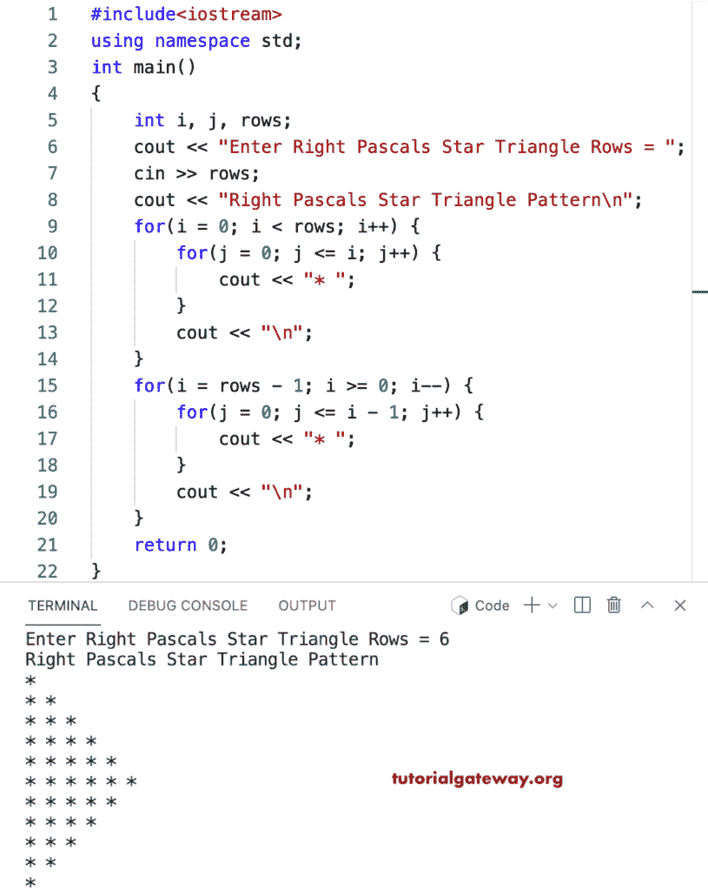

# C++ 程序：打印星号的直角三角形

> 原文：<https://www.tutorialgateway.org/cpp-program-to-print-right-pascals-star-triangle/>

写一个 C++ 程序，用 for 循环打印右帕斯卡星号三角形。

```cpp
#include<iostream>
using namespace std;

int main()
{
	int i, j, rows;

    cout << "Enter Right Pascals Star Triangle Rows = ";
    cin >> rows;

    cout << "Right Pascals Star Triangle Pattern\n"; 

    for(i = 0; i < rows; i++)
    {
    	for(j = 0; j <= i; j++)
		{
            cout << "* ";
        }
        cout << "\n";
    }	

    for(i = rows - 1; i >= 0; i--)
    {
    	for(j = 0; j <= i - 1; j++)
		{
            cout << "* ";
        }
        cout << "\n";
    }	
 	return 0;
}
```



这个 [C++ 示例](https://www.tutorialgateway.org/cpp-programs/)使用 while 循环打印给定字符的右帕斯卡三角形模式。

```cpp
#include<iostream>
using namespace std;

int main()
{
	int i = 0, j, rows;
    char ch;

    cout << "Enter Right Pascals Star Triangle Rows = ";
    cin >> rows;

    cout << "Enter Symbol for Right Pascals Triangle = ";
    cin >> ch;

    cout << "Right Pascals Star Triangle Pattern\n"; 

    while( i < rows)
    {
        j = 0;
    	while( j <= i)
		{
            cout << ch << " ";
            j++;
        }
        cout << "\n";
        i++;
    }	

    i = rows - 1; 
    while(i >= 0)
    {
        j = 0; 
    	while(j <= i - 1)
		{
            cout << ch << " ";
            j++;
        }
        cout << "\n";
        i--;
    }	
 	return 0;
}
```

```cpp
Enter Right Pascals Star Triangle Rows = 12
Enter Symbol for Right Pascals Triangle = #
Right Pascals Star Triangle Pattern
# 
# # 
# # # 
# # # # 
# # # # # 
# # # # # # 
# # # # # # # 
# # # # # # # # 
# # # # # # # # # 
# # # # # # # # # # 
# # # # # # # # # # # 
# # # # # # # # # # # # 
# # # # # # # # # # # 
# # # # # # # # # # 
# # # # # # # # # 
# # # # # # # # 
# # # # # # # 
# # # # # # 
# # # # # 
# # # # 
# # # 
# # 
# 
```