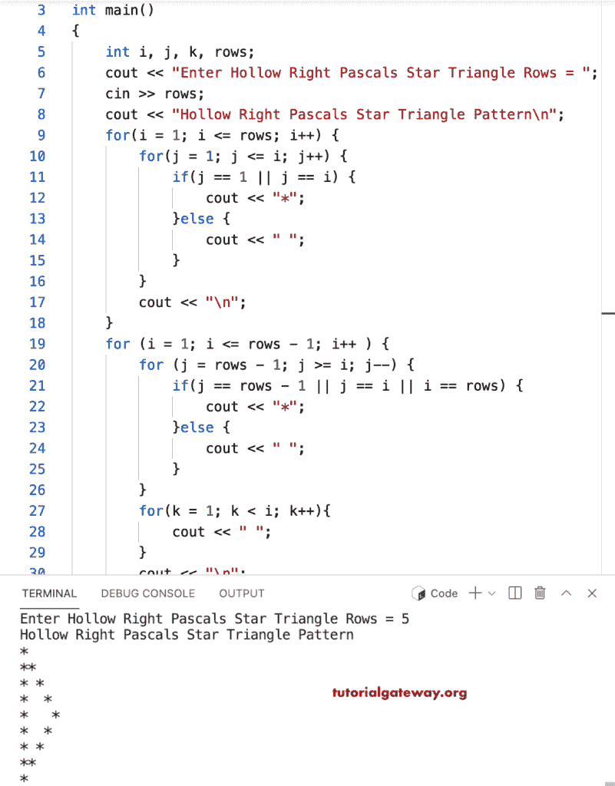

# C++ 程序：打印空心直角三角形

> 原文：<https://www.tutorialgateway.org/cpp-program-to-print-hollow-right-pascals-star-triangle/>

写一个 C++ 程序，打印空心直角帕斯卡星号三角图案，用于循环。

```cpp
#include<iostream>
using namespace std;

int main()
{
	int i, j, k, rows;

    cout << "Enter Hollow Right Pascals Star Triangle Rows = ";
    cin >> rows;

    cout << "Hollow Right Pascals Star Triangle Pattern\n"; 

    for(i = 1; i <= rows; i++)
    {
    	for(j = 1; j <= i; j++)
		{
            if(j == 1 || j == i) 
            {
                cout << "*";
            }
            else {
                cout << " ";
            }
        }
        cout << "\n";
    }	

    for (i = 1; i <= rows - 1; i++ ) 
    {
		for (j = rows - 1; j >= i; j--) 
		{
			if(j == rows - 1 || j == i || i == rows) 
            {
                cout << "*";
			}
			else {
				cout << " ";
			}
		}
		for(k = 1; k < i; k++)
		{
			cout << " ";
		}
        cout << "\n";
    }	
 	return 0;
}
```



这个 [C++ 示例](https://www.tutorialgateway.org/cpp-programs/)使用 while 循环打印给定字符的空心直角帕斯卡三角形图案。

```cpp
#include<iostream>
using namespace std;

int main()
{
	int i = 1, j, k, rows;
    char ch;

    cout << "Enter Hollow Right Pascals Star Triangle Rows = ";
    cin >> rows;

    cout << "Enter Symbol for Hollow Right Pascals Triangle = ";
    cin >> ch;

    cout << "Hollow Right Pascals Star Triangle Pattern\n"; 

    while(i <= rows)
    {
        j = 1;
    	while( j <= i)
		{
            if(j == 1 || j == i) 
            {
                cout << ch;
            }
            else {
                cout << " ";
            }
            j++;
        }
        cout << "\n";
        i++;
    }	

    i = 1; 
    while (i <= rows - 1 ) 
    {
        j = rows - 1; 
		while (j >= i) 
		{
			if(j == rows - 1 || j == i || i == rows) 
            {
                cout << ch;
			}
			else {
				cout << " ";
			}
            j--;
		}
        k = 1;
		while( k < i)
		{
			cout << " ";
            k++;
		}
        cout << "\n";
        i++;
    }	
 	return 0;
}
```

```cpp
Enter Hollow Right Pascals Star Triangle Rows = 10
Enter Symbol for Hollow Right Pascals Triangle = &
Hollow Right Pascals Star Triangle Pattern
&
&&
& &
&  &
&   &
&    &
&     &
&      &
&       &
&        &
&       &
&      & 
&     &  
&    &   
&   &    
&  &     
& &      
&&       
& 
```