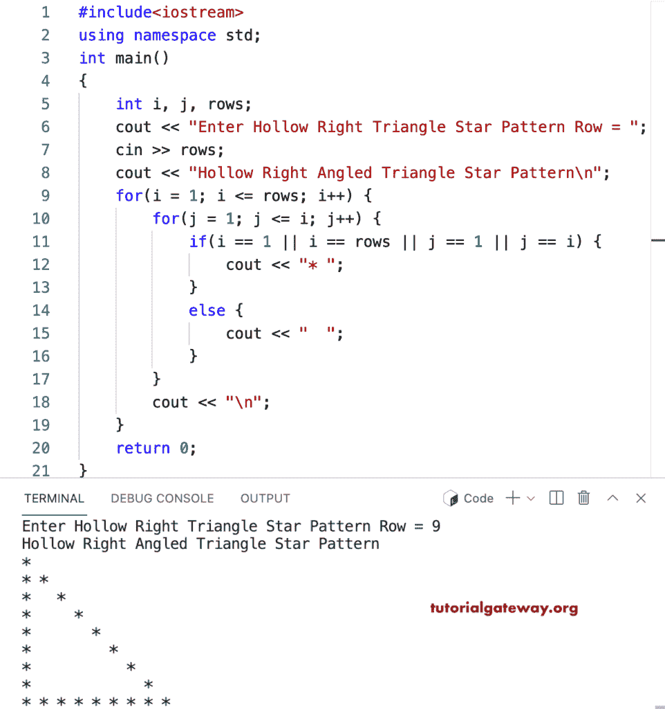

# C++ 程序：打印空心直角三角形星形图案

> 原文：<https://www.tutorialgateway.org/cpp-program-to-print-hollow-right-angled-triangle-star-pattern/>

写一个 C++ 程序来打印用于循环的空心直角三角形星形图案。

```cpp
#include<iostream>
using namespace std;

int main()
{
	int i, j, rows;

    cout << "Enter Hollow Right Triangle Star Pattern Row = ";
    cin >> rows;

    cout << "Hollow Right Angled Triangle Star Pattern\n"; 

    for(i = 1; i <= rows; i++)
    {
    	for(j = 1; j <= i; j++)
		{
            if(i == 1 || i == rows || j == 1 || j == i)
            {
                cout << "* ";
            }
            else
            {
                cout << "  ";
            }
        }
        cout << "\n";
    }		
 	return 0;
}
```



这个 [C++ 示例](https://www.tutorialgateway.org/cpp-programs/)使用 while 循环打印给定字符的空心直角三角形图案。

```cpp
#include<iostream>
using namespace std;

int main()
{
	int i = 1, j, rows;
    char ch;

    cout << "Enter Hollow Right Triangle Star Pattern Row = ";
    cin >> rows;

    cout << "Enter Symbol for Hollow Right Triangle Pattern = ";
    cin >> ch;

    cout << "Hollow Right Angled Triangle Star Pattern\n"; 

    while(i <= rows)
    {
        j = 1; 
    	while(j <= i)
		{
            if(i == 1 || i == rows || j == 1 || j == i)
            {
                cout << ch << " ";
            }
            else
            {
                cout << "  ";
            }
            j++;
        }
        cout << "\n";
        i++;
    }		
 	return 0;
}
```

```cpp
Enter Hollow Right Triangle Star Pattern Row = 16
Enter Symbol for Hollow Right Triangle Pattern = $
Hollow Right Angled Triangle Star Pattern
$ 
$ $ 
$   $ 
$     $ 
$       $ 
$         $ 
$           $ 
$             $ 
$               $ 
$                 $ 
$                   $ 
$                     $ 
$                       $ 
$                         $ 
$                           $ 
$ $ $ $ $ $ $ $ $ $ $ $ $ $ $ $
```