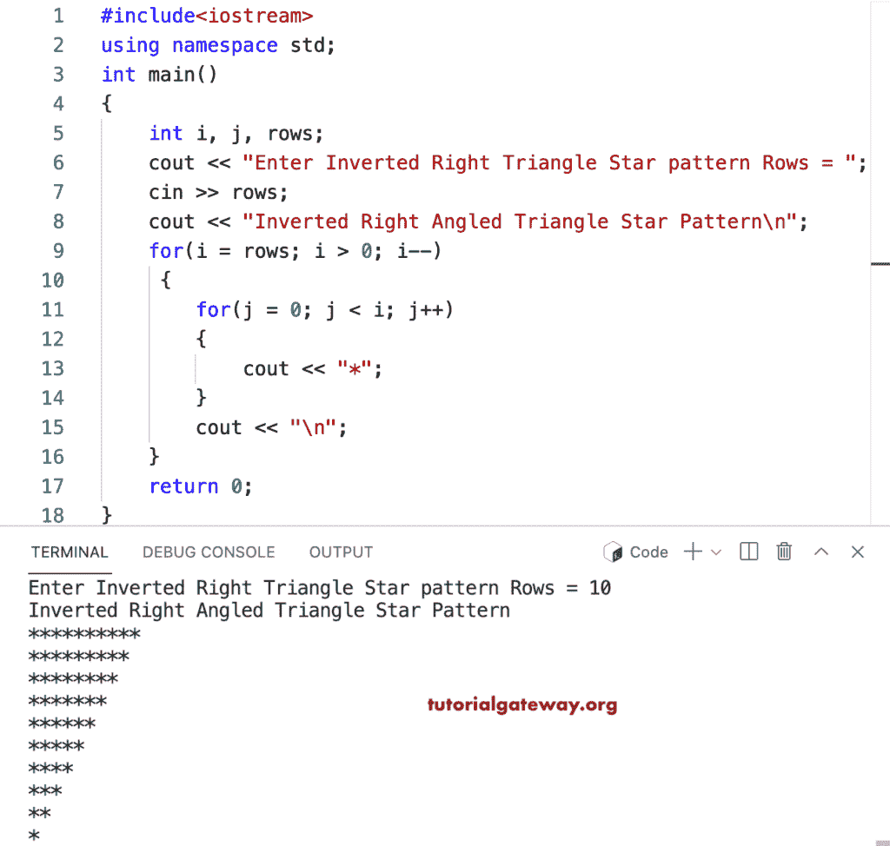

# C++ 程序：打印倒直角三角形星形图案

> 原文：<https://www.tutorialgateway.org/cpp-program-to-print-inverted-right-triangle-star-pattern/>

写一个 C++ 程序打印倒直角三角形星形图案用于循环。

```cpp
#include<iostream>
using namespace std;

int main()
{
	int i, j, rows;

    cout << "Enter Inverted Right Triangle Star pattern Rows = ";
    cin >> rows;

    cout << "Inverted Right Angled Triangle Star Pattern\n"; 

    for(i = rows; i > 0; i--)
    {
    	for(j = 0; j < i; j++)
		{
            cout << "*";
        }
        cout << "\n";
    }		
 	return 0;
}
```



这个 [C++ 示例](https://www.tutorialgateway.org/cpp-programs/)示例使用 while 循环打印给定字符的倒直角三角形。

```cpp
#include<iostream>
using namespace std;

int main()
{
	int i, j, rows;
    char ch;

    cout << "Enter Inverted Right Triangle Star pattern Rows = ";
    cin >> rows;

    cout << "Enter Symbol for Inverted Right Triangle pattern = ";
    cin >> ch;

    cout << "Inverted Right Angled Triangle Star Pattern\n"; 

    i = rows;

    while( i > 0)
    {
        j = 0;
    	while( j < i)
		{
            cout << ch;
            j++;
        }
        cout << "\n";
        i--;
    }		
 	return 0;
}
```

```cpp
Enter Inverted Right Triangle Star pattern Rows = 16
Enter Symbol for Inverted Right Triangle pattern = @
Inverted Right Angled Triangle Star Pattern
@@@@@@@@@@@@@@@@
@@@@@@@@@@@@@@@
@@@@@@@@@@@@@@
@@@@@@@@@@@@@
@@@@@@@@@@@@
@@@@@@@@@@@
@@@@@@@@@@
@@@@@@@@@
@@@@@@@@
@@@@@@@
@@@@@@
@@@@@
@@@@
@@@
@@
@
```