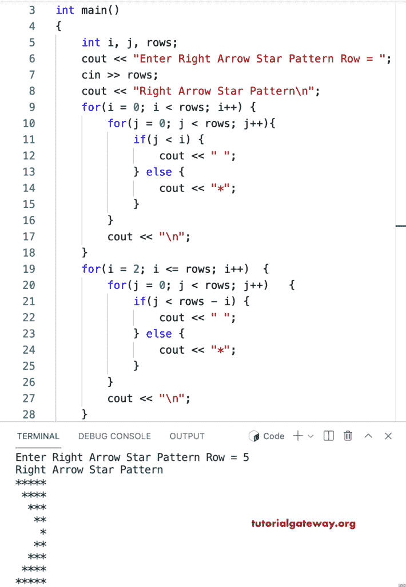

# C++ 程序：打印星号的右箭头图案

> 原文：<https://www.tutorialgateway.org/cpp-program-to-print-right-arrow-star-pattern/>

写一个 C++ 程序，用 for 循环打印星号的右箭头图案。

```cpp
#include<iostream>
using namespace std;

int main()
{
	int i, j, rows;

    cout << "Enter Right Arrow Star Pattern Row = ";
    cin >> rows;

    cout << "Right Arrow Star Pattern\n"; 

    for(i = 0; i < rows; i++)
    {
    	for(j = 0; j < rows; j++)
		{
            if(j < i) {
                cout << " ";
            } 
            else {
                cout << "*";
            }    
        }
        cout << "\n";
    }	

    for(i = 2; i <= rows; i++)
    {
    	for(j = 0; j < rows; j++)
		{
            if(j < rows - i) {
                cout << " ";
            } 
            else {
                cout << "*";
            }
        }
        cout << "\n";
    }	
 	return 0;
}
```



这个 [C++ 例子](https://www.tutorialgateway.org/cpp-programs/)使用 while 循环打印给定字符的右箭头模式。

```cpp
#include<iostream>
using namespace std;

int main()
{
	int i = 0, j, rows;
    char ch;

    cout << "Enter Right Arrow Star Pattern Row = ";
    cin >> rows;

    cout << "Enter Symbol for Right Arrow Pattern = ";
    cin >> ch;

    cout << "Right Arrow Star Pattern\n"; 

    while(i < rows)
    {
        j = 0; 
    	while(j < rows)
		{
            if(j < i) {
                cout << " ";
            } 
            else {
                cout << ch;
            }  
            j++;  
        }
        cout << "\n";
        i++;
    }

    i = 2;
    while( i <= rows)
    {
        j = 0;
    	while( j < rows)
		{
            if(j < rows - i) {
                cout << " ";
            } 
            else {
                cout << ch;
            }
            j++;
        }
        cout << "\n";
        i++;
    }	
 	return 0;
}
```

```cpp
Enter Right Arrow Star Pattern Row = 12
Enter Symbol for Right Arrow Pattern = #
Right Arrow Star Pattern
############
 ###########
  ##########
   #########
    ########
     #######
      ######
       #####
        ####
         ###
          ##
           #
          ##
         ###
        ####
       #####
      ######
     #######
    ########
   #########
  ##########
 ###########
############
```