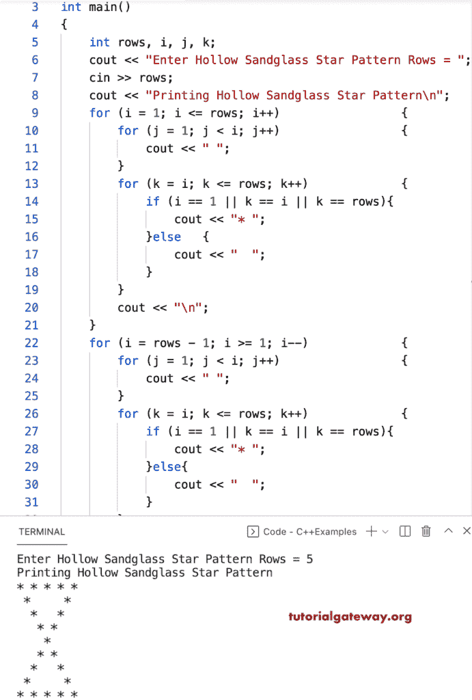

# C++ 程序：打印星号的空心沙漏图案

> 原文：<https://www.tutorialgateway.org/cpp-program-to-print-hollow-sandglass-star-pattern/>

写一个 C++ 程序打印星号的空心沙漏图案用于循环。

```cpp
#include<iostream>
using namespace std;

int main()
{
	int rows, i, j, k;

	cout << "Enter Hollow Sandglass Star Pattern Rows = ";
	cin >> rows;

	cout << "Printing Hollow Sandglass Star Pattern\n";

	for (i = 1; i <= rows; i++)
	{
		for (j = 1; j < i; j++)
		{
			cout << " ";
		}
		for (k = i; k <= rows; k++)
		{
			if (i == 1 || k == i || k == rows)
			{
				cout << "* ";
			}
			else
			{
				cout << "  ";
			}
		}
		cout << "\n";
	}

	for (i = rows - 1; i >= 1; i--)
	{
		for (j = 1; j < i; j++)
		{
			cout << " ";
		}
		for (k = i; k <= rows; k++)
		{
			if (i == 1 || k == i || k == rows)
			{
				cout << "* ";
			}
			else
			{
				cout << "  ";
			}
		}
		cout << "\n";
	}
}
```



这个 C++ 程序使用 while 循环显示星星的空心沙漏图案。

```cpp
#include<iostream>
using namespace std;

int main()
{
	int rows, i, j, k;

	cout << "Enter Hollow Sandglass Star Pattern Rows = ";
	cin >> rows;

	cout << "Printing Hollow Sandglass Star Pattern\n";
	i = 1;
	while (i <= rows)
	{
		j = 1;
		while (j < i)
		{
			cout << " ";
			j++;
		}
		k = i;
		while (k <= rows)
		{
			if (i == 1 || k == i || k == rows)
			{
				cout << "* ";
			}
			else
			{
				cout << "  ";
			}
			k++;
		}
		cout << "\n";
		i++;
	}

	i = rows - 1;
	while (i >= 1)
	{
		j = 1;
		while (j < i)
		{
			cout << " ";
			j++;
		}
		k = i;
		while (k <= rows)
		{
			if (i == 1 || k == i || k == rows)
			{
				cout << "* ";
			}
			else
			{
				cout << "  ";
			}
			k++;
		}
		cout << "\n";
		i--;
	}
}
```

```cpp
Enter Hollow Sandglass Star Pattern Rows = 10
Printing Hollow Sandglass Star Pattern
* * * * * * * * * * 
 *               * 
  *             * 
   *           * 
    *         * 
     *       * 
      *     * 
       *   * 
        * * 
         * 
        * * 
       *   * 
      *     * 
     *       * 
    *         * 
   *           * 
  *             * 
 *               * 
* * * * * * * * * * 
```

## 使用 do while 循环打印星号的空心沙漏图案的 C++ 程序

```cpp
#include<iostream>
using namespace std;

int main()
{
	int rows, i, j, k;

	cout << "Enter Hollow Sandglass Star Pattern Rows = ";
	cin >> rows;

	cout << "Printing Hollow Sandglass Star Pattern\n";
	i = 1;
	do
	{
		j = 1;
		do
		{
			cout << " ";
		} while (j++ <= i);
		k = i;
		do
		{
			if (i == 1 || k == i || k == rows)
			{
				cout << "* ";
			}
			else
			{
				cout << "  ";
			}
		} while (++k <= rows);
		cout << "\n";
	} while (++i <= rows);

	i = rows - 1;
	do
	{
		j = 1;
		do
		{
			cout << " ";
		} while (j++ <= i);
		k = i;
		do
		{
			if (i == 1 || k == i || k == rows)
			{
				cout << "* ";
			}
			else
			{
				cout << "  ";
			}
		} while (++k <= rows);
		cout << "\n";
	} while (--i >= 1);
}
```

```cpp
Enter Hollow Sandglass Star Pattern Rows = 13
Printing Hollow Sandglass Star Pattern
  * * * * * * * * * * * * * 
   *                     * 
    *                   * 
     *                 * 
      *               * 
       *             * 
        *           * 
         *         * 
          *       * 
           *     * 
            *   * 
             * * 
              * 
             * * 
            *   * 
           *     * 
          *       * 
         *         * 
        *           * 
       *             * 
      *               * 
     *                 * 
    *                   * 
   *                     * 
  * * * * * * * * * * * * * 
```

在本 [C++ 示例](https://www.tutorialgateway.org/cpp-programs/)中，HollowSandglassPattern 函数允许用户输入字符并打印给定字符的中空沙漏图案。

```cpp
#include<iostream>
using namespace std;

void HollowSandglassPattern(int rows, char ch)
{
	int i, j, k;

	for (i = 1; i <= rows; i++)
	{
		for (j = 1; j < i; j++)
		{
			cout << " ";
		}
		for (k = i; k <= rows; k++)
		{
			if (i == 1 || k == i || k == rows)
			{
				cout << ch << " ";
			}
			else
			{
				cout << "  ";
			}
		}
		cout << "\n";
	}

	for (i = rows - 1; i >= 1; i--)
	{
		for (j = 1; j < i; j++)
		{
			cout << " ";
		}
		for (k = i; k <= rows; k++)
		{
			if (i == 1 || k == i || k == rows)
			{
				cout << ch << " ";
			}
			else
			{
				cout << "  ";
			}
		}
		cout << "\n";
	}
}

int main()
{
	int rows;
	char ch;

	cout << "Enter Hollow Sandglass Star Pattern Rows = ";
	cin >> rows;

	cout << "Enter Character for Hollow Sandglass Pattern = ";
	cin >> ch;

	cout << "Printing Hollow Sandglass Star Pattern\n";
	HollowSandglassPattern(rows, ch);
}
```

```cpp
Enter Hollow Sandglass Star Pattern Rows = 15
Enter Character for Hollow Sandglass Pattern = $
Printing Hollow Sandglass Star Pattern
$ $ $ $ $ $ $ $ $ $ $ $ $ $ $ 
 $                         $ 
  $                       $ 
   $                     $ 
    $                   $ 
     $                 $ 
      $               $ 
       $             $ 
        $           $ 
         $         $ 
          $       $ 
           $     $ 
            $   $ 
             $ $ 
              $ 
             $ $ 
            $   $ 
           $     $ 
          $       $ 
         $         $ 
        $           $ 
       $             $ 
      $               $ 
     $                 $ 
    $                   $ 
   $                     $ 
  $                       $ 
 $                         $ 
$ $ $ $ $ $ $ $ $ $ $ $ $ $ $ 
```