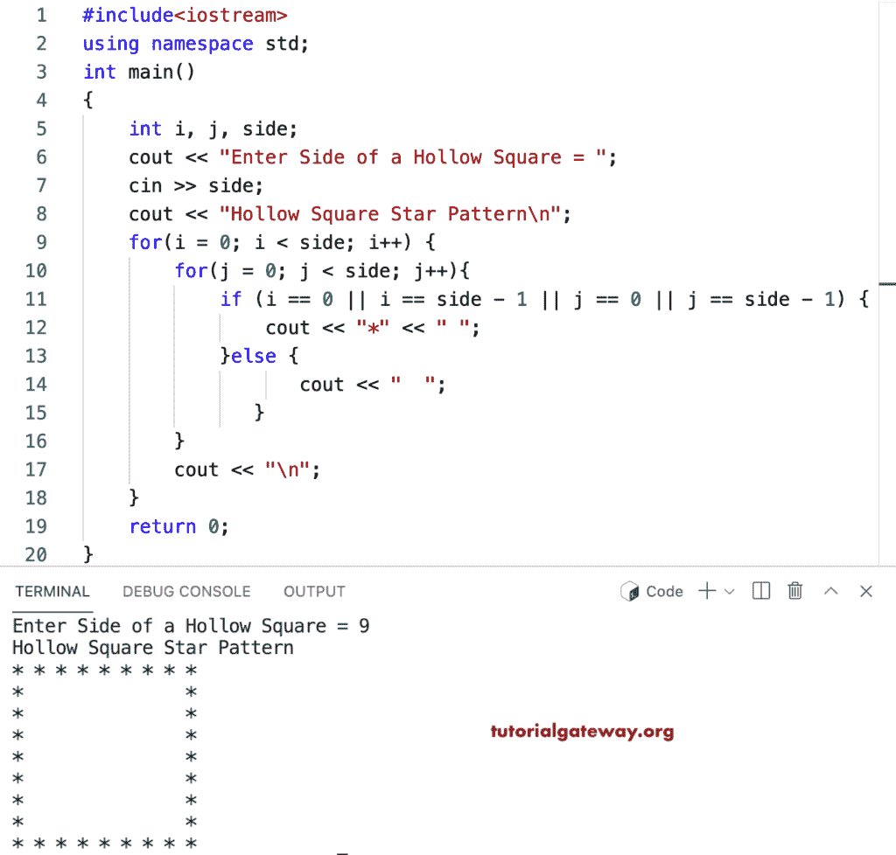

# C++ 程序：打印星号的空心方形图案

> 原文：<https://www.tutorialgateway.org/cpp-program-to-print-hollow-square-star-pattern/>

写一个 C++ 程序打印星号的空心方形图案用于循环。

```cpp
#include<iostream>
using namespace std;

int main()
{
	int i, j, side;  

    cout << "Enter Side of a Hollow Square = ";
    cin >> side;

    cout << "Hollow Square Star Pattern\n";

    for(i = 0; i < side; i++) 
    {
    	for(j = 0; j < side; j++)
        {
            if (i == 0 || i == side - 1 || j == 0 || j == side - 1) 
            {
                cout << "*" << " ";
            }
            else 
            {
                cout << "  ";
            } 
        }
        cout << "\n";
    }		
 	return 0;
}

```



这个 [C++ 示例](https://www.tutorialgateway.org/cpp-programs/)使用 while 循环打印给定字符的空心正方形图案。

```cpp
#include<iostream>
using namespace std;

int main()
{
	int i, j, side;
    char ch;

    cout << "Enter Side of a Hollow Square = ";
    cin >> side;

    cout << "Enter Symbol to Print in Hollow Square = ";
    cin >> ch;

    cout << "Hollow Square Pattern\n"; 
    i = 0;

    while( i < side)
    {
        j = 0;
    	while( j < side)
		{
            if (i == 0 || i == side - 1 || j == 0 || j == side - 1) 
            {
                cout << ch << " ";
            }
           	else {
                   cout << "  ";
            }
            j++;    
        }
        cout << "\n";
        i++;
    }		
 	return 0;
}
```

```cpp
Enter Side of a Hollow Square = 17
Enter Symbol to Print in Hollow Square = @
Hollow Square Pattern
@ @ @ @ @ @ @ @ @ @ @ @ @ @ @ @ @ 
@                @ 
@                @ 
@                @ 
@                @ 
@                @ 
@                @ 
@                @ 
@                @ 
@                @ 
@                @ 
@                @ 
@                @ 
@                @ 
@                @ 
@                @ 
@ @ @ @ @ @ @ @ @ @ @ @ @ @ @ @ @ 
SureshMac:C++Examples suresh$ cd "/Users/suresh/Desktop/C++Examples/" && g++ HollowSquareStar2.cpp -o HollowSquareStar2 && "/Users/suresh/Desktop/C++Examples/"HollowSquareStar2
Enter Side of a Hollow Square = 17
Enter Symbol to Print in Hollow Square = @
Hollow Square Pattern
@ @ @ @ @ @ @ @ @ @ @ @ @ @ @ @ @ 
@                               @ 
@                               @ 
@                               @ 
@                               @ 
@                               @ 
@                               @ 
@                               @ 
@                               @ 
@                               @ 
@                               @ 
@                               @ 
@                               @ 
@                               @ 
@                               @ 
@                               @ 
@ @ @ @ @ @ @ @ @ @ @ @ @ @ @ @ @ 
```