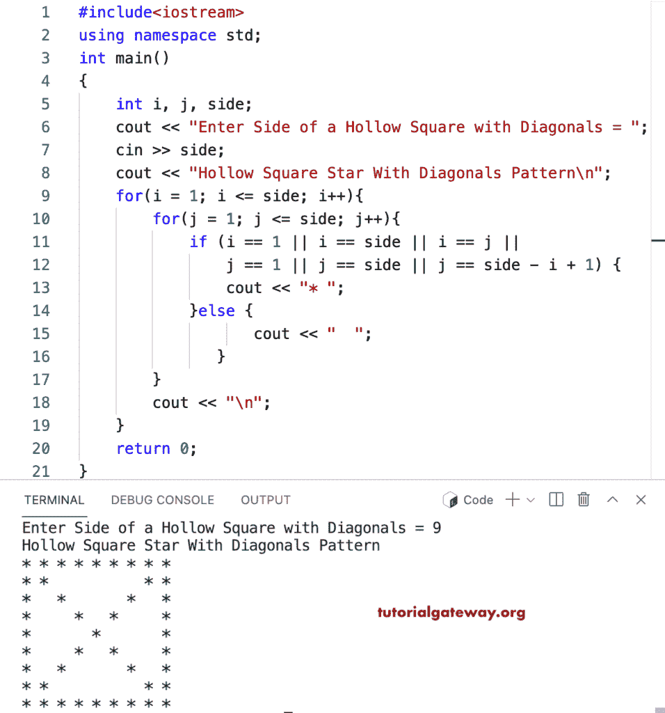

# C++ 程序：打印带有对角线星形图案的空心方块

> 原文：<https://www.tutorialgateway.org/cpp-program-to-print-hollow-square-with-diagonals-star-pattern/>

写一个 C++ 程序，打印带有星形图案对角线的空心方块，用于循环。

```cpp
#include<iostream>
using namespace std;

int main()
{
	int i, j, side;

    cout << "Enter Side of a Hollow Square with Diagonals = ";
    cin >> side;

    cout << "Hollow Square Star With Diagonals Pattern\n"; 
    for(i = 1; i <= side; i++)
    {
    	for(j = 1; j <= side; j++)
		{
            if (i == 1 || i == side || i == j || 
                j == 1 || j == side || j == side - i + 1) 
            {
                cout << "* ";
            }
           	else {
                   cout << "   ";
               } 
        }
        cout << "\n";
    }		
 	return 0;
}
```



这个 [C++ 示例](https://www.tutorialgateway.org/cpp-programs/)使用 while 循环打印带有给定字符对角线模式的空心正方形。

```cpp
#include<iostream>
using namespace std;

int main()
{
	int i, j, side;
    char ch;

    cout << "Enter Side of a Hollow Square with Diagonals = ";
    cin >> side;

    cout << "Enter Symbol for Hollow Square with Diagonals = ";
    cin >> ch;

    cout << "Hollow Square With Diagonals Pattern\n"; 
    for(i = 1; i <= side; i++)
    {
    	for(j = 1; j <= side; j++)
		{
            if (i == 1 || i == side || i == j || 
                j == 1 || j == side || j == side - i + 1) 
            {
                cout << ch << " ";
            }
           	else {
                   cout << "  ";
               } 
        }
        cout << "\n";
    }		
 	return 0;
}
```

```cpp
Enter Side of a Hollow Square with Diagonals = 16
Enter Symbol for Hollow Square with Diagonals = #
Hollow Square With Diagonals Pattern
# # # # # # # # # # # # # # # # 
# #                         # # 
#   #                     #   # 
#     #                 #     # 
#       #             #       # 
#         #         #         # 
#           #     #           # 
#             # #             # 
#             # #             # 
#           #     #           # 
#         #         #         # 
#       #             #       # 
#     #                 #     # 
#   #                     #   # 
# #                         # # 
# # # # # # # # # # # # # # # # 
```