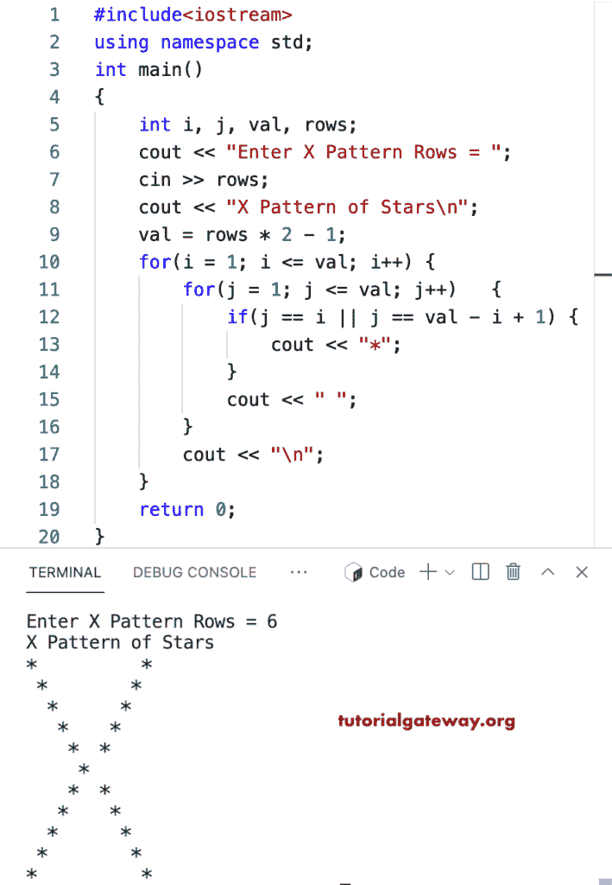

# C++ 程序：打印`X`星形图案

> 原文：<https://www.tutorialgateway.org/cpp-program-to-print-x-star-pattern/>

用 for 循环写一个 C++ 程序打印 X 星形模式。

```cpp
#include<iostream>
using namespace std;

int main()
{
	int i, j, val, rows;

    cout << "Enter X Pattern Rows = ";
    cin >> rows;

    cout << "X Pattern of Stars\n"; 

    val = rows * 2 - 1;

    for(i = 1; i <= val; i++)
    {
    	for(j = 1; j <= val; j++)
		{
            if(j == i || j == val - i + 1)
            {
                cout << "*";
            }
            cout << " ";
        }
        cout << "\n";
    }		
 	return 0;
}
```



这个 [C++ 例子](https://www.tutorialgateway.org/cpp-programs/)使用 while 循环打印给定字符的 X 模式。

```cpp
#include<iostream>
using namespace std;

int main()
{
	int i, j, val, rows;
    char ch;

    cout << "Enter X Pattern Rows = ";
    cin >> rows;

    cout << "Enter Symbol for X Pattern = ";
    cin >> ch;

    cout << "X Pattern of Stars\n"; 

    val = rows * 2 - 1;

    for(i = 1; i <= val; i++)
    {
    	for(j = 1; j <= val; j++)
		{
            if(j == i || j == val - i + 1)
            {
                cout << ch;
            }
            cout << " ";
        }
        cout << "\n";
    }		
 	return 0;
}
```

```cpp
Enter X Pattern Rows = 10
Enter Symbol for X Pattern = #
X Pattern of Stars
#                  # 
 #                #  
  #              #   
   #            #    
    #          #     
     #        #      
      #      #       
       #    #        
        #  #         
         #          
        #  #         
       #    #        
      #      #       
     #        #      
    #          #     
   #            #    
  #              #   
 #                #  
#                  #
```