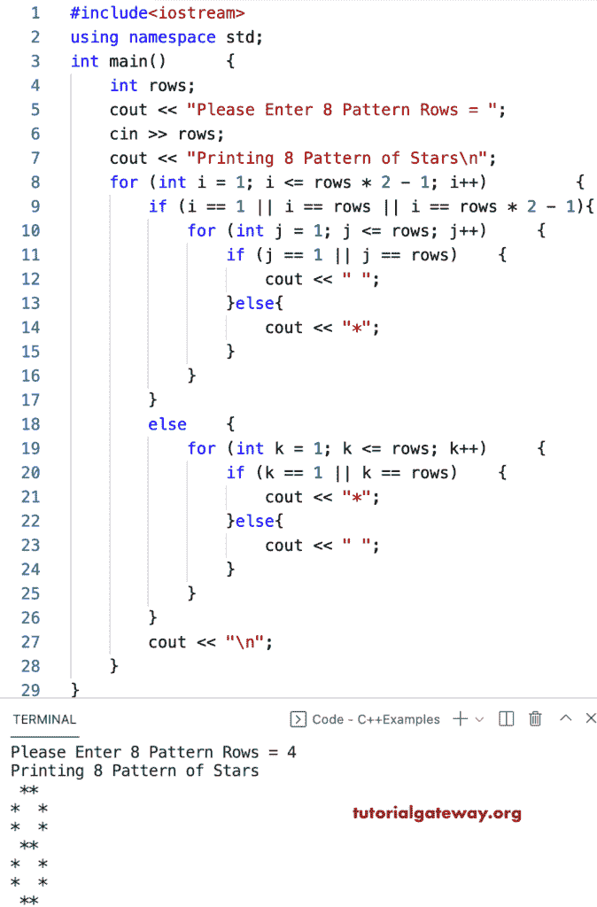

# C++ 程序：打印星号的`8`图案

> 原文：<https://www.tutorialgateway.org/cpp-program-to-print-8-star-pattern/>

写一个 C++ 程序，用 for 循环打印星号的`8`图案。

```cpp
#include<iostream>
using namespace std;

int main()
{
	int rows;

	cout << "Please Enter 8 Pattern Rows = ";
	cin >> rows;

	cout << "Printing 8 Pattern of Stars\n";

	for (int i = 1; i <= rows * 2 - 1; i++)
	{
		if (i == 1 || i == rows || i == rows * 2 - 1)
		{
			for (int j = 1; j <= rows; j++)
			{
				if (j == 1 || j == rows)
				{
					cout << " ";
				}
				else
				{
					cout << "*";
				}
			}
		}
		else
		{
			for (int k = 1; k <= rows; k++)
			{
				if (k == 1 || k == rows)
				{
					cout << "*";
				}
				else
				{
					cout << " ";
				}
			}
		}
		cout << "\n";
	}
}
```



## 使用 while 循环打印星号的`8`图案的 C++ 程序

```cpp
#include<iostream>
using namespace std;

int main()
{
	int rows, i, j, k;

	cout << "Please Enter 8 Pattern Rows = ";
	cin >> rows;

	cout << "Printing 8 Pattern of Stars\n";
	i = 1;
	while (i <= rows * 2 - 1)
	{
		if (i == 1 || i == rows || i == rows * 2 - 1)
		{
			j = 1;
			while (j <= rows)
			{
				if (j == 1 || j == rows)
				{
					cout << " ";
				}
				else
				{
					cout << "*";
				}
				j++;
			}
		}
		else
		{
			k = 1;
			while (k <= rows)
			{
				if (k == 1 || k == rows)
				{
					cout << "*";
				}
				else
				{
					cout << " ";
				}
				k++;
			}
		}
		cout << "\n";
		i++;
	}
}
```

```cpp
Please Enter 8 Pattern Rows = 10
Printing 8 Pattern of Stars
 ******** 
*        *
*        *
*        *
*        *
*        *
*        *
*        *
*        *
 ******** 
*        *
*        *
*        *
*        *
*        *
*        *
*        *
*        *
 ******** 
```

这个 C++ 程序使用 do while 循环打印星星的数字或 8 位模式。

```cpp
#include<iostream>
using namespace std;

int main()
{
	int rows, i, j, k;

	cout << "Please Enter 8 Pattern Rows = ";
	cin >> rows;

	cout << "Printing 8 Pattern of Stars\n";
	i = 1;
	do
	{
		if (i == 1 || i == rows || i == rows * 2 - 1)
		{
			j = 1;
			do
			{
				if (j == 1 || j == rows)
				{
					cout << " ";
				}
				else
				{
					cout << "*";
				}
			} while (++j <= rows);
		}
		else
		{
			k = 1;
			do
			{
				if (k == 1 || k == rows)
				{
					cout << "*";
				}
				else
				{
					cout << " ";
				}
			} while (++k <= rows);
		}
		cout << "\n";
	} while (++i <= rows * 2 - 1);
}
```

```cpp
Please Enter 8 Pattern Rows = 13
Printing 8 Pattern of Stars
 *********** 
*           *
*           *
*           *
*           *
*           *
*           *
*           *
*           *
*           *
*           *
*           *
 *********** 
*           *
*           *
*           *
*           *
*           *
*           *
*           *
*           *
*           *
*           *
*           *
 *********** 
```

在这个 [C++ 例子](https://www.tutorialgateway.org/cpp-programs/)中，star8Pattern 函数允许行和字符，并打印给定字符的 8 位数模式。

```cpp
#include<iostream>
using namespace std;

void Pattern8(int rows, char ch)
{
	for (int i = 1; i <= rows * 2 - 1; i++)
	{
		if (i == 1 || i == rows || i == rows * 2 - 1)
		{
			for (int j = 1; j <= rows; j++)
			{
				if (j == 1 || j == rows)
				{
					cout << " ";
				}
				else
				{
					cout << ch;
				}
			}
		}
		else
		{
			for (int k = 1; k <= rows; k++)
			{
				if (k == 1 || k == rows)
				{
					cout << ch;
				}
				else
				{
					cout << " ";
				}
			}
		}
		cout << "\n";
	}
}
int main()
{
	int rows;
	char ch;

	cout << "Enter Character for 8 Pattern = ";
	cin >> ch;

	cout << "Please Enter 8 Pattern Rows = ";
	cin >> rows;

	cout << "Printing 8 Pattern of Stars\n";
	Pattern8(rows, ch);
}
```

```cpp
Enter Character for 8 Pattern = #
Please Enter 8 Pattern Rows = 15
Printing 8 Pattern of Stars
 ############# 
#             #
#             #
#             #
#             #
#             #
#             #
#             #
#             #
#             #
#             #
#             #
#             #
#             #
 ############# 
#             #
#             #
#             #
#             #
#             #
#             #
#             #
#             #
#             #
#             #
#             #
#             #
#             #
 ############# 
```