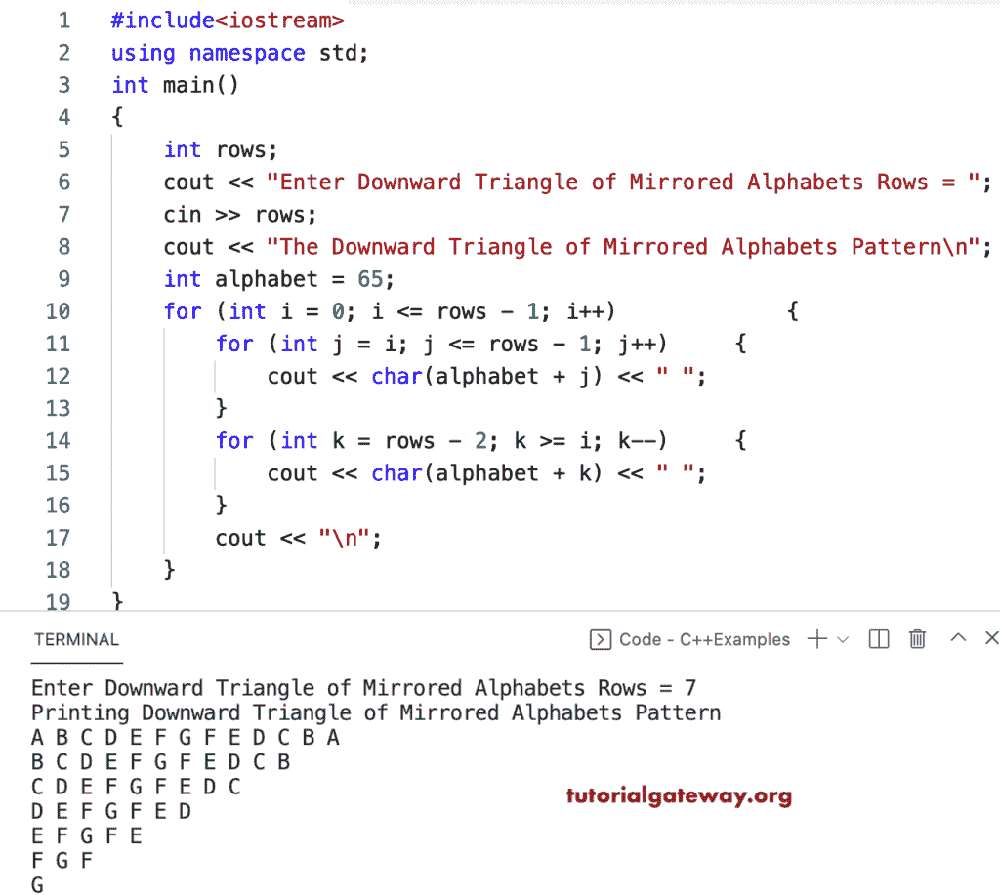

# C++ 程序：打印向下三角形镜像字母图案

> 原文：<https://www.tutorialgateway.org/cpp-program-to-print-downward-triangle-mirrored-alphabets-pattern/>

写一个 C++ 程序打印向下的三角形镜像字母图案，用于循环。

```cpp
#include<iostream>
using namespace std;

int main()
{
	int rows;

	cout << "Enter Downward Triangle of Mirrored Alphabets Rows = ";
	cin >> rows;

	cout << "The Downward Triangle of Mirrored Alphabets Pattern\n";
	int alphabet = 65;

	for (int i = 0; i <= rows - 1; i++)
	{
		for (int j = i; j <= rows - 1; j++)
		{
			cout << char(alphabet + j) << " ";
		}
		for (int k = rows - 2; k >= i; k--)
		{
			cout << char(alphabet + k) << " ";
		}
		cout << "\n";
	}
}
```



这个 [C++ 例子](https://www.tutorialgateway.org/cpp-programs/)使用 while 循环打印镜像字母的向下三角形模式。

```cpp
#include<iostream>
using namespace std;

int main()
{
	int rows, i, j, k, alphabet;

	cout << "Enter Downward Triangle of Mirrored Alphabets Rows = ";
	cin >> rows;

	cout << "The Downward Triangle of Mirrored Alphabets Pattern\n";
	alphabet = 65;
	i = 0;

	while (i <= rows - 1)
	{
		j = i;
		while (j <= rows - 1)
		{
			cout << char(alphabet + j);
			j++;
		}

		k = rows - 2;
		while (k >= i)
		{
			cout << char(alphabet + k);
			k--;
		}
		cout << "\n";
		i++;
	}
}
```

```cpp
Enter Downward Triangle of Mirrored Alphabets Rows = 17
The Downward Triangle of Mirrored Alphabets Pattern
ABCDEFGHIJKLMNOPQPONMLKJIHGFEDCBA
BCDEFGHIJKLMNOPQPONMLKJIHGFEDCB
CDEFGHIJKLMNOPQPONMLKJIHGFEDC
DEFGHIJKLMNOPQPONMLKJIHGFED
EFGHIJKLMNOPQPONMLKJIHGFE
FGHIJKLMNOPQPONMLKJIHGF
GHIJKLMNOPQPONMLKJIHG
HIJKLMNOPQPONMLKJIH
IJKLMNOPQPONMLKJI
JKLMNOPQPONMLKJ
KLMNOPQPONMLK
LMNOPQPONML
MNOPQPONM
NOPQPON
OPQPO
PQP
Q
```