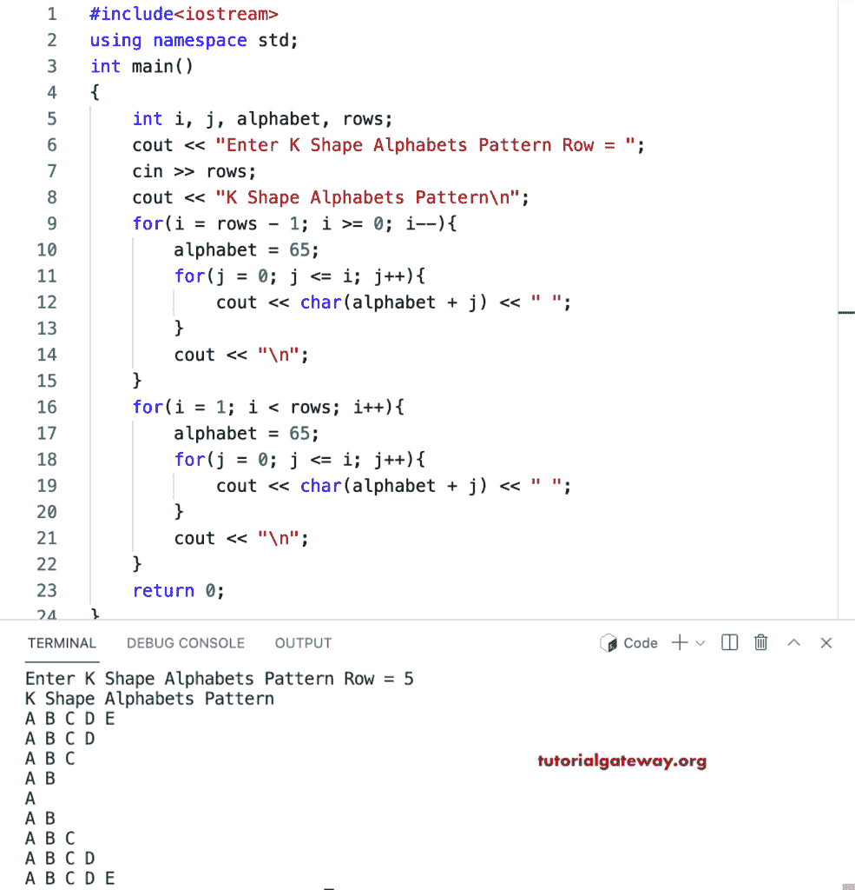

# C++ 程序：打印字母的`K`形图案

> 原文：<https://www.tutorialgateway.org/cpp-program-to-print-k-shape-alphabets-pattern/>

写一个 C++ 程序来打印字母的用于循环的`K`形图案。

```cpp
#include<iostream>
using namespace std;

int main()
{
	int i, j, alphabet, rows;

    cout << "Enter K Shape Alphabets Pattern Row = ";
    cin >> rows;

    cout << "K Shape Alphabets Pattern\n"; 

    for(i = rows - 1; i >= 0; i--)
    {
        alphabet = 65;
    	for(j = 0; j <= i; j++)
		{
            cout << char(alphabet + j) << " ";
        }
        cout << "\n";
    }

    for(i = 1; i < rows; i++)
    {
        alphabet = 65;
    	for(j = 0; j <= i; j++)
		{
            cout << char(alphabet + j) << " ";
        }
        cout << "\n";
    }		
 	return 0;
}
```



这个 [C++ 例子](https://www.tutorialgateway.org/cpp-programs/)使用 while 循环打印字母的`K`形模式。

```cpp
#include<iostream>
using namespace std;

int main()
{
	int i, j, alphabet, rows;

    cout << "Enter K Shape Alphabets Pattern Row = ";
    cin >> rows;

    cout << "K Shape Alphabets Pattern\n"; 

    i = rows - 1; 
    while(i >= 0)
    {
        alphabet = 65;
        j = 0;
    	while( j <= i)
		{
            cout << char(alphabet + j) << " ";
            j++;
        }
        cout << "\n";
        i--;
    }

    i = 1;
    while( i < rows)
    {
        alphabet = 65;
    	j = 0;
    	while( j <= i)
		{
            cout << char(alphabet + j) << " ";
            j++;
        }
        cout << "\n";
        i++;
    }		
 	return 0;
}
```

```cpp
Enter K Shape Alphabets Pattern Row = 10
K Shape Alphabets Pattern
A B C D E F G H I J 
A B C D E F G H I 
A B C D E F G H 
A B C D E F G 
A B C D E F 
A B C D E 
A B C D 
A B C 
A B 
A 
A B 
A B C 
A B C D 
A B C D E 
A B C D E F 
A B C D E F G 
A B C D E F G H 
A B C D E F G H I 
A B C D E F G H I J 
```