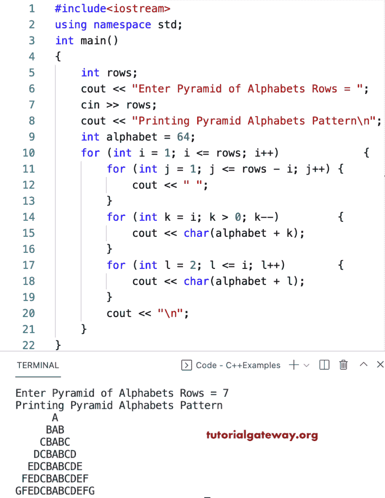

# C++ 程序：打印金字塔字母图案

> 原文：<https://www.tutorialgateway.org/cpp-program-to-print-pyramid-alphabets-pattern/>

编写一个 C++ 程序来打印金字塔字母图案，用于循环。

```cpp
#include<iostream>
using namespace std;

int main()
{
	int rows;

	cout << "Enter Pyramid of Alphabets Rows = ";
	cin >> rows;

	cout << "Printing Pyramid Alphabets Pattern\n";

	int alphabet = 64;

	for (int i = 1; i <= rows; i++)
	{
		for (int j = 1; j <= rows - i; j++)
		{
			cout << " ";
		}
		for (int k = i; k > 0; k--)
		{
			cout << char(alphabet + k);
		}
		for (int l = 2; l <= i; l++)
		{
			cout << char(alphabet + l);
		}
		cout << "\n";
	}
}
```



这个 [C++ 例子](https://www.tutorialgateway.org/cpp-programs/)使用 while 循环打印字母的金字塔模式。

```cpp
#include<iostream>
using namespace std;

int main()
{
	int rows, i, j, k, l, alphabet;

	cout << "Enter Pyramid of Alphabets Rows = ";
	cin >> rows;

	cout << "Printing Pyramid Alphabets Pattern\n";

	alphabet = 64;
	i = 1;

	while (i <= rows)
	{
		j = 1;
		while (j <= rows - i)
		{
			cout << " ";
			j++;
		}

		k = i;
		while (k > 0)
		{
			cout << char(alphabet + k);
			k--;
		}

		l = 2;
		while (l <= i)
		{
			cout << char(alphabet + l);
			l++;
		}
		cout << "\n";
		i++;
	}
}
```

```cpp
Enter Pyramid of Alphabets Rows = 15
Printing Pyramid Alphabets Pattern
              A
             BAB
            CBABC
           DCBABCD
          EDCBABCDE
         FEDCBABCDEF
        GFEDCBABCDEFG
       HGFEDCBABCDEFGH
      IHGFEDCBABCDEFGHI
     JIHGFEDCBABCDEFGHIJ
    KJIHGFEDCBABCDEFGHIJK
   LKJIHGFEDCBABCDEFGHIJKL
  MLKJIHGFEDCBABCDEFGHIJKLM
 NMLKJIHGFEDCBABCDEFGHIJKLMN
ONMLKJIHGFEDCBABCDEFGHIJKLMNO
```