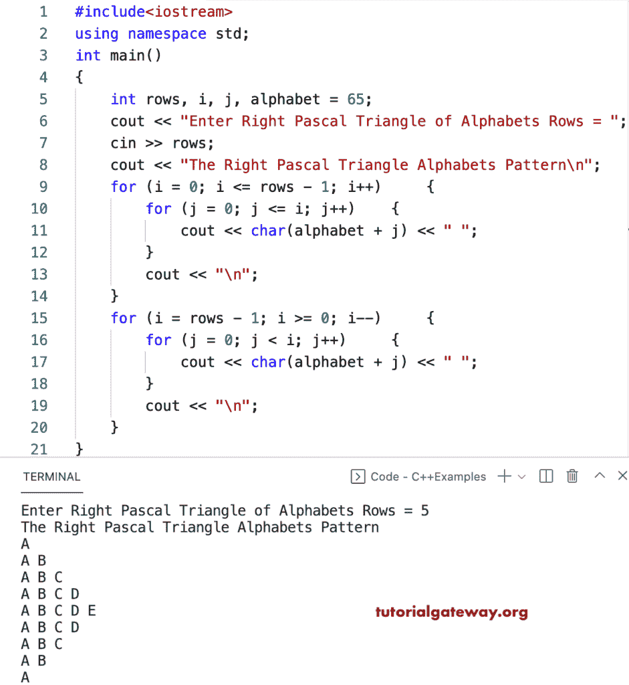

# C++ 程序：打印直角三角形字母图案

> 原文：<https://www.tutorialgateway.org/cpp-program-to-print-right-pascals-triangle-alphabets-pattern/>

写一个 C++ 程序来打印用于循环的直角三角形字母图案。

```cpp
#include<iostream>
using namespace std;

int main()
{
	int rows, i, j, alphabet = 65;

	cout << "Enter Right Pascal Triangle of Alphabets Rows = ";
	cin >> rows;

	cout << "The Right Pascal Triangle Alphabets Pattern\n";

	for (i = 0; i <= rows - 1; i++)
	{
		for (j = 0; j <= i; j++)
		{
			cout << char(alphabet + j) << " ";
		}
		cout << "\n";
	}

	for (i = rows - 1; i >= 0; i--)
	{
		for (j = 0; j < i; j++)
		{
			cout << char(alphabet + j) << " ";
		}
		cout << "\n";
	}
}
```



C++ 程序打印右帕斯卡字母三角形模式使用 while 循环。

```cpp
#include<iostream>
using namespace std;

int main()
{
	int rows, i, j, alphabet = 65;

	cout << "Enter Right Pascal Triangle of Alphabets Rows = ";
	cin >> rows;

	cout << "The Right Pascal Triangle Alphabets Pattern\n";
	i = 0;

	while (i <= rows - 1)
	{
		j = 0;
		while (j <= i)
		{
			cout << char(alphabet + j) << " ";
			j++;
		}
		cout << "\n";
		i++;
	}

	i = rows - 1;
	while (i >= 0)
	{
		j = 0;
		while (j < i)
		{
			cout << char(alphabet + j) << " ";
			j++;
		}
		cout << "\n";
		i--;
	}
}
```

```cpp
Enter Right Pascal Triangle of Alphabets Rows = 14
The Right Pascal Triangle Alphabets Pattern
A 
A B 
A B C 
A B C D 
A B C D E 
A B C D E F 
A B C D E F G 
A B C D E F G H 
A B C D E F G H I 
A B C D E F G H I J 
A B C D E F G H I J K 
A B C D E F G H I J K L 
A B C D E F G H I J K L M 
A B C D E F G H I J K L M N 
A B C D E F G H I J K L M 
A B C D E F G H I J K L 
A B C D E F G H I J K 
A B C D E F G H I J 
A B C D E F G H I 
A B C D E F G H 
A B C D E F G 
A B C D E F 
A B C D E 
A B C D 
A B C 
A B 
A 
```

这个 [C++ 例子](https://www.tutorialgateway.org/cpp-programs/)使用 do while 循环显示字母的右帕斯卡三角形模式。

```cpp
#include<iostream>
using namespace std;

int main()
{
	int rows, i, j, alphabet = 65;

	cout << "Enter Right Pascal Triangle of Alphabets Rows = ";
	cin >> rows;

	cout << "The Right Pascal Triangle Alphabets Pattern\n";

	i = 0;

	do
	{
		j = 0;
		do
		{
			cout << char(alphabet + j) << " ";

		} while (++j <= i);

		cout << "\n";

	} while (++i <= rows - 1);

	i = rows - 1;
	do
	{
		j = 0;
		do
		{
			cout << char(alphabet + j) << " ";

		} while (++j < i);
		cout << "\n";

	} while (--i > 0);
}
```

```cpp
Enter Right Pascal Triangle of Alphabets Rows = 17
The Right Pascal Triangle Alphabets Pattern
A 
A B 
A B C 
A B C D 
A B C D E 
A B C D E F 
A B C D E F G 
A B C D E F G H 
A B C D E F G H I 
A B C D E F G H I J 
A B C D E F G H I J K 
A B C D E F G H I J K L 
A B C D E F G H I J K L M 
A B C D E F G H I J K L M N 
A B C D E F G H I J K L M N O 
A B C D E F G H I J K L M N O P 
A B C D E F G H I J K L M N O P Q 
A B C D E F G H I J K L M N O P 
A B C D E F G H I J K L M N O 
A B C D E F G H I J K L M N 
A B C D E F G H I J K L M 
A B C D E F G H I J K L 
A B C D E F G H I J K 
A B C D E F G H I J 
A B C D E F G H I 
A B C D E F G H 
A B C D E F G 
A B C D E F 
A B C D E 
A B C D 
A B C 
A B 
A 
```