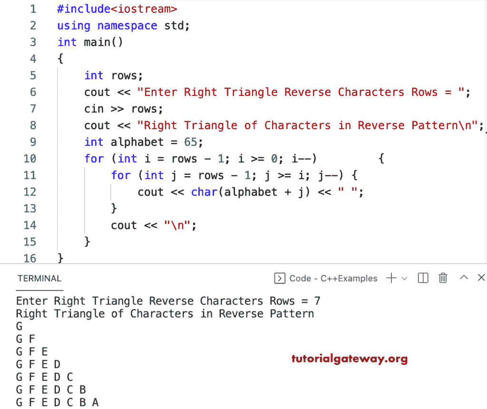

# C++ 程序：打印倒排字母直角三角形

> 原文：<https://www.tutorialgateway.org/cpp-program-to-print-right-triangle-of-alphabets-in-reverse-pattern/>

编写一个 C++ 程序，使用 for 循环以相反的模式打印字母的直角三角形。

```cpp
#include<iostream>
using namespace std;

int main()
{
	int rows;

	cout << "Enter Right Triangle Reverse Characters Rows = ";
	cin >> rows;

	cout << "Right Triangle of Characters in Reverse Pattern\n";
	int alphabet = 65;

	for (int i = rows - 1; i >= 0; i--)
	{
		for (int j = rows - 1; j >= i; j--)
		{
			cout << char(alphabet + j) << " ";
		}
		cout << "\n";
	}
}
```



C++ 程序，使用 while 循环以相反的顺序打印字母的直角三角形图案。

```cpp
#include<iostream>
using namespace std;

int main()
{
	int i, j, alphabet, rows;

	cout << "Enter Right Triangle Reverse Characters Rows = ";
	cin >> rows;

	cout << "Right Triangle of Characters in Reverse Pattern\n";
	alphabet = 65;
	i = rows - 1;

	while (i >= 0)
	{
		j = rows - 1;
		while (j >= i)
		{
			cout << char(alphabet + j) << " ";
			j--;
		}
		cout << "\n";
		i--;
	}
}
```

```cpp
Enter Right Triangle Reverse Characters Rows = 13
Right Triangle of Characters in Reverse Pattern
M 
M L 
M L K 
M L K J 
M L K J I 
M L K J I H 
M L K J I H G 
M L K J I H G F 
M L K J I H G F E 
M L K J I H G F E D 
M L K J I H G F E D C 
M L K J I H G F E D C B 
M L K J I H G F E D C B A 
```

这个 C++ 模式[示例](https://www.tutorialgateway.org/cpp-programs/)使用 do while 循环以逆序或降序显示字母的直角三角形。

```cpp
#include<iostream>
using namespace std;

int main()
{
	int i, j, alphabet, rows;

	cout << "Enter Right Triangle Reverse Characters Rows = ";
	cin >> rows;

	cout << "Right Triangle of Characters in Reverse Pattern\n";
	alphabet = 65;
	i = rows - 1;

	do
	{
		j = rows - 1;
		do
		{
			cout << char(alphabet + j) << " ";

		} while (--j >= i);
		cout << "\n";
	} while (--i >= 0);
}
```

```cpp
Enter Right Triangle Reverse Characters Rows = 15
Right Triangle of Characters in Reverse Pattern
O 
O N 
O N M 
O N M L 
O N M L K 
O N M L K J 
O N M L K J I 
O N M L K J I H 
O N M L K J I H G 
O N M L K J I H G F 
O N M L K J I H G F E 
O N M L K J I H G F E D 
O N M L K J I H G F E D C 
O N M L K J I H G F E D C B 
O N M L K J I H G F E D C B A
```