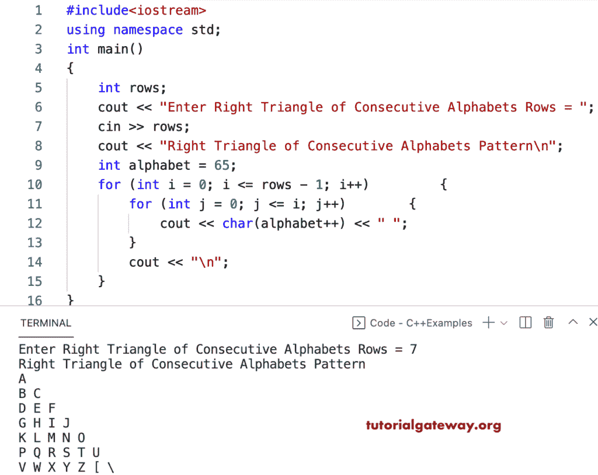

# C++ 程序：打印字母的连续图案的直角三角形

> 原文：<https://www.tutorialgateway.org/cpp-program-to-print-right-triangle-of-consecutive-alphabets-pattern/>

写一个 C++ 程序打印连续字母的直角三角形模式，用于循环。

```cpp
#include<iostream>
using namespace std;

int main()
{
	int rows;

	cout << "Enter Right Triangle of Consecutive Alphabets Rows = ";
	cin >> rows;

	cout << "Right Triangle of Consecutive Alphabets Pattern\n";
	int alphabet = 65;

	for (int i = 0; i <= rows - 1; i++)
	{
		for (int j = 0; j <= i; j++)
		{
			cout << char(alphabet++) << " ";
		}
		cout << "\n";
	}
}
```



C++ 程序，使用 while 循环打印字母的连续图案的直角三角形。

```cpp
#include<iostream>
using namespace std;

int main()
{
	int rows, i, j, alphabet;

	cout << "Enter Right Triangle of Consecutive Alphabets Rows = ";
	cin >> rows;

	cout << "Right Triangle of Consecutive Alphabets Pattern\n";
	alphabet = 65;

	i = 0;

	while (i <= rows - 1)
	{
		j = 0;

		while (j <= i)
		{
			cout << char(alphabet++) << " ";
			j++;
		}
		cout << "\n";
		i++;
	}
}
```

```cpp
Enter Right Triangle of Consecutive Alphabets Rows = 9
Right Triangle of Consecutive Alphabets Pattern
A 
B C 
D E F 
G H I J 
K L M N O 
P Q R S T U 
V W X Y Z [ \ 
] ^ _ ` a b c d 
e f g h i j k l m 
```

这个 [C++ 例子](https://www.tutorialgateway.org/cpp-programs/)使用 do while 循环在每列显示连续字母的直角三角形模式。

```cpp
#include<iostream>
using namespace std;

int main()
{
	int rows, i, j, alphabet;

	cout << "Enter Right Triangle of Consecutive Alphabets Rows = ";
	cin >> rows;

	cout << "Right Triangle of Consecutive Alphabets Pattern\n";
	alphabet = 65;

	i = 0;

	do
	{
		j = 0;

		do
		{
			cout << char(alphabet++) << " ";

		} while (++j <= i);

		cout << "\n";

	} while (++i <= rows - 1);
}
```

```cpp
Enter Right Triangle of Consecutive Alphabets Rows = 10
Right Triangle of Consecutive Alphabets Pattern
A 
B C 
D E F 
G H I J 
K L M N O 
P Q R S T U 
V W X Y Z [ \ 
] ^ _ ` a b c d 
e f g h i j k l m 
n o p q r s t u v w 
```