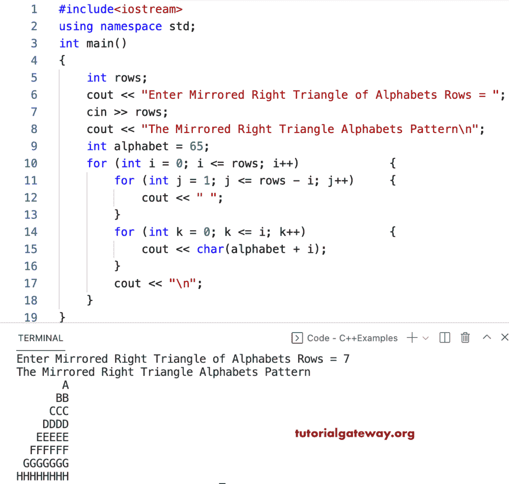

# C++ 程序：打印字母的镜像直角三角形图案

> 原文：<https://www.tutorialgateway.org/cpp-program-to-print-mirrored-right-triangle-alphabets-pattern/>

写一个 C++ 程序来打印字母的镜像直角三角形图案，用于循环。

```cpp
#include<iostream>
using namespace std;

int main()
{
	int rows;

	cout << "Enter Mirrored Right Triangle of Alphabets Rows = ";
	cin >> rows;

	cout << "The Mirrored Right Triangle Alphabets Pattern\n";

	int alphabet = 65;

	for (int i = 0; i <= rows; i++)
	{
		for (int j = 1; j <= rows - i; j++)
		{
			cout << " ";
		}
		for (int k = 0; k <= i; k++)
		{
			cout << char(alphabet + i);
		}
		cout << "\n";
	}
}
```



C++ 程序打印字母的镜像直角三角形图案使用 while 循环。

```cpp
#include<iostream>
using namespace std;

int main()
{
	int rows, i, j, k, alphabet;

	cout << "Enter Mirrored Right Triangle of Alphabets Rows = ";
	cin >> rows;

	cout << "The Mirrored Right Triangle Alphabets Pattern\n";

	alphabet = 65;
	i = 0;

	while (i <= rows)
	{
		j = 1;
		while (j <= rows - i)
		{
			cout << " ";
			j++;
		}

		k = 0;
		while (k <= i)
		{
			cout << char(alphabet + i);
			k++;
		}
		cout << "\n";
		i++;
	}
}
```

```cpp
Enter Mirrored Right Triangle of Alphabets Rows = 14
The Mirrored Right Triangle Alphabets Pattern
              A
             BB
            CCC
           DDDD
          EEEEE
         FFFFFF
        GGGGGGG
       HHHHHHHH
      IIIIIIIII
     JJJJJJJJJJ
    KKKKKKKKKKK
   LLLLLLLLLLLL
  MMMMMMMMMMMMM
 NNNNNNNNNNNNNN
OOOOOOOOOOOOOOO
```

这个 [C++ 示例](https://www.tutorialgateway.org/cpp-programs/)使用 do while 循环显示字母的镜像直角三角形图案。

```cpp
#include<iostream>
using namespace std;

int main()
{
	int rows, i, j, k, alphabet;

	cout << "Enter Mirrored Right Triangle of Alphabets Rows = ";
	cin >> rows;

	cout << "The Mirrored Right Triangle Alphabets Pattern\n";

	alphabet = 65;
	i = 0;

	do
	{
		j = 1;
		do
		{
			cout << " ";

		} while (j++ <= rows - i);

		k = 0;
		do
		{
			cout << char(alphabet + i);

		} while (++k <= i);
		cout << "\n";

	} while (++i < rows);
}
```

```cpp
Enter Mirrored Right Triangle of Alphabets Rows = 17
The Mirrored Right Triangle Alphabets Pattern
                  A
                 BB
                CCC
               DDDD
              EEEEE
             FFFFFF
            GGGGGGG
           HHHHHHHH
          IIIIIIIII
         JJJJJJJJJJ
        KKKKKKKKKKK
       LLLLLLLLLLLL
      MMMMMMMMMMMMM
     NNNNNNNNNNNNNN
    OOOOOOOOOOOOOOO
   PPPPPPPPPPPPPPPP
  QQQQQQQQQQQQQQQQQ
```