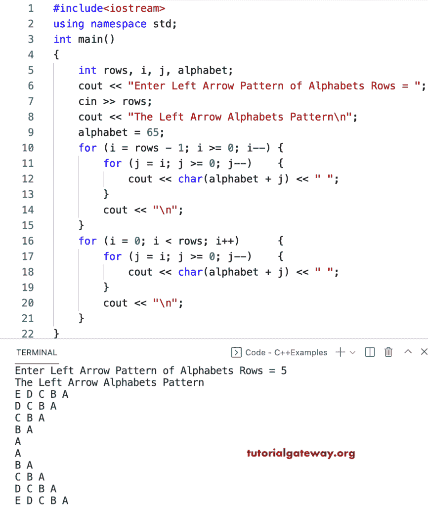

# C++ 程序：打印字母的左箭头图案

> 原文：<https://www.tutorialgateway.org/cpp-program-to-print-left-arrow-alphabets-pattern/>

编写一个 C++ 程序来打印字母的用于循环的左箭头图案。

```cpp
#include<iostream>
using namespace std;

int main()
{
	int rows, i, j, alphabet;

	cout << "Enter Left Arrow Pattern of Alphabets Rows = ";
	cin >> rows;

	cout << "The Left Arrow Alphabets Pattern\n";
	alphabet = 65;

	for (i = rows - 1; i >= 0; i--)
	{
		for (j = i; j >= 0; j--)
		{
			cout << char(alphabet + j) << " ";
		}
		cout << "\n";
	}

	for (i = 0; i < rows; i++)
	{
		for (j = i; j >= 0; j--)
		{
			cout << char(alphabet + j) << " ";
		}
		cout << "\n";
	}
}
```



C++ 程序打印字母的左箭头图案使用 while 循环。

```cpp
#include<iostream>
using namespace std;

int main()
{
	int rows, i, j, alphabet;

	cout << "Enter Left Arrow Pattern of Alphabets Rows = ";
	cin >> rows;

	cout << "The Left Arrow Alphabets Pattern\n";
	alphabet = 65;
	i = rows - 1;

	while (i >= 0)
	{
		j = i;
		while (j >= 0)
		{
			cout << char(alphabet + j) << " ";
			j--;
		}
		cout << "\n";
		i--;
	}

	i = 0;
	while (i < rows)
	{
		j = i;
		while (j >= 0)
		{
			cout << char(alphabet + j) << " ";
			j--;
		}
		cout << "\n";
		i++;
	}
}
```

```cpp
Enter Left Arrow Pattern of Alphabets Rows = 13
The Left Arrow Alphabets Pattern
M L K J I H G F E D C B A 
L K J I H G F E D C B A 
K J I H G F E D C B A 
J I H G F E D C B A 
I H G F E D C B A 
H G F E D C B A 
G F E D C B A 
F E D C B A 
E D C B A 
D C B A 
C B A 
B A 
A 
A 
B A 
C B A 
D C B A 
E D C B A 
F E D C B A 
G F E D C B A 
H G F E D C B A 
I H G F E D C B A 
J I H G F E D C B A 
K J I H G F E D C B A 
L K J I H G F E D C B A 
M L K J I H G F E D C B A 
```

这个 [C++ 例子](https://www.tutorialgateway.org/cpp-programs/)使用 do while 循环显示字母的左箭头模式。

```cpp
#include<iostream>
using namespace std;

int main()
{
	int rows, i, j, alphabet;

	cout << "Enter Left Arrow Pattern of Alphabets Rows = ";
	cin >> rows;

	cout << "The Left Arrow Alphabets Pattern\n";
	alphabet = 65;
	i = rows - 1;

	do
	{
		j = i;
		do
		{
			cout << char(alphabet + j) << " ";

		} while (--j >= 0);
		cout << "\n";

	} while (--i >= 0);

	i = 0;
	do
	{
		j = i;
		do
		{
			cout << char(alphabet + j) << " ";

		} while (--j >= 0);
		cout << "\n";

	} while (++i < rows);
}
```

```cpp
Enter Left Arrow Pattern of Alphabets Rows = 17
The Left Arrow Alphabets Pattern
Q P O N M L K J I H G F E D C B A 
P O N M L K J I H G F E D C B A 
O N M L K J I H G F E D C B A 
N M L K J I H G F E D C B A 
M L K J I H G F E D C B A 
L K J I H G F E D C B A 
K J I H G F E D C B A 
J I H G F E D C B A 
I H G F E D C B A 
H G F E D C B A 
G F E D C B A 
F E D C B A 
E D C B A 
D C B A 
C B A 
B A 
A 
A 
B A 
C B A 
D C B A 
E D C B A 
F E D C B A 
G F E D C B A 
H G F E D C B A 
I H G F E D C B A 
J I H G F E D C B A 
K J I H G F E D C B A 
L K J I H G F E D C B A 
M L K J I H G F E D C B A 
N M L K J I H G F E D C B A 
O N M L K J I H G F E D C B A 
P O N M L K J I H G F E D C B A 
Q P O N M L K J I H G F E D C B A 
```