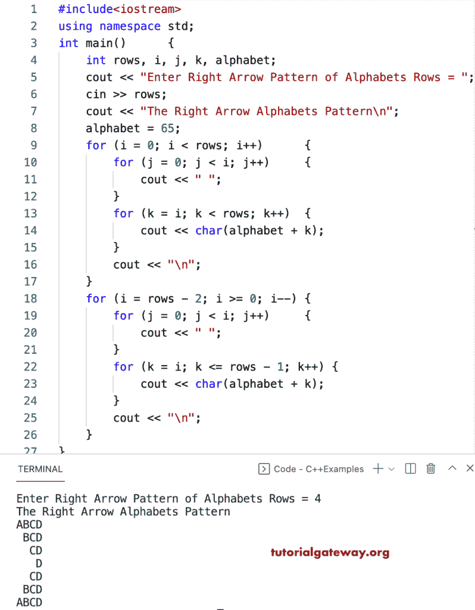

# C++ 程序：打印右箭头字母模式

> 原文：<https://www.tutorialgateway.org/cpp-program-to-print-right-arrow-alphabets-pattern/>

编写一个 C++ 程序来打印用于循环的右箭头字母模式。

```cpp
#include<iostream>
using namespace std;

int main()
{
	int rows, i, j, k, alphabet;

	cout << "Enter Right Arrow Pattern of Alphabets Rows = ";
	cin >> rows;

	cout << "The Right Arrow Alphabets Pattern\n";
	alphabet = 65;

	for (i = 0; i < rows; i++)
	{
		for (j = 0; j < i; j++)
		{
			cout << " ";
		}
		for (k = i; k < rows; k++)
		{
			cout << char(alphabet + k);
		}
		cout << "\n";
	}

	for (i = rows - 2; i >= 0; i--)
	{
		for (j = 0; j < i; j++)
		{
			cout << " ";
		}
		for (k = i; k <= rows - 1; k++)
		{
			cout << char(alphabet + k);
		}
		cout << "\n";
	}
}
```



这个 [C++ 例子](https://www.tutorialgateway.org/cpp-programs/)使用 while 循环打印字母的右箭头模式。

```cpp
#include<iostream>
using namespace std;

int main()
{
	int rows, i, j, k, alphabet;

	cout << "Enter Right Arrow Pattern of Alphabets Rows = ";
	cin >> rows;

	cout << "The Right Arrow Alphabets Pattern\n";
	alphabet = 65;
	i = 0;

	while (i < rows)
	{
		j = 0;
		while (j < i)
		{
			cout << " ";
			j++;
		}
		k = i;
		while (k < rows)
		{
			cout << char(alphabet + k);
			k++;
		}
		cout << "\n";
		i++;
	}

	i = rows - 2;
	while (i >= 0)
	{
		j = 0;
		while (j < i)
		{
			cout << " ";
			j++;
		}
		k = i;
		while (k <= rows - 1)
		{
			cout << char(alphabet + k);
			k++;
		}
		cout << "\n";
		i--;
	}
}
```

```cpp
Enter Right Arrow Pattern of Alphabets Rows = 12
The Right Arrow Alphabets Pattern
ABCDEFGHIJKL
 BCDEFGHIJKL
  CDEFGHIJKL
   DEFGHIJKL
    EFGHIJKL
     FGHIJKL
      GHIJKL
       HIJKL
        IJKL
         JKL
          KL
           L
          KL
         JKL
        IJKL
       HIJKL
      GHIJKL
     FGHIJKL
    EFGHIJKL
   DEFGHIJKL
  CDEFGHIJKL
 BCDEFGHIJKL
ABCDEFGHIJKL
```