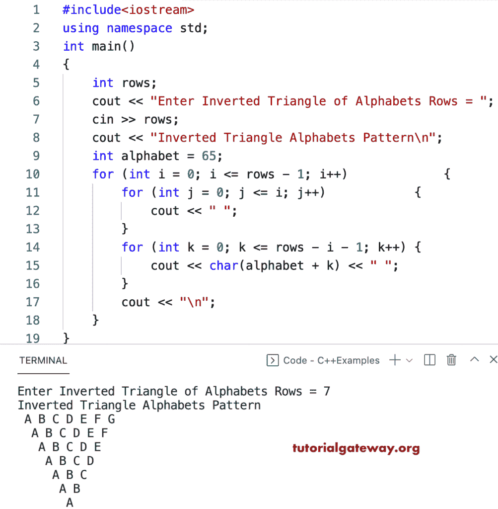

# C++ 程序：打印倒三角字母图案

> 原文：<https://www.tutorialgateway.org/cpp-program-to-print-inverted-triangle-alphabets-pattern/>

写一个 C++ 程序打印倒三角字母模式用于循环。

```cpp
#include<iostream>
using namespace std;

int main()
{
	int rows;

	cout << "Enter Inverted Triangle of Alphabets Rows = ";
	cin >> rows;

	cout << "Inverted Triangle Alphabets Pattern\n";
	int alphabet = 65;

	for (int i = 0; i <= rows - 1; i++)
	{
		for (int j = 0; j <= i; j++)
		{
			cout << " ";
		}
		for (int k = 0; k <= rows - i - 1; k++)
		{
			cout << char(alphabet + k) << " ";
		}
		cout << "\n";
	}
}
```



C++ 程序打印倒三角字母模式使用 while 循环。

```cpp
#include<iostream>
using namespace std;

int main()
{
	int rows, i, j, k, alphabet;

	cout << "Enter Inverted Triangle of Alphabets Rows = ";
	cin >> rows;

	cout << "Inverted Triangle Alphabets Pattern\n";
	 alphabet = 65;

	i = 0;

	while (i <= rows - 1)
	{

		j = 0;
		while (j <= i)
		{
			cout << " ";
			j++;
		}

		k = 0;
		while (k <= rows - i - 1)
		{
			cout << char(alphabet + k) << " ";
			k++;
		}
		cout << "\n";
		i++;
	}
}
```

```cpp
Enter Inverted Triangle of Alphabets Rows = 15
Inverted Triangle Alphabets Pattern
 A B C D E F G H I J K L M N O 
  A B C D E F G H I J K L M N 
   A B C D E F G H I J K L M 
    A B C D E F G H I J K L 
     A B C D E F G H I J K 
      A B C D E F G H I J 
       A B C D E F G H I 
        A B C D E F G H 
         A B C D E F G 
          A B C D E F 
           A B C D E 
            A B C D 
             A B C 
              A B 
               A 
```

这个 [C++ 例子](https://www.tutorialgateway.org/cpp-programs/)使用 do while 循环显示字母的倒三角模式。

```cpp
#include<iostream>
using namespace std;

int main()
{
	int rows, i, j, k, alphabet;

	cout << "Enter Inverted Triangle of Alphabets Rows = ";
	cin >> rows;

	cout << "Inverted Triangle Alphabets Pattern\n";
	alphabet = 65;

	i = 0;

	do
	{
		j = 0;
		do
		{
			cout << " ";

		} while (j++ <= i);

		k = 0;
		do
		{
			cout << char(alphabet + k) << " ";

		} while (++k <= rows - i - 1);

		cout << "\n";

	} while (++i <= rows - 1);
}
```

```cpp
Enter Inverted Triangle of Alphabets Rows = 17
Inverted Triangle Alphabets Pattern
  A B C D E F G H I J K L M N O P Q 
   A B C D E F G H I J K L M N O P 
    A B C D E F G H I J K L M N O 
     A B C D E F G H I J K L M N 
      A B C D E F G H I J K L M 
       A B C D E F G H I J K L 
        A B C D E F G H I J K 
         A B C D E F G H I J 
          A B C D E F G H I 
           A B C D E F G H 
            A B C D E F G 
             A B C D E F 
              A B C D E 
               A B C D 
                A B C 
                 A B 
                  A 
```