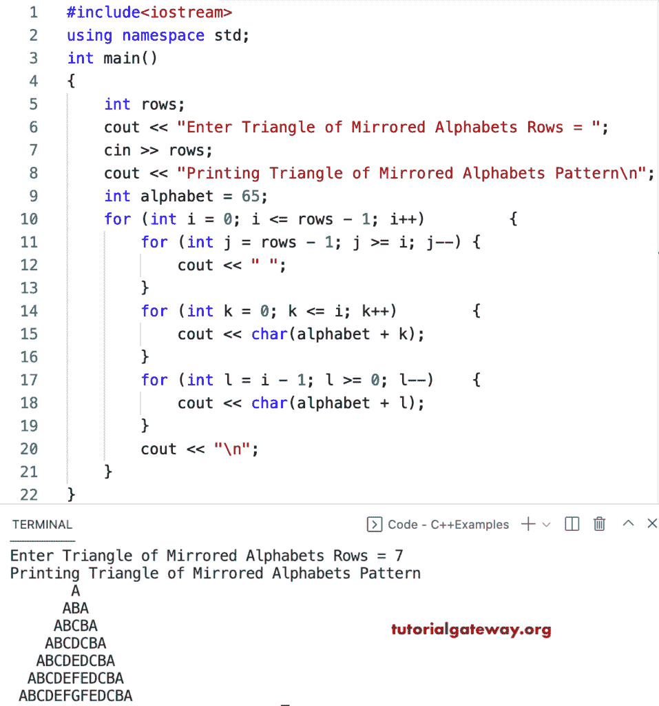

# C++ 程序：打印镜像字母的三角形图案

> 原文：<https://www.tutorialgateway.org/cpp-program-to-print-triangle-of-mirrored-alphabets-pattern/>

写一个 C++ 程序来打印字母的三角形的镜像图案，用于循环。

```cpp
#include<iostream>
using namespace std;

int main()
{
	int rows;

	cout << "Enter Triangle of Mirrored Alphabets Rows = ";
	cin >> rows;

	cout << "Printing Triangle of Mirrored Alphabets Pattern\n";

	int alphabet = 65;

	for (int i = 0; i <= rows - 1; i++)
	{
		for (int j = rows - 1; j >= i; j--)
		{
			cout << " ";
		}
		for (int k = 0; k <= i; k++)
		{
			cout << char(alphabet + k);
		}
		for (int l = i - 1; l >= 0; l--)
		{
			cout << char(alphabet + l);
		}
		cout << "\n";
	}
}
```



这个 [C++ 模式](https://www.tutorialgateway.org/cpp-programs/)示例使用 while 循环打印镜像字母的三角形模式。

```cpp
#include<iostream>
using namespace std;

int main()
{
	int rows, i, j, k, l, alphabet;

	cout << "Enter Triangle of Mirrored Alphabets Rows = ";
	cin >> rows;

	cout << "Printing Triangle of Mirrored Alphabets Pattern\n";

	alphabet = 65;

	i = 0;
	while (i <= rows - 1)
	{
		j = rows - 1;
		while (j >= i)
		{
			cout << " ";
			j--;
		}

		k = 0;
		while (k <= i)
		{
			cout << char(alphabet + k);
			k++;
		}

		l = i - 1;
		while (l >= 0)
		{
			cout << char(alphabet + l);
			l--;
		}
		cout << "\n";
		i++;
	}
}
```

```cpp
Enter Triangle of Mirrored Alphabets Rows = 15
Printing Triangle of Mirrored Alphabets Pattern
               A
              ABA
             ABCBA
            ABCDCBA
           ABCDEDCBA
          ABCDEFEDCBA
         ABCDEFGFEDCBA
        ABCDEFGHGFEDCBA
       ABCDEFGHIHGFEDCBA
      ABCDEFGHIJIHGFEDCBA
     ABCDEFGHIJKJIHGFEDCBA
    ABCDEFGHIJKLKJIHGFEDCBA
   ABCDEFGHIJKLMLKJIHGFEDCBA
  ABCDEFGHIJKLMNMLKJIHGFEDCBA
 ABCDEFGHIJKLMNONMLKJIHGFEDCBA
```