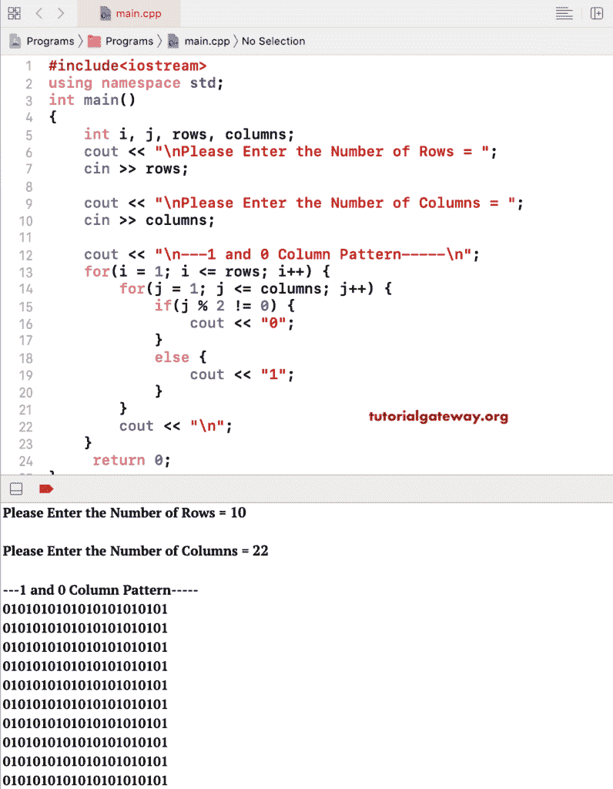

# C++ 程序：打印 1 和 0 列模式

> 原文：<https://www.tutorialgateway.org/cpp-program-to-print-1-and-0-column-pattern/>

用一个例子写一个 C++ 程序，用 For 循环打印 1 和 0 列模式。在这个 C++ 列模式示例中，我们在嵌套 for 循环中使用了 if-else 语句来检查列号是偶数还是奇数。如果是奇数列，则打印 0，如果是偶数列，则打印 1。

```cpp
#include<iostream>
using namespace std;

int main()
{
	int i, j, rows, columns;

    cout << "\nPlease Enter the Number of Rows = ";
    cin >> rows;

    cout << "\nPlease Enter the Number of Columns = ";
    cin >> columns;

    cout << "\n---1 and 0 Column Pattern-----\n";
    for(i = 1; i <= rows; i++)
    {
    	for(j = 1; j <= columns; j++)
		{
			if(j % 2 != 0)
			{
				cout << "0";
			}
			else
			{
				cout << "1";
			}       	
        }
        cout << "\n";
    }

 	return 0;
}
```



## 使用 While 循环打印 0 和 1 列模式的 C++ 程序

```cpp
#include<iostream>
using namespace std;

int main()
{
	int i, j, rows, columns;

    cout << "\nPlease Enter the Number of Rows = ";
    cin >> rows;

    cout << "\nPlease Enter the Number of Columns = ";
    cin >> columns;

    cout << "\n---1 and 0 Column Pattern-----\n";
    i = 1; 
    while(i <= rows)
    {
    	j = 1; 
    	while(j <= columns)
		{
			if(j % 2 != 0)
			{
				cout << "0";
			}
			else
			{
				cout << "1";
			}   
			j++;    	
        }
        cout << "\n";
        i++;
    }

 	return 0;
}
```

```cpp
Please Enter the Number of Rows = 8

Please Enter the Number of Columns = 13

---1 and 0 Column Pattern-----
0101010101010
0101010101010
0101010101010
0101010101010
0101010101010
0101010101010
0101010101010
0101010101010
```

在此 [C++ 代码](https://www.tutorialgateway.org/cpp-programs/)打印 1 和 0 列模式，如果是奇数列，打印 1，如果是偶数列，打印 0。

```cpp
#include<iostream>
using namespace std;

int main()
{
	int i, j, rows, columns;

    cout << "\nPlease Enter the Number of Rows = ";
    cin >> rows;

    cout << "\nPlease Enter the Number of Columns = ";
    cin >> columns;

    cout << "\n---1 and 0 Column Pattern-----\n";
    for(i = 1; i <= rows; i++)
    {
    	for(j = 1; j <= columns; j++)
		{
			if(j % 2 != 0)
			{
				cout << "1";
			}
			else
			{
				cout << "0";
			}       	
        }
        cout << "\n";
    }

 	return 0;
}
```

```cpp
Please Enter the Number of Rows = 7

Please Enter the Number of Columns = 15

---1 and 0 Column Pattern-----
101010101010101
101010101010101
101010101010101
101010101010101
101010101010101
101010101010101
101010101010101
```

在这个 C++ 1 和 0 列模式示例中，我们直接在嵌套 for 循环中打印 j % 2 结果的结果。

```cpp
#include<iostream>
using namespace std;

int main()
{
	int i, j, rows, columns;

    cout << "\nPlease Enter the Number of Rows = ";
    cin >> rows;

    cout << "\nPlease Enter the Number of Columns = ";
    cin >> columns;

    cout << "\n---1 and 0 Column Pattern-----\n";
    for(i = 1; i <= rows; i++)
    {
    	for(j = 1; j <= columns; j++)
		{
			cout << j % 2;    	
        }
        cout << "\n";
    }

 	return 0;
}
```

```cpp
Please Enter the Number of Rows = 11

Please Enter the Number of Columns = 25

---1 and 0 Column Pattern-----
1010101010101010101010101
1010101010101010101010101
1010101010101010101010101
1010101010101010101010101
1010101010101010101010101
1010101010101010101010101
1010101010101010101010101
1010101010101010101010101
1010101010101010101010101
1010101010101010101010101
1010101010101010101010101
```