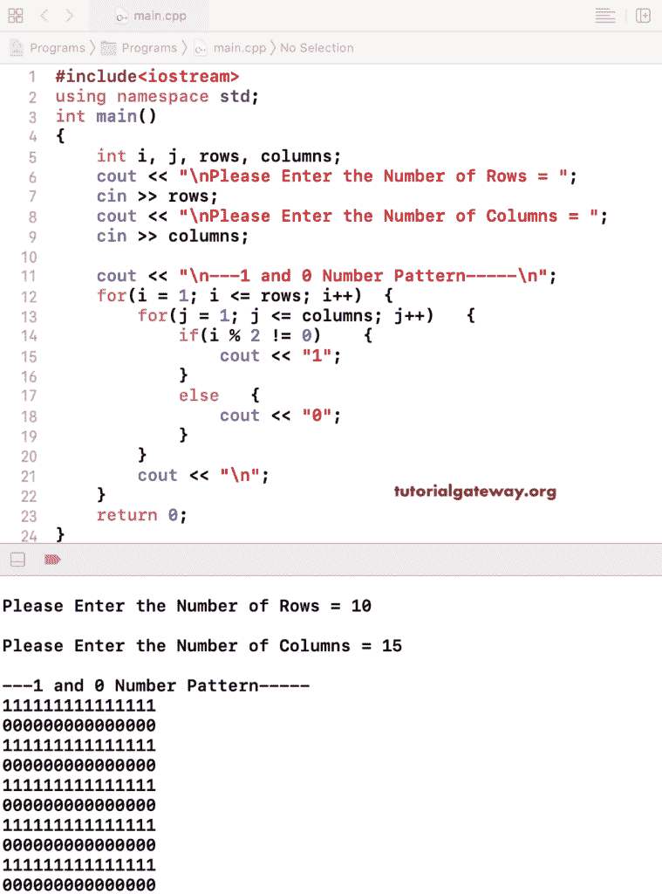

# C++ 程序：打印 1 和 0 行模式

> 原文：<https://www.tutorialgateway.org/cpp-program-to-print-1-and-0-row-pattern/>

用一个例子写一个 C++ 程序，用 For 循环打印 1 和 0 行模式。在这个 C++ 示例中，我们使用嵌套 for 循环中的 if-else 语句来检查偶数行和奇数行。如果是奇数行，打印 1，如果是偶数行，则打印 0。

```cpp
#include<iostream>
using namespace std;

int main()
{
	int i, j, rows, columns;

    cout << "\nPlease Enter the Number of Rows = ";
    cin >> rows;

    cout << "\nPlease Enter the Number of Columns = ";
    cin >> columns;

    cout << "\n---1 and 0 Number Pattern-----\n";
    for(i = 1; i <= rows; i++)
    {
    	for(j = 1; j <= columns; j++)
		{
			if(i % 2 != 0)
			{
				cout << "1";
			}
			else
			{
				cout << "0";
			}       	
        }
        cout << "\n";
    }

 	return 0;
}
```



## 使用 While 循环打印 1 和 0 行模式的 C++ 程序

```cpp
#include<iostream>
using namespace std;

int main()
{
	int i, j, rows, columns;

    cout << "\nPlease Enter the Number of Rows = ";
    cin >> rows;

    cout << "\nPlease Enter the Number of Columns = ";
    cin >> columns;

    cout << "\n---1 and 0 Number Pattern-----\n";
    i = 1;
    while(i <= rows)
    {
    	j = 1; 
    	while(j <= columns)
		{
			if(i % 2 != 0)
			{
				cout << "1";
			}
			else
			{
				cout << "0";
			} 
			j++;      	
        }
        cout << "\n";
        i++;
    }

 	return 0;
}
```

```cpp
Please Enter the Number of Rows = 6

Please Enter the Number of Columns = 15

---1 and 0 Number Pattern-----
111111111111111
000000000000000
111111111111111
000000000000000
111111111111111
000000000000000
```

在这个 [C++](https://www.tutorialgateway.org/cpp-programs/) 1 和 0 行模式的例子中，我们直接在嵌套 for 循环中打印 i% 2 结果的结果。

```cpp
#include<iostream>
using namespace std;

int main()
{
	int i, j, rows, columns;

    cout << "\nPlease Enter the Number of Rows = ";
    cin >> rows;

    cout << "\nPlease Enter the Number of Columns = ";
    cin >> columns;

    cout << "\n---1 and 0 Number Pattern-----\n";
    for(i = 1; i <= rows; i++)
    {
    	for(j = 1; j <= columns; j++)
		{
			cout << i % 2;     	
        }
        cout << "\n";
    }

 	return 0;
}
```

```cpp
Please Enter the Number of Rows = 8

Please Enter the Number of Columns = 20

---1 and 0 Number Pattern-----
11111111111111111111
00000000000000000000
11111111111111111111
00000000000000000000
11111111111111111111
00000000000000000000
11111111111111111111
00000000000000000000
```