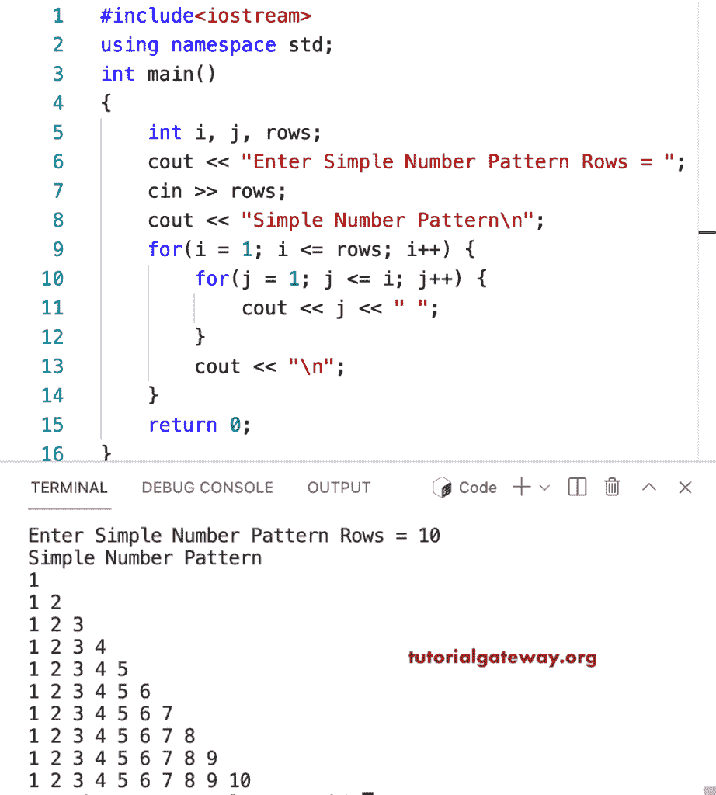

# C++ 程序：打印简单数字模式

> 原文：<https://www.tutorialgateway.org/cpp-program-to-print-a-simple-number-pattern/>

写一个 C++ 程序，打印一个简单的数字模式，用于循环。

```cpp
#include<iostream>
using namespace std;

int main()
{
	int i, j, rows;

    cout << "Enter Simple Number Pattern Rows = ";
    cin >> rows;

    cout << "Simple Number Pattern\n"; 

    for(i = 1; i <= rows; i++)
    {
    	for(j = 1; j <= i; j++)
		{
            cout << j << " ";
        }
        cout << "\n";
    }		
 	return 0;
}
```



这个 [C++ 示例](https://www.tutorialgateway.org/cpp-programs/)示例使用 while 循环显示直角三角形中的数字。

```cpp
#include<iostream>
using namespace std;

int main()
{
	int i = 1, j, rows;

    cout << "Enter Simple Number Pattern Rows = ";
    cin >> rows;

    cout << "Simple Number Pattern\n"; 

    while(i <= rows)
    {
        j = 1; 
    	while(j <= i)
		{
            cout << j << " ";
            j++;
        }
        cout << "\n";
        i++;
    }		
 	return 0;
}
```

```cpp
Enter Simple Number Pattern Rows = 14
Simple Number Pattern
1 
1 2 
1 2 3 
1 2 3 4 
1 2 3 4 5 
1 2 3 4 5 6 
1 2 3 4 5 6 7 
1 2 3 4 5 6 7 8 
1 2 3 4 5 6 7 8 9 
1 2 3 4 5 6 7 8 9 10 
1 2 3 4 5 6 7 8 9 10 11 
1 2 3 4 5 6 7 8 9 10 11 12 
1 2 3 4 5 6 7 8 9 10 11 12 13 
1 2 3 4 5 6 7 8 9 10 11 12 13 14 
```