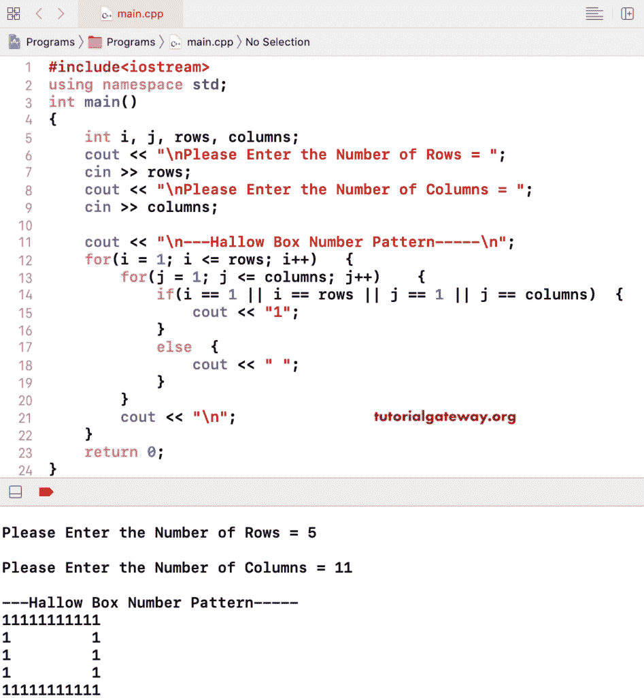

# C++ 程序：打印数字的空心盒子图案

> 原文：<https://www.tutorialgateway.org/cpp-program-to-print-hollow-box-number-pattern/>

用 For 循环写一个 C++ 程序打印数字的空心盒图案，并举例说明。在这个 C++ 示例中，我们使用嵌套 for 循环中的 if 语句来检查框的边框。如果是方框边框，打印 1；否则，打印空白。

```cpp
#include<iostream>
using namespace std;

int main()
{
	int i, j, rows, columns;

    cout << "\nPlease Enter the Number of Rows = ";
    cin >> rows;

    cout << "\nPlease Enter the Number of Columns = ";
    cin >> columns;

    cout << "\n---Hallow Box Number Pattern-----\n";
    for(i = 1; i <= rows; i++)
    {
    	for(j = 1; j <= columns; j++)
		{
			if(i == 1 || i == rows || j == 1 || j == columns)
			{
				cout << "1";
			}
			else
			{
				cout << " ";
			}       	
        }
        cout << "\n";
    }

 	return 0;
}
```



## C++ 程序打印零的空心盒模式

这里，我们将 1 替换为 0。

```cpp
#include<iostream>
using namespace std;

int main()
{
	int i, j, rows, columns;

    cout << "\nPlease Enter the Number of Rows = ";
    cin >> rows;

    cout << "\nPlease Enter the Number of Columns = ";
    cin >> columns;

    cout << "\n---Hallow Box Number Pattern-----\n";
    for(i = 1; i <= rows; i++)
    {
    	for(j = 1; j <= columns; j++)
		{
			if(i == 1 || i == rows || j == 1 || j == columns)
			{
				cout << "0";
			}
			else
			{
				cout << " ";
			}       	
        }
        cout << "\n";
    }

 	return 0;
}
```

```cpp
Please Enter the Number of Rows = 7

Please Enter the Number of Columns = 15

---Hallow Box Number Pattern-----
000000000000000
0             0
0             0
0             0
0             0
0             0
000000000000000
```

## 用 While 循环打印数字的空心盒图案的 C++ 程序

```cpp
#include<iostream>
using namespace std;

int main()
{
	int i, j, rows, columns;

    cout << "\nPlease Enter the Number of Rows = ";
    cin >> rows;

    cout << "\nPlease Enter the Number of Columns = ";
    cin >> columns;

    cout << "\n---Hollow Box Number Pattern-----\n";
    i = 1; 
    while(i <= rows)
    {
    	j = 1; 
    	while(j <= columns)
		{
			if(i == 1 || i == rows || j == 1 || j == columns)
			{
				cout << "1";
			}
			else
			{
				cout << " ";
			}     
			j++;  	
        }
        cout << "\n";
        i++;
    }

 	return 0;
}
```

```cpp
Please Enter the Number of Rows = 7

Please Enter the Number of Columns = 16

---Hollow Box Number Pattern-----
1111111111111111
1              1
1              1
1              1
1              1
1              1
1111111111111111
```

在这个 [C++](https://www.tutorialgateway.org/cpp-programs/) 空心盒数字图案的例子中，我们允许用户输入他/她自己的数字在边框中打印。

```cpp
#include<iostream>
using namespace std;

int main()
{
	int i, j, rows, columns, num;

    cout << "\nPlease Enter the Number of Rows = ";
    cin >> rows;

    cout << "\nPlease Enter the Number of Columns = ";
    cin >> columns;

    cout << "\nPlease Enter Any Integer Value = ";
    cin >> num;

    cout << "\n---Hallow Box Number Pattern-----\n";
    for(i = 1; i <= rows; i++)
    {
    	for(j = 1; j <= columns; j++)
		{
			if(i == 1 || i == rows || j == 1 || j == columns)
			{
				cout << num;
			}
			else
			{
				cout << " ";
			}       	
        }
        cout << "\n";
    }

 	return 0;
}
```

```cpp
Please Enter the Number of Rows = 12

Please Enter the Number of Columns = 25

Please Enter Any Integer Value = 9

---Hallow Box Number Pattern-----
9999999999999999999999999
9                       9
9                       9
9                       9
9                       9
9                       9
9                       9
9                       9
9                       9
9                       9
9                       9
9999999999999999999999999
```