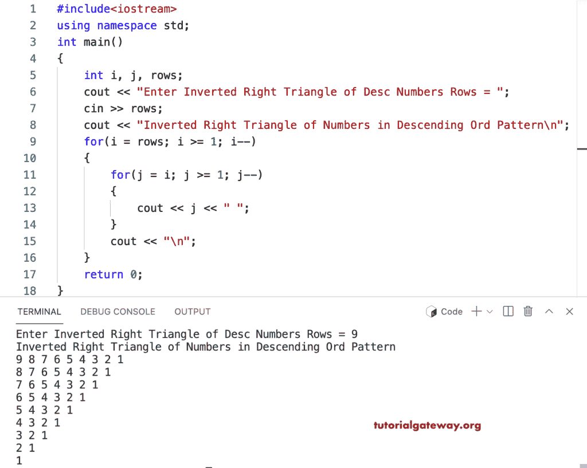

# C++ 程序：打印降序倒直角三角形

> 原文：<https://www.tutorialgateway.org/cpp-program-to-print-inverted-right-triangle-of-descending-order-numbers/>

写一个 C++ 程序打印倒直角三角形的降序数字模式用于循环。

```cpp
#include<iostream>
using namespace std;

int main()
{
	int i, j, rows;

    cout << "Enter Inverted Right Triangle of Desc Numbers Rows = ";
    cin >> rows;

    cout << "Inverted Right Triangle of Numbers in Descending Ord Pattern\n";  

    for(i = rows; i >= 1; i--)
    {
    	for(j = i; j >= 1; j--)
		{
            cout << j << " ";
        }
        cout << "\n";
    }		
 	return 0;
}
```



这个 [C++ 示例](https://www.tutorialgateway.org/cpp-programs/)使用 while 循环以降序打印数字的倒直角三角形。

```cpp
#include<iostream>
using namespace std;

int main()
{
	int i, j, rows;

    cout << "Enter Inverted Right Triangle of Desc Numbers Rows = ";
    cin >> rows;

    cout << "Inverted Right Triangle of Numbers in Descending Ord Pattern\n";  
    i = rows;

    while( i >= 1)
    {
        j = i;
    	while (j >= 1)
		{
            cout << j << " ";
            j--;
        }
        cout << "\n";
        i--;
    }		
 	return 0;
}
```

```cpp
Enter Inverted Right Triangle of Desc Numbers Rows = 15
Inverted Right Triangle of Numbers in Descending Ord Pattern
15 14 13 12 11 10 9 8 7 6 5 4 3 2 1 
14 13 12 11 10 9 8 7 6 5 4 3 2 1 
13 12 11 10 9 8 7 6 5 4 3 2 1 
12 11 10 9 8 7 6 5 4 3 2 1 
11 10 9 8 7 6 5 4 3 2 1 
10 9 8 7 6 5 4 3 2 1 
9 8 7 6 5 4 3 2 1 
8 7 6 5 4 3 2 1 
7 6 5 4 3 2 1 
6 5 4 3 2 1 
5 4 3 2 1 
4 3 2 1 
3 2 1 
2 1 
1 
```