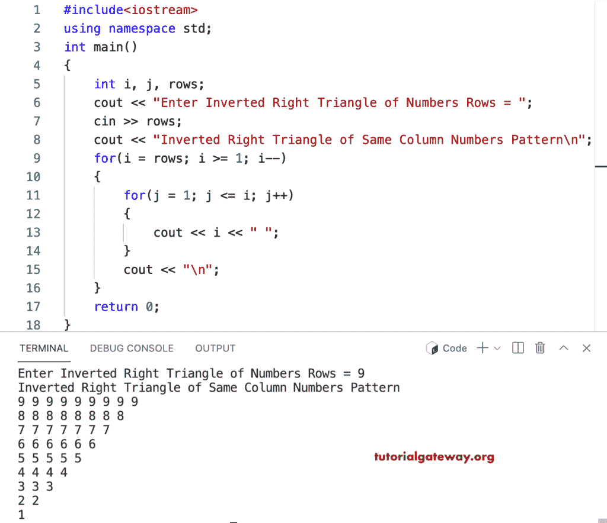

# C++ 程序：打印列数字相同的倒直角三角形

> 原文：<https://www.tutorialgateway.org/cpp-program-to-print-inverted-right-triangle-of-same-column-numbers/>

编写一个 C++ 程序，使用 for 循环打印相同列号的倒直角三角形。

```cpp
#include<iostream>
using namespace std;

int main()
{
	int i, j, rows;

    cout << "Enter Inverted Right Triangle of Numbers Rows = ";
    cin >> rows;

    cout << "Inverted Right Triangle of Same Column Numbers Pattern\n";  

    for(i = rows; i >= 1; i--)
    {
    	for(j = 1; j <= i; j++)
		{
            cout << i << " ";
        }
        cout << "\n";
    }		
 	return 0;
}
```



这个 [C++ 示例](https://www.tutorialgateway.org/cpp-programs/)示例使用 while 循环打印相同列号的倒直角三角形。

```cpp
#include<iostream>
using namespace std;

int main()
{
	int i, j, rows;

    cout << "Enter Inverted Right Triangle of Numbers Rows = ";
    cin >> rows;

    cout << "Inverted Right Triangle of Same Column Numbers Pattern\n";

    i = rows;

    while( i >= 1)
    {
        j = 1;
    	while( j <= i)
		{
            cout << i << " ";
            j++;
        }
        cout << "\n";
        i--;
    }		
 	return 0;
}
```

```cpp
Enter Inverted Right Triangle of Numbers Rows = 8
Inverted Right Triangle of Same Column Numbers Pattern
8 8 8 8 8 8 8 8 
7 7 7 7 7 7 7 
6 6 6 6 6 6 
5 5 5 5 5 
4 4 4 4 
3 3 3 
2 2 
1
```