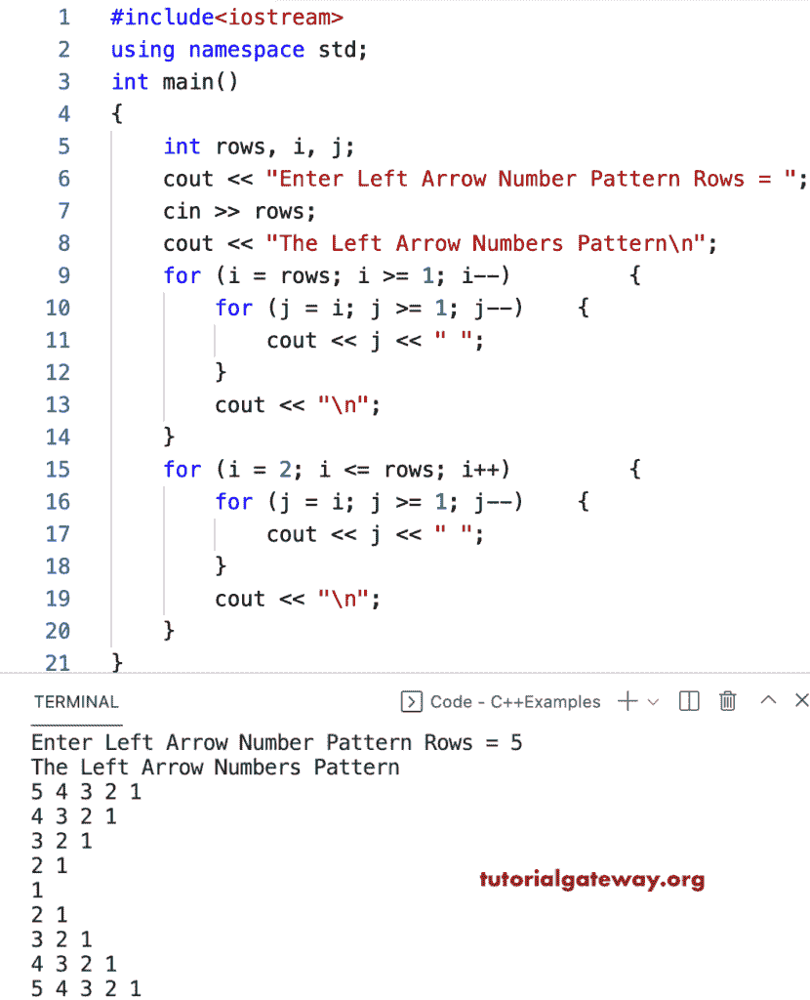

# C++ 程序：打印数字的左箭头图案

> 原文：<https://www.tutorialgateway.org/cpp-program-to-print-left-arrow-numbers-pattern/>

编写一个 C++ 程序，使用 for 循环打印左箭头数字图案。

```cpp
#include<iostream>
using namespace std;

int main()
{
	int rows, i, j;

	cout << "Enter Left Arrow Number Pattern Rows = ";
	cin >> rows;

	cout << "The Left Arrow Numbers Pattern\n";

	for (i = rows; i >= 1; i--)
	{
		for (j = i; j >= 1; j--)
		{
			cout << j << " ";
		}
		cout << "\n";
	}

	for (i = 2; i <= rows; i++)
	{
		for (j = i; j >= 1; j--)
		{
			cout << j << " ";
		}
		cout << "\n";
	}
}
```



使用 while 循环打印左箭头数字图案的 C++ 程序。

```cpp
#include<iostream>
using namespace std;

int main()
{
	int rows, i, j;

	cout << "Enter Left Arrow Number Pattern Rows = ";
	cin >> rows;

	cout << "The Left Arrow Numbers Pattern\n";
	i = rows;

	while (i >= 1)
	{
		j = i;
		while (j >= 1)
		{
			cout << j << " ";
			j--;
		}
		cout << "\n";
		i--;
	}

	i = 2;
	while (i <= rows)
	{
		j = i;
		while (j >= 1)
		{
			cout << j << " ";
			j--;
		}
		cout << "\n";
		i++;
	}
}
```

```cpp
Enter Left Arrow Number Pattern Rows = 12
The Left Arrow Numbers Pattern
12 11 10 9 8 7 6 5 4 3 2 1 
11 10 9 8 7 6 5 4 3 2 1 
10 9 8 7 6 5 4 3 2 1 
9 8 7 6 5 4 3 2 1 
8 7 6 5 4 3 2 1 
7 6 5 4 3 2 1 
6 5 4 3 2 1 
5 4 3 2 1 
4 3 2 1 
3 2 1 
2 1 
1 
2 1 
3 2 1 
4 3 2 1 
5 4 3 2 1 
6 5 4 3 2 1 
7 6 5 4 3 2 1 
8 7 6 5 4 3 2 1 
9 8 7 6 5 4 3 2 1 
10 9 8 7 6 5 4 3 2 1 
11 10 9 8 7 6 5 4 3 2 1 
12 11 10 9 8 7 6 5 4 3 2 1
```

这个 [C++ 例子](https://www.tutorialgateway.org/cpp-programs/)使用 do while 循环显示数字的左箭头模式。

```cpp
#include<iostream>
using namespace std;

int main()
{
	int rows, i, j;

	cout << "Enter Left Arrow Number Pattern Rows = ";
	cin >> rows;

	cout << "The Left Arrow Numbers Pattern\n";
	i = rows;

	do
	{
		j = i;
		do
		{
			cout << j << " ";

		} while (--j >= 1);
		cout << "\n";

	} while (--i >= 1);

	i = 2;
	do
	{
		j = i;
		do
		{
			cout << j << " ";

		} while (--j >= 1);
		cout << "\n";

	} while (++i <= rows);
}
```

```cpp
Enter Left Arrow Number Pattern Rows = 16
The Left Arrow Numbers Pattern
16 15 14 13 12 11 10 9 8 7 6 5 4 3 2 1 
15 14 13 12 11 10 9 8 7 6 5 4 3 2 1 
14 13 12 11 10 9 8 7 6 5 4 3 2 1 
13 12 11 10 9 8 7 6 5 4 3 2 1 
12 11 10 9 8 7 6 5 4 3 2 1 
11 10 9 8 7 6 5 4 3 2 1 
10 9 8 7 6 5 4 3 2 1 
9 8 7 6 5 4 3 2 1 
8 7 6 5 4 3 2 1 
7 6 5 4 3 2 1 
6 5 4 3 2 1 
5 4 3 2 1 
4 3 2 1 
3 2 1 
2 1 
1 
2 1 
3 2 1 
4 3 2 1 
5 4 3 2 1 
6 5 4 3 2 1 
7 6 5 4 3 2 1 
8 7 6 5 4 3 2 1 
9 8 7 6 5 4 3 2 1 
10 9 8 7 6 5 4 3 2 1 
11 10 9 8 7 6 5 4 3 2 1 
12 11 10 9 8 7 6 5 4 3 2 1 
13 12 11 10 9 8 7 6 5 4 3 2 1 
14 13 12 11 10 9 8 7 6 5 4 3 2 1 
15 14 13 12 11 10 9 8 7 6 5 4 3 2 1 
16 15 14 13 12 11 10 9 8 7 6 5 4 3 2 1 
```