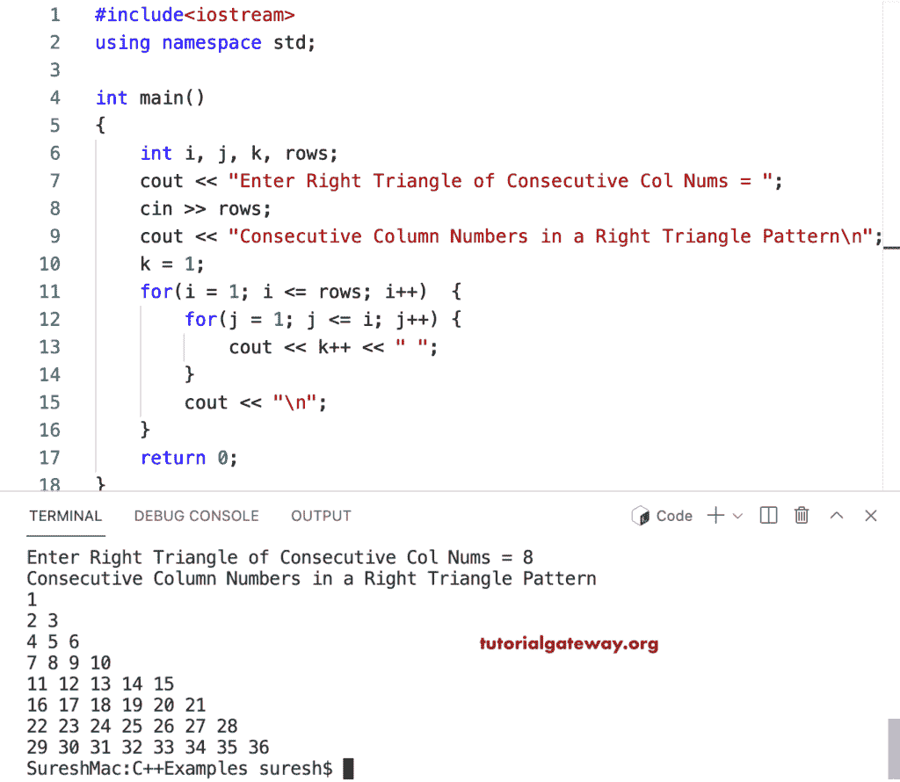

# C++ 程序：打印列数字连续的直角三角形

> 原文：<https://www.tutorialgateway.org/cpp-program-to-print-consecutive-column-numbers-in-right-triangle/>

编写一个 C++ 程序，使用 for 循环以直角三角形模式打印连续的列数字。

```cpp
#include<iostream>
using namespace std;

int main()
{
	int i, j, k, rows;

    cout << "Enter Right Triangle of Consecutive Col Nums = ";
    cin >> rows;

    cout << "Consecutive Column Numbers in a Right Triangle Pattern\n"; 
    k = 1;
    for(i = 1; i <= rows; i++)
    {
    	for(j = 1; j <= i; j++)
		{
            cout << k++ << " ";
        }
        cout << "\n";
    }		
 	return 0;
}
```



这个 [C++ 示例](https://www.tutorialgateway.org/cpp-programs/)使用 while 循环打印列数字连续的直角三角形模式。

```cpp
#include<iostream>
using namespace std;

int main()
{
	int i, j, k, rows;

    cout << "Enter Right Triangle of Consecutive Col Nums = ";
    cin >> rows;

    cout << "Consecutive Column Numbers in a Right Triangle Pattern\n"; 
    k = 1;
    i = 1;
    while(i <= rows)
    {
        j = 1;
    	while( j <= i)
		{
            cout << k++ << " ";
            j++;
        }
        cout << "\n";
        i++;
    }		
 	return 0;
}
```

```cpp
Enter Right Triangle of Consecutive Col Nums = 10
Consecutive Column Numbers in a Right Triangle Pattern
1 
2 3 
4 5 6 
7 8 9 10 
11 12 13 14 15 
16 17 18 19 20 21 
22 23 24 25 26 27 28 
29 30 31 32 33 34 35 36 
37 38 39 40 41 42 43 44 45 
46 47 48 49 50 51 52 53 54 55 
```