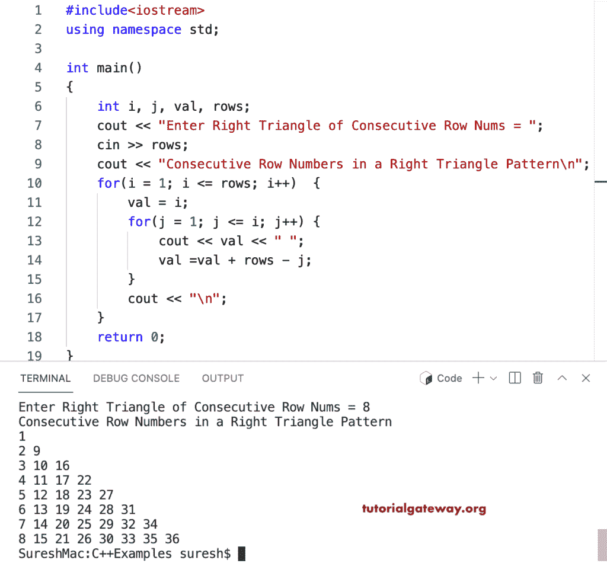

# C++ 程序：打印行数字连续的直角三角形

> 原文：<https://www.tutorialgateway.org/cpp-program-to-print-consecutive-rows-numbers-in-right-triangle/>

编写一个 C++ 程序，使用 for 循环以直角三角形图案打印连续的行数字。

```cpp
#include<iostream>
using namespace std;

int main()
{
	int i, j, val, rows;

    cout << "Enter Right Triangle of Consecutive Row Nums = ";
    cin >> rows;

    cout << "Consecutive Row Numbers in a Right Triangle Pattern\n"; 
    for(i = 1; i <= rows; i++)
    {
        val = i;
    	for(j = 1; j <= i; j++)
		{
            cout << val << " ";
            val =val + rows - j;
        }
        cout << "\n";
    }		
 	return 0;
}
```



这个 [C++ 示例](https://www.tutorialgateway.org/cpp-programs/)使用 while 循环打印行数字连续的直角三角形图案。

```cpp
#include<iostream>
using namespace std;

int main()
{
	int i, j, val, rows;

    cout << "Enter Right Triangle of Consecutive Row Nums = ";
    cin >> rows;

    cout << "Consecutive Row Numbers in a Right Triangle Pattern\n"; 
    i = 1;
    while(i <= rows)
    {
        val = i;
        j = 1;
    	while( j <= i)
		{
            cout << val << " ";
            val =val + rows - j;
            j++;
        }
        cout << "\n";
        i++;
    }		
 	return 0;
}
```

```cpp
Enter Right Triangle of Consecutive Row Nums = 15
Consecutive Row Numbers in a Right Triangle Pattern
1 
2 16 
3 17 30 
4 18 31 43 
5 19 32 44 55 
6 20 33 45 56 66 
7 21 34 46 57 67 76 
8 22 35 47 58 68 77 85 
9 23 36 48 59 69 78 86 93 
10 24 37 49 60 70 79 87 94 100 
11 25 38 50 61 71 80 88 95 101 106 
12 26 39 51 62 72 81 89 96 102 107 111 
13 27 40 52 63 73 82 90 97 103 108 112 115 
14 28 41 53 64 74 83 91 98 104 109 113 116 118 
15 29 42 54 65 75 84 92 99 105 110 114 117 119 120 
```