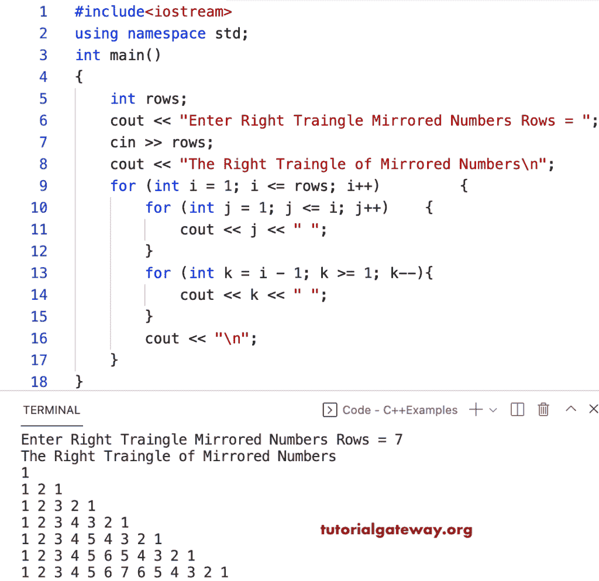

# C++ 程序：打印镜像数字图案的直角三角形

> 原文：<https://www.tutorialgateway.org/cpp-program-to-print-right-triangle-of-mirrored-numbers-pattern/>

写一个 C++ 程序来打印用于循环的镜像数字模式的直角三角形。

```cpp
#include<iostream>
using namespace std;

int main()
{
	int rows;

	cout << "Enter Right Traingle Mirrored Numbers Rows = ";
	cin >> rows;

	cout << "The Right Traingle of Mirrored Numbers\n";

	for (int i = 1; i <= rows; i++)
	{
		for (int j = 1; j <= i; j++)
		{
			cout << j << " ";
		}
		for (int k = i - 1; k >= 1; k--)
		{
			cout << k << " ";
		}
		cout << "\n";
	}
}
```



使用 while 循环打印镜像数字直角三角形图案的 C++ 程序。

```cpp
#include<iostream>
using namespace std;

int main()
{
	int rows, i, j, k;

	cout << "Enter Right Traingle Mirrored Numbers Rows = ";
	cin >> rows;

	cout << "The Right Traingle of Mirrored Numbers\n";

	i = 1;
	while (i <= rows)
	{
		j = 1;
		while (j <= i)
		{
			cout << j << " ";
			j++;
		}

		k = i - 1;
		while (k >= 1)
		{
			cout << k << " ";
			k--;
		}
		cout << "\n";
		i++;
	}
}
```

```cpp
Enter Right Traingle Mirrored Numbers Rows = 9
The Right Traingle of Mirrored Numbers
1 
1 2 1 
1 2 3 2 1 
1 2 3 4 3 2 1 
1 2 3 4 5 4 3 2 1 
1 2 3 4 5 6 5 4 3 2 1 
1 2 3 4 5 6 7 6 5 4 3 2 1 
1 2 3 4 5 6 7 8 7 6 5 4 3 2 1 
1 2 3 4 5 6 7 8 9 8 7 6 5 4 3 2 1 
```

这个 [C++ 例子](https://www.tutorialgateway.org/cpp-programs/)使用 do while 循环显示镜像数字的直角三角形模式。

```cpp
#include<iostream>
using namespace std;

void rtMirroredColumnNumbers(int rows)
{
	for (int i = 1; i <= rows; i++)
	{
		for (int j = 1; j <= i; j++)
		{
			cout << j << " ";
		}
		for (int k = i - 1; k >= 1; k--)
		{
			cout << k << " ";
		}
		cout << "\n";
	}
}

int main()
{
	int rows;

	cout << "Enter Right Traingle Mirrored Numbers Rows = ";
	cin >> rows;

	cout << "The Right Traingle of Mirrored Numbers\n";
	rtMirroredColumnNumbers(rows);
}
```

```cpp
Enter Right Traingle Mirrored Numbers Rows = 13
The Right Traingle of Mirrored Numbers
1 
1 2 1 
1 2 3 2 1 
1 2 3 4 3 2 1 
1 2 3 4 5 4 3 2 1 
1 2 3 4 5 6 5 4 3 2 1 
1 2 3 4 5 6 7 6 5 4 3 2 1 
1 2 3 4 5 6 7 8 7 6 5 4 3 2 1 
1 2 3 4 5 6 7 8 9 8 7 6 5 4 3 2 1 
1 2 3 4 5 6 7 8 9 10 9 8 7 6 5 4 3 2 1 
1 2 3 4 5 6 7 8 9 10 11 10 9 8 7 6 5 4 3 2 1 
1 2 3 4 5 6 7 8 9 10 11 12 11 10 9 8 7 6 5 4 3 2 1 
1 2 3 4 5 6 7 8 9 10 11 12 13 12 11 10 9 8 7 6 5 4 3 2 1 
```