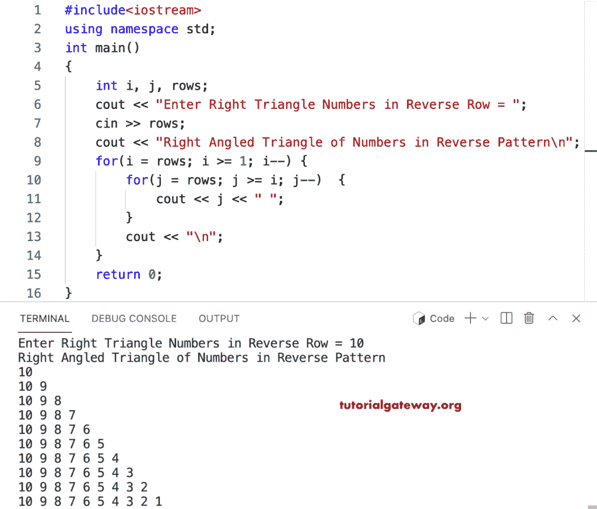

# C++ 程序：反向打印数字的直角三角形

> 原文：<https://www.tutorialgateway.org/cpp-program-to-print-right-triangle-of-numbers-in-reverse/>

编写一个 C++ 程序，使用 for 循环以相反的顺序打印数字的直角三角形。

```cpp
#include<iostream>
using namespace std;

int main()
{
	int i, j, rows;

    cout << "Enter Right Triangle Numbers in Reverse Row = ";
    cin >> rows;

    cout << "Right Angled Triangle of Numbers in Reverse Pattern\n"; 

    for(i = rows; i >= 1; i--)
    {
    	for(j = rows; j >= i; j--)
		{
            cout << j << " ";
        }
        cout << "\n";
    }		
 	return 0;
}
```



这个 [C++ 示例](https://www.tutorialgateway.org/cpp-programs/)使用 while 循环打印直角三角形模式中的逆序数字。

```cpp
#include<iostream>
using namespace std;

int main()
{
	int i, j, rows;

    cout << "Enter Right Triangle Numbers in Reverse Row = ";
    cin >> rows;

    cout << "Right Angled Triangle of Numbers in Reverse Pattern\n"; 

    i = rows;
    while(i >= 1)
    {
        j = rows;
    	while( j >= i)
		{
            cout << j << " ";
            j--;
        }
        cout << "\n";
        i--;
    }		
 	return 0;
}
```

```cpp
Enter Right Triangle Numbers in Reverse Row = 17
Right Angled Triangle of Numbers in Reverse Pattern
17 
17 16 
17 16 15 
17 16 15 14 
17 16 15 14 13 
17 16 15 14 13 12 
17 16 15 14 13 12 11 
17 16 15 14 13 12 11 10 
17 16 15 14 13 12 11 10 9 
17 16 15 14 13 12 11 10 9 8 
17 16 15 14 13 12 11 10 9 8 7 
17 16 15 14 13 12 11 10 9 8 7 6 
17 16 15 14 13 12 11 10 9 8 7 6 5 
17 16 15 14 13 12 11 10 9 8 7 6 5 4 
17 16 15 14 13 12 11 10 9 8 7 6 5 4 3 
17 16 15 14 13 12 11 10 9 8 7 6 5 4 3 2 
17 16 15 14 13 12 11 10 9 8 7 6 5 4 3 2 1 
```