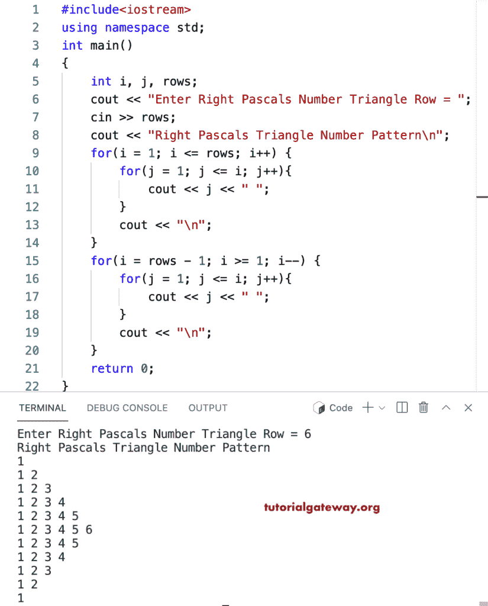

# C++ 程序：打印数字的右帕斯卡三角形

> 原文：<https://www.tutorialgateway.org/cpp-program-to-print-right-pascals-number-triangle/>

编写一个 C++ 程序，用 for 循环打印右帕斯卡数字三角形。

```cpp
#include<iostream>
using namespace std;

int main()
{
	int i, j, rows;

    cout << "Enter Right Pascals Number Triangle Row = ";
    cin >> rows;

    cout << "Right Pascals Triangle Number Pattern\n"; 

    for(i = 1; i <= rows; i++)
    {
    	for(j = 1; j <= i; j++)
		{
            cout << j << " ";  
        }
        cout << "\n";
    }	

    for(i = rows - 1; i >= 1; i--)
    {
    	for(j = 1; j <= i; j++)
		{
            cout << j << " "; 
        }
        cout << "\n";
    }	
 	return 0;
}
```



这个 [C++ 例子](https://www.tutorialgateway.org/cpp-programs/)使用 while 循环打印数字的右帕斯卡三角形。

```cpp
#include<iostream>
using namespace std;

int main()
{
	int i, j, rows;

    cout << "Enter Right Pascals Number Triangle Row = ";
    cin >> rows;

    cout << "Right Pascals Triangle Number Pattern\n"; 

    i = 1;
    while( i <= rows)
    {
        j = 1;
    	while(j <= i)
		{
            cout << j << " ";  
            j++;
        }
        cout << "\n";
        i++;
    }	

    i = rows - 1;
    while( i >= 1)
    {
        j = 1;
    	while( j <= i)
		{
            cout << j << " ";
            j++; 
        }
        cout << "\n";
        i--;
    }	
 	return 0;
}
```

```cpp
Enter Right Pascals Number Triangle Row = 9
Right Pascals Triangle Number Pattern
1 
1 2 
1 2 3 
1 2 3 4 
1 2 3 4 5 
1 2 3 4 5 6 
1 2 3 4 5 6 7 
1 2 3 4 5 6 7 8 
1 2 3 4 5 6 7 8 9 
1 2 3 4 5 6 7 8 
1 2 3 4 5 6 7 
1 2 3 4 5 6 
1 2 3 4 5 
1 2 3 4 
1 2 3 
1 2 
1 
```