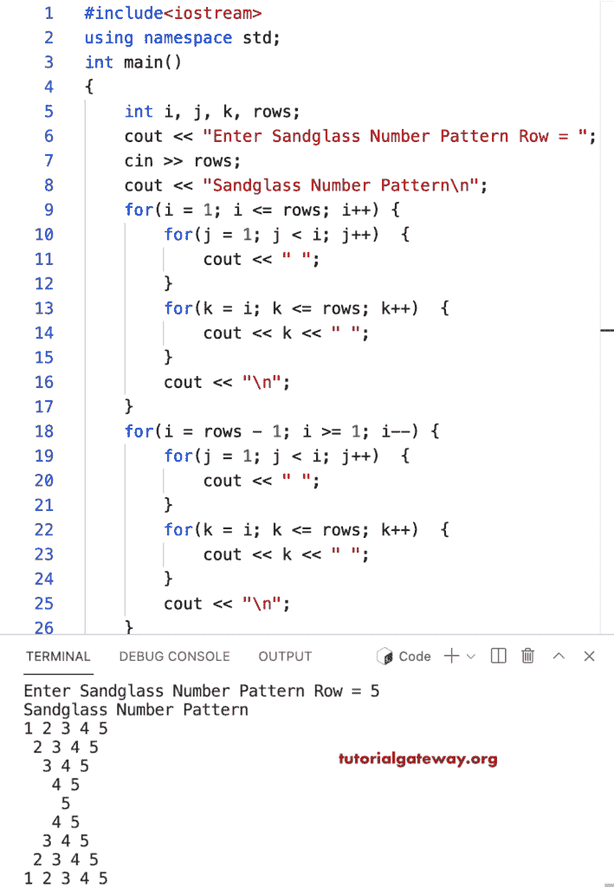

# C++ 程序：打印数字的沙漏图案

> 原文：<https://www.tutorialgateway.org/cpp-program-to-print-sandglass-number-pattern/>

写一个 C++ 程序来打印循环使用的沙漏数字图案。

```cpp
#include<iostream>
using namespace std;

int main()
{
	int i, j, k, rows;

    cout << "Enter Sandglass Number Pattern Row = ";
    cin >> rows;

    cout << "Sandglass Number Pattern\n"; 

    for(i = 1; i <= rows; i++)
    {
    	for(j = 1; j < i; j++)
		{
            cout << " ";
        }
        for(k = i; k <= rows; k++)
        {
            cout << k << " ";
        }
        cout << "\n";
    }	

    for(i = rows - 1; i >= 1; i--)
    {
    	for(j = 1; j < i; j++)
		{
            cout << " ";
        }
        for(k = i; k <= rows; k++)
        {
            cout << k << " ";
        }
        cout << "\n";
    }	
 	return 0;
}
```



这个 [C++ 例子](https://www.tutorialgateway.org/cpp-programs/)使用 while 循环以沙漏模式打印数字。

```cpp
#include<iostream>
using namespace std;

int main()
{
	int i = 1, j, k, rows;

    cout << "Enter Sandglass Number Pattern Row = ";
    cin >> rows;

    cout << "Sandglass Number Pattern\n"; 

    while( i <= rows)
    {
    	j = 1;
    	while( j < i)
		{
            cout << " ";
            j++;
        }

        k = i;
        while( k <= rows )
        {
            cout << k << " ";
            k++;
        }
        cout << "\n";
        i++;
    }	

    i = rows - 1;
    while( i >= 1)
    {
        j = 1;
    	while( j < i)
		{
            cout << " ";
            j++;
        }

        k = i;
        while( k <= rows )
        {
            cout << k << " ";
            k++;
        }
        cout << "\n";
        i--;
    }	
 	return 0;
}
```

```cpp
Enter Sandglass Number Pattern Row = 9
Sandglass Number Pattern
1 2 3 4 5 6 7 8 9 
 2 3 4 5 6 7 8 9 
  3 4 5 6 7 8 9 
   4 5 6 7 8 9 
    5 6 7 8 9 
     6 7 8 9 
      7 8 9 
       8 9 
        9 
       8 9 
      7 8 9 
     6 7 8 9 
    5 6 7 8 9 
   4 5 6 7 8 9 
  3 4 5 6 7 8 9 
 2 3 4 5 6 7 8 9 
1 2 3 4 5 6 7 8 9 
```